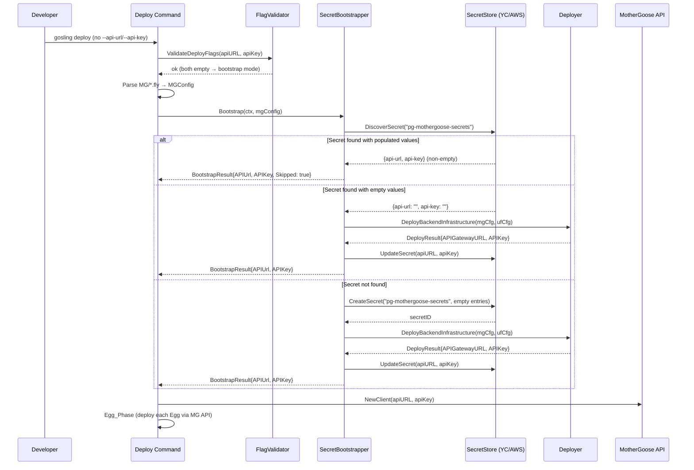
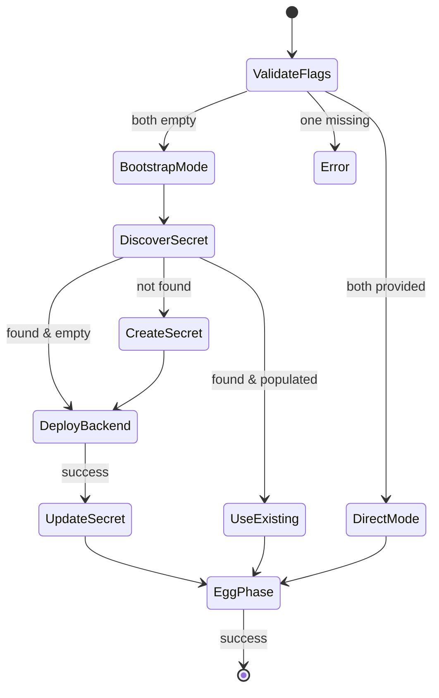

# Design Document: Deploy Bootstrap Secrets

## Overview

This feature transforms the `gosling deploy` command from a single-phase process requiring pre-existing MG API credentials into a two-phase workflow (Bootstrap_Phase → Egg_Phase) that automatically provisions credentials on first run. The core challenge is a chicken-and-egg problem: deploying Egg configurations requires a MotherGoose API, but the API doesn't exist until backend infrastructure is deployed.

The solution introduces a `SecretBootstrapper` component that:
1. Makes `--api-url` and `--api-key` flags optional
2. Discovers or creates an MG API secret in the cloud provider's secret store
3. Deploys backend infrastructure and captures the resulting API Gateway URL and API key
4. Populates the secret with real values
5. Proceeds to Egg deployment using the bootstrapped credentials

All new code lives under `dev-new-features/internal/` following existing package conventions.

## Architecture



### Decision: Separate SecretBootstrapper vs Inline Logic

The bootstrap logic is extracted into a dedicated `SecretBootstrapper` struct rather than inlined in the deploy command. Rationale:
- **Testability**: The bootstrapper can be unit-tested with mock secret stores and deployers
- **Single responsibility**: The deploy command orchestrates phases; the bootstrapper handles credential lifecycle
- **Reusability**: Other commands (e.g., future `gosling secrets rotate`) could reuse the discovery logic

### Decision: Extend Existing `lockbox` Package vs New Package

The existing `lockbox` package handles per-Egg secrets with a `SecretStore` interface. The MG API secret has different semantics (fixed name, different entries, update capability), so we introduce a new `bootstrap` package under `internal/bootstrap/` rather than overloading the existing lockbox package. This keeps per-Egg secret management separate from infrastructure credential bootstrapping.

## Components and Interfaces

### New Package: `internal/bootstrap`

```go
package bootstrap

// SecretBootstrapper orchestrates MG API credential discovery, creation, and population.
type SecretBootstrapper struct {
    store    MGSecretStore
    deployer BackendDeployer
}

// MGSecretStore abstracts cloud-specific MG API secret operations.
// Implementations: YCMGSecretStore, AWSMGSecretStore
type MGSecretStore interface {
    // Discover searches for an existing MG API secret.
    // Returns nil, nil if no secret exists.
    // Returns ErrSecretDeleted if secret is in scheduled-deletion state.
    Discover(ctx context.Context) (*MGSecret, error)

    // Create provisions a new MG API secret with empty placeholder entries.
    Create(ctx context.Context) (*MGSecret, error)

    // Update populates the MG API secret with real credential values.
    Update(ctx context.Context, secretID string, creds Credentials) error
}

// BackendDeployer abstracts backend infrastructure deployment.
// The existing deployer.Deployer satisfies this via an adapter.
type BackendDeployer interface {
    // DeployBackend deploys MotherGoose infrastructure and returns API credentials.
    DeployBackend(ctx context.Context, mgCfg *deployer.MGConfig, ufCfg *deployer.UFConfig) (*DeployResult, error)
}

// MGSecret represents a discovered or created MG API secret.
type MGSecret struct {
    ID          string      // Secret UUID (YC) or secret name (AWS)
    Credentials Credentials // May have empty values if not yet populated
    Populated   bool        // True if both api-url and api-key are non-empty
}

// Credentials holds the MG API access values.
type Credentials struct {
    APIURL string
    APIKey string
}

// DeployResult holds outputs from backend infrastructure deployment.
type DeployResult struct {
    APIGatewayURL string // HTTPS URL of the deployed API Gateway
    APIKey        string // Generated API key for authentication
}

// BootstrapResult is the output of a successful bootstrap operation.
type BootstrapResult struct {
    APIURL       string
    APIKey       string
    SecretID     string
    SecretURI    string // Full URI (yc-lockbox://... or aws-sm://...)
    WasDiscovered bool  // True if credentials came from existing populated secret
}

// Bootstrap executes the full bootstrap workflow.
func (b *SecretBootstrapper) Bootstrap(ctx context.Context, mgCfg *deployer.MGConfig, ufCfg *deployer.UFConfig) (*BootstrapResult, error)
```

### New Package: `internal/bootstrap/ycstore`

```go
package ycstore

// YCMGSecretStore implements bootstrap.MGSecretStore for Yandex Cloud Lockbox.
type YCMGSecretStore struct {
    sdk      *ycsdk.SDK
    folderID string
}

// Secret name: "pg-mothergoose-secrets"
// Entries: "api-url", "api-key"
// Labels: polar-gosling=true, resource-type=mothergoose-api
```

### New Package: `internal/bootstrap/awsstore`

```go
package awsstore

// AWSMGSecretStore implements bootstrap.MGSecretStore for AWS Secrets Manager.
type AWSMGSecretStore struct {
    client *secretsmanager.Client
    region string
}

// Secret name: "polar-gosling/mothergoose"
// JSON keys: "api-url", "api-key"
// Tags: polar-gosling=true, resource-type=mothergoose-api
```

### Modified: `internal/cli/deploy.go`

Changes to the existing deploy command:
1. Remove `mustMarkRequired` for `--api-url` and `--api-key` (make them optional)
2. Add flag validation logic (both-or-neither, URL format check)
3. Insert Bootstrap_Phase before Egg_Phase when flags are omitted
4. Modify Egg_Phase to accept credentials from either flags or bootstrap result
5. Add structured error messages for partial failures with recovery instructions

### Modified: `internal/deployer/deployer.go`

Extend `DeployBackendInfrastructure` to return a `DeployResult` containing the API Gateway URL and API key extracted from deployment outputs. Current signature returns only `error`; the new signature returns `(*DeployResult, error)`.

```go
// DeployResult contains outputs extracted from backend infrastructure deployment.
type DeployResult struct {
    APIGatewayURL string
    APIKey        string
}

// DeployBackendInfrastructure deploys backend and returns API credentials.
func (d *Deployer) DeployBackendInfrastructure(ctx context.Context, mgCfg *MGConfig, ufCfg *UFConfig) (*DeployResult, error)
```

### Flag Validation

```go
package bootstrap

// ValidateDeployFlags checks the --api-url and --api-key flag combination.
// Returns (useBootstrap bool, err error).
// - Both non-empty: useBootstrap=false, err=nil
// - Both empty: useBootstrap=true, err=nil  
// - One empty, one non-empty: err with descriptive message
// - api-url not valid HTTP(S) URL: err with format guidance
func ValidateDeployFlags(apiURL, apiKey string) (bool, error)
```

## Data Models

### MG API Secret Structure

**Yandex Cloud Lockbox:**
```
Secret Name: "pg-mothergoose-secrets"
Labels: { "polar-gosling": "true", "resource-type": "mothergoose-api" }
Version Entries:
  - Key: "api-url",  Value: "" (placeholder) → "https://api-gw.apigw.yandexcloud.net"
  - Key: "api-key",  Value: "" (placeholder) → "generated-api-key-value"
```

**AWS Secrets Manager:**
```
Secret Name: "polar-gosling/mothergoose"
Tags: [ {Key: "polar-gosling", Value: "true"}, {Key: "resource-type", Value: "mothergoose-api"} ]
SecretString (JSON):
  { "api-url": "", "api-key": "" }  →  { "api-url": "https://...", "api-key": "..." }
```

### BootstrapResult Flow



### Error Recovery States

| Phase | Failure Point | State After Failure | Recovery Action |
|-------|--------------|--------------------|-----------------| 
| Bootstrap | Secret creation | No secret exists | Retry same command |
| Bootstrap | Backend deployment | Secret exists (empty) | Retry same command (discovers empty secret, redeploys) |
| Bootstrap | Secret update | Backend deployed, secret empty | Use --api-url/--api-key with printed values |
| Egg | API connection | Backend deployed, secret populated | Retry with --api-url/--api-key |
| Egg | Individual Egg | Partial Eggs deployed | Retry with --api-url/--api-key |


## Correctness Properties

*A property is a characteristic or behavior that should hold true across all valid executions of a system — essentially, a formal statement about what the system should do. Properties serve as the bridge between human-readable specifications and machine-verifiable correctness guarantees.*

### Property 1: Flag Validation Consistency

*For any* combination of `apiURL` and `apiKey` string values, `ValidateDeployFlags` SHALL:
- Return `useBootstrap=false, err=nil` when both are non-empty and apiURL is a valid HTTP(S) URL
- Return `useBootstrap=true, err=nil` when both are empty strings
- Return an error when exactly one is non-empty
- Return an error when apiURL is non-empty but not a valid HTTP(S) URL

**Validates: Requirements 1.2, 1.3, 1.4, 1.5**

### Property 2: Discovery Determines Deployment Path

*For any* `MGSecret` returned by `Discover`, if both `Credentials.APIURL` and `Credentials.APIKey` are non-empty strings, then `Bootstrap` SHALL return a `BootstrapResult` with `WasDiscovered=true` and SHALL NOT call `DeployBackend` or `Update`. Conversely, if either credential field is empty, `Bootstrap` SHALL call `DeployBackend`.

**Validates: Requirements 2.4, 2.5**

### Property 3: DeployResult Validity

*For any* `DeployResult` returned by `DeployBackend`, the `APIGatewayURL` SHALL be a valid HTTPS URL (matching `https://...`) and `APIKey` SHALL be a non-empty string. If the deployer returns a result where `APIGatewayURL` is empty or not a valid HTTPS URL, `Bootstrap` SHALL return an error rather than proceeding to secret update.

**Validates: Requirements 4.1, 4.2, 4.6**

### Property 4: Secret Update Round-Trip

*For any* valid `Credentials{APIURL, APIKey}` passed to `MGSecretStore.Update`, a subsequent `Discover` call SHALL return an `MGSecret` with `Populated=true` and `Credentials` matching the values that were written.

**Validates: Requirements 4.3, 4.4, 4.5**

### Property 5: Dry-Run Is Read-Only

*For any* valid deployment configuration (MGConfig, UFConfig, Egg list), when `--dry-run` is true, the number of write calls to `MGSecretStore` (Create, Update), `BackendDeployer` (DeployBackend), and `MotherGooseClient` (CreateOrUpdateEgg) SHALL be zero.

**Validates: Requirements 8.4**

### Property 6: Stop-On-Failure Reports Progress

*For any* ordered list of N Egg configurations where the Egg at position K (0-indexed) fails deployment, the error message SHALL contain the name of the failed Egg and the count K (number of successfully deployed Eggs before the failure).

**Validates: Requirements 5.5**

### Property 7: Failure Recovery Prints Credentials

*For any* non-empty `APIGatewayURL` and `APIKey` values, if either secret update fails after successful deployment OR Egg_Phase fails after successful Bootstrap_Phase, the command SHALL print both the `APIGatewayURL` and `APIKey` values to stdout.

**Validates: Requirements 7.2, 7.3**

### Property 8: Dry-Run Output Completeness

*For any* `MGConfig` with a cloud provider (yandex or aws) and location identifiers (folder-id or region), when `--dry-run` is specified and credentials are omitted, the output SHALL contain: the MG_API_Secret name for that provider, the provider name, and the location identifier. Additionally, the output SHALL display both Bootstrap_Phase and Egg_Phase sections.

**Validates: Requirements 8.1, 8.3**

### Property 9: Bootstrap Output Contains Identifiers

*For any* successful bootstrap execution, the stdout output SHALL contain: the word "bootstrapping", the cloud provider name, the secret identifier, the secret URI (using `yc-lockbox://` or `aws-sm://` scheme), and the API Gateway URL returned from deployment.

**Validates: Requirements 9.1, 9.2, 9.3, 9.4**

## Error Handling

### Error Categories and Responses

| Error Type | Source | Response | Exit Code |
|-----------|--------|----------|-----------|
| Flag validation | CLI argument parsing | Print usage error + guidance | Non-zero |
| Authentication | Cloud SDK credential resolution | Print provider name, resource ID, required permissions | Non-zero |
| Permission denied (create) | Secret store API | Print required role/permission (lockbox.editor / secretsmanager:CreateSecret) | Non-zero |
| Permission denied (list) | Secret store API | Print required permission (lockbox.viewer / secretsmanager:ListSecrets) | Non-zero |
| Permission denied (update) | Secret store API | Print required permission (lockbox.editor / secretsmanager:PutSecretValue) | Non-zero |
| Timeout (30s) | Secret store API | Print endpoint unreachable + retry suggestion | Non-zero |
| Secret creation failure | Cloud provider | Print secret name + underlying error | Non-zero |
| Backend deployment failure | Deployer | Print retry instruction (re-run same command) | Non-zero |
| Secret update failure | Secret store API | Print credentials to stdout + manual flag instruction | Non-zero |
| API connection failure | MotherGoose HTTP client | Print unreachable API URL | Non-zero |
| Egg deployment failure | MotherGoose API | Print failed Egg name + success count | Non-zero |

### No-Rollback Policy

The deploy command SHALL NOT roll back resources from previously completed phases. This design choice enables:
- Idempotent retries (re-running the same command picks up where it left off)
- Partial state is always recoverable (credentials are printed for manual use)
- No risk of destroying infrastructure that was successfully provisioned

### Timeout Configuration

- Secret store API calls: 30-second context deadline
- Backend deployment: No fixed timeout (infrastructure provisioning can take minutes)
- MotherGoose API client: 30-second timeout per request (existing client default)

### Error Wrapping Convention

All errors follow Go's `fmt.Errorf("context: %w", err)` pattern to preserve the original error for inspection while adding deployment-specific context. Cloud SDK errors are NOT unwrapped in user-facing messages — only the descriptive wrapper is shown.

## Testing Strategy

### Property-Based Testing (using `gopter`)

The project already uses `github.com/leanovate/gopter` for property-based testing (see existing `*_property_test.go` files). Each correctness property maps to one property-based test with a minimum of 100 iterations.

**Test file**: `dev-new-features/internal/bootstrap/bootstrap_property_test.go`

Properties 1–9 from the Correctness Properties section are tested with gopter generators:
- **Property 1**: Generate random string pairs for apiURL/apiKey with a custom generator that produces valid URLs, invalid URLs, empty strings, and non-empty non-URL strings
- **Property 2**: Generate MGSecret instances with varying Populated states
- **Property 3**: Generate DeployResult with valid/invalid URLs and empty/non-empty keys
- **Property 4**: Generate random Credentials, write them, then read back and compare (round-trip)
- **Property 5**: Generate configs, run with dry-run=true, count mock write calls
- **Property 6**: Generate Egg name lists of varying length with failure position
- **Property 7**: Generate random URL+key pairs, trigger failure paths, verify stdout
- **Property 8**: Generate MGConfig variants (yandex/aws with different IDs), verify dry-run output
- **Property 9**: Generate bootstrap scenarios, verify output keywords

Each test is tagged: `// Feature: deploy-bootstrap-secrets, Property N: <title>`

### Unit Tests (example-based)

**Test files**:
- `dev-new-features/internal/bootstrap/bootstrap_test.go` — Core bootstrap logic
- `dev-new-features/internal/bootstrap/ycstore/yc_store_test.go` — YC-specific behavior
- `dev-new-features/internal/bootstrap/awsstore/aws_store_test.go` — AWS-specific behavior
- `dev-new-features/internal/cli/deploy_test.go` (extend existing) — Command integration

Key example tests:
- Secret name is exactly `pg-mothergoose-secrets` for YC (Req 2.2)
- Secret name is exactly `polar-gosling/mothergoose` for AWS (Req 2.3)
- Labels include `polar-gosling=true` and `resource-type=mothergoose-api` (Req 3.3)
- Deleted secret treated as not-found (Req 2.6)
- Specific permission error messages include correct role/permission names (Req 6.2–6.5)
- Exit code 0 on successful dry-run (Req 8.5)
- No rollback calls on failure (Req 7.4)
- Egg_Phase skipped when no Eggs directory (Req 5.3)
- Egg_Phase skipped message in output (Req 9.6)
- Credential source indicated in output (Req 9.5)

### Integration Tests

- End-to-end bootstrap flow with LocalStack (AWS) or mock YC SDK
- Timeout behavior with deliberately slow mock endpoints
- Full deploy command with `--dry-run` flag end-to-end

### Mock Strategy

All interfaces are designed for testability:
- `MGSecretStore` → mock implementations for property and unit tests
- `BackendDeployer` → mock returning configurable `DeployResult` or errors
- `MotherGooseClient` → existing interface, mock for Egg_Phase testing
- stdout/stderr capture → `bytes.Buffer` replacing os.Stdout for output assertions
