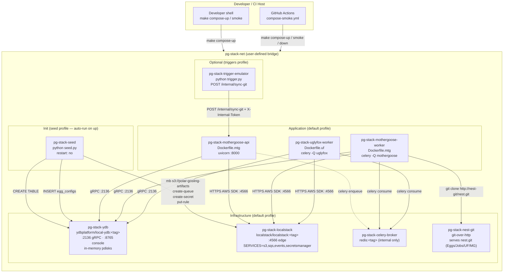
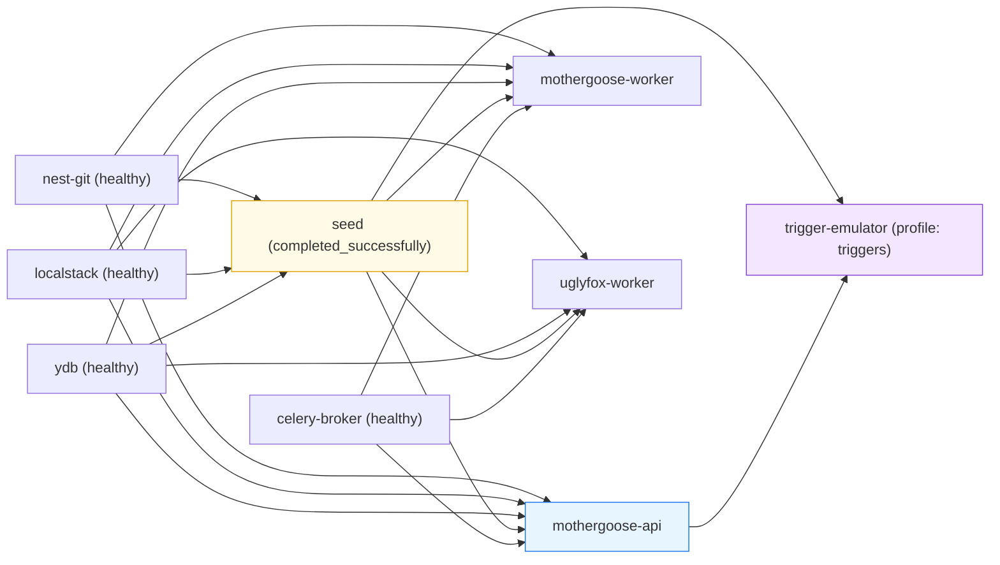
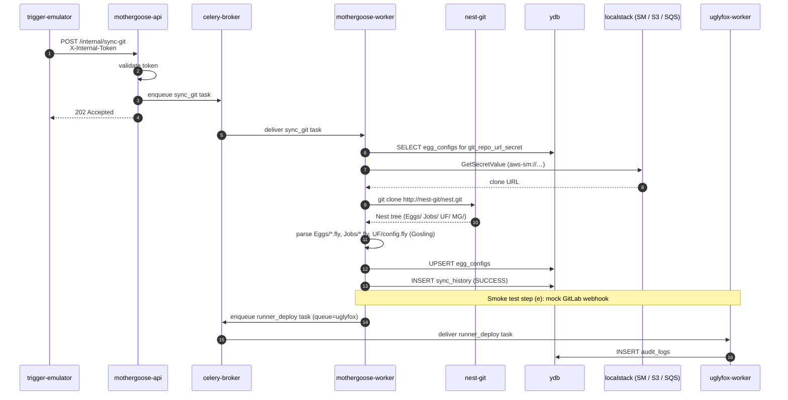

# Design Document

## Overview

Cloud_Stack is a long-lived, `docker-compose`-orchestrated emulation of the full
Polar-Gosling production pipeline. Unlike the existing `testcontainers` fixtures
— which spin up ephemeral YDB and LocalStack containers inside a single `pytest`
process — Cloud_Stack runs as a single, coherent environment that a developer
or CI runner can bring up once, exercise end-to-end, and tear down with a small
set of Makefile targets.

The stack is composed of nine services on a single user-defined bridge network
(`pg-stack-net`) inside the `dev-new-features/compose/` directory of the
`Polar-Gosling-Backends` repository:

| Service              | Role                                                                                | Image / Build source               |
| -------------------- | ----------------------------------------------------------------------------------- | ---------------------------------- |
| `ydb`                | YDB database (runners, egg_configs, sync_history, deployment_plans, audit_logs, …) | `ydbplatform/local-ydb:<tag>`      |
| `localstack`         | S3, SQS, EventBridge, Secrets Manager emulation                                     | `localstack/localstack:<tag>`      |
| `celery-broker`      | Celery transport + result backend for MG ↔ UF task dispatch                         | `redis:<tag>`                      |
| `nest-git`           | Static HTTP Git server serving a sample Nest repo                                   | `cirocosta/gitserver-http:<tag>`   |
| `mothergoose-api`    | FastAPI + uvicorn process on port 8000                                              | `dev-new-features/Dockerfile.mtg`  |
| `mothergoose-worker` | Celery worker on queue `mothergoose`                                                | `dev-new-features/Dockerfile.mtg`  |
| `uglyfox-worker`     | Celery worker on queue `uglyfox`                                                    | `dev-new-features/Dockerfile.uf`   |
| `trigger-emulator`   | Periodic `POST /internal/sync-git` driver (stands in for YC Timer / EventBridge)    | `dev-new-features/Dockerfile.runner` base or small Python image |
| `seed`               | One-shot initializer: YDB tables, S3 buckets, SQS queues, secrets, seed rows        | Same Python base image as MG       |

All artifacts introduced by this feature live **exclusively** under
`dev-new-features/` of the backends repository (per the workspace steering
rules); the spec itself lives under `.kiro/specs/` in the Polar-Gosling main
repo by operator preference. Target on-disk layout:

```
Polar-Gosling-Backends/
└── dev-new-features/
    ├── compose/
    │   ├── docker-compose.yml
    │   ├── .env.example
    │   ├── README.md
    │   ├── nest/                         # sample Nest repo content for nest-git
    │   │   ├── Eggs/{sample-egg}/config.fly
    │   │   ├── Jobs/rotate-secrets.fly
    │   │   ├── UF/config.fly
    │   │   └── MG/config.fly
    │   ├── seed/
    │   │   ├── Dockerfile                # lightweight — reuses MG image as base
    │   │   ├── pyproject.toml
    │   │   ├── seed.py                   # idempotent seed orchestrator
    │   │   ├── fixtures/
    │   │   │   ├── egg_configs.json
    │   │   │   ├── secrets.json
    │   │   │   ├── buckets.json
    │   │   │   ├── queues.json
    │   │   │   └── eventbridge_rules.json
    │   │   └── artifacts/                # optional local OpenTofu/Gosling binaries
    │   ├── trigger/
    │   │   ├── Dockerfile
    │   │   └── trigger.py                # periodic POSTer
    │   ├── nest-git/
    │   │   └── Dockerfile                # optional custom git-over-http image
    │   └── scripts/
    │       ├── smoke_test.py             # Pipeline_Smoke_Test (R12)
    │       ├── check_env.py              # env-example ↔ compose-file consistency (R11.7)
    │       └── check_compose.py          # image-tag lint + prefix invariants (R1.5, R13.1-3)
    ├── Dockerfile.mtg                    # existing
    ├── Dockerfile.uf                     # existing
    ├── Makefile                          # extended with `compose-*` targets
    └── .github/workflows/
        └── compose-smoke.yml             # CI workflow (R16)
```

### Design drivers

1. **Mirror production shapes, not production SLAs.** Healthchecks, retries,
   and timeouts are tuned for a developer laptop, not for scale. The point is
   to exercise the same code paths the production deployment uses: real FastAPI
   serving HTTP, a real Celery worker consuming from a real broker, a real Git
   clone over HTTP, real AWS SDK calls against LocalStack endpoints, real YDB
   gRPC.
2. **One source of truth for env vars.** Every variable is declared once in
   `.env.example`, consumed by `docker-compose.yml` via `${VAR:-default}` or
   `${VAR:?required}`, and validated by a small Python script so that `CI`
   catches drift (R11).
3. **Idempotent seed, deterministic reset.** `seed` runs at every `up` and must
   be a no-op on a warm stack; `compose-reset` guarantees a cold-stack by
   removing every named volume.
4. **Isolation by prefix.** All container names, networks, and volumes start
   with `pg-stack-` so Cloud_Stack cannot collide with the `pytest`/
   testcontainers ephemeral containers or any other stack the developer may be
   running (R13).
5. **No floating tags, anywhere.** Every `image:` declaration must end with
   `:<explicit-tag>` and must not end in `:latest`; this is enforced by a
   `check_compose.py` lint step that runs in CI (R1.5).

---

## Architecture

### High-level service topology



### Startup ordering and healthcheck graph



### End-to-end happy-path pipeline



### Compose profile model

Compose profiles partition the stack into an always-on "happy path" and
opt-in extensions:

| Profile         | Services included                                                                                                                  | Notes                                                                    |
| --------------- | ---------------------------------------------------------------------------------------------------------------------------------- | ------------------------------------------------------------------------ |
| *(default)*     | `ydb`, `localstack`, `celery-broker`, `nest-git`, `mothergoose-api`, `mothergoose-worker`, `uglyfox-worker`                        | Minimum set to drive any pipeline manually. `seed` also auto-runs (see below). |
| `seed`          | `seed`                                                                                                                             | One-shot initializer. Always implicitly activated by `compose-up`.      |
| `with-triggers` | `trigger-emulator`                                                                                                                 | Periodic `/internal/sync-git` poster (R5.7).                            |
| `debug`         | reserved — e.g. future `celery-flower`, `ydb-ui` sidecars                                                                          | R1.7 keeps this profile in the allowed closed set.                       |

> **Note on the `seed` profile.** Requirement 1.7 puts `seed` in the closed set
> of allowed non-default profiles. The Makefile compensates by setting
> `COMPOSE_PROFILES=seed` (merged with any user-supplied profiles) inside
> `compose-up`/`compose-reset` so the seed still runs automatically on a cold
> stack without the user typing it.

---

## Components and Interfaces

This section specifies each of the nine Compose services: image, build,
command, ports, env, volumes, healthcheck, depends_on, and the interfaces it
exposes. Values shown as `${VAR}` are defined in `.env.example` (see
[Environment variable wiring](#environment-variable-wiring)).

### 1. `ydb` — YDB_Container

| Aspect          | Value                                                                                                     |
| --------------- | --------------------------------------------------------------------------------------------------------- |
| `container_name`| `pg-stack-ydb`                                                                                            |
| `image`         | `ydbplatform/local-ydb:${YDB_IMAGE_TAG:?set YDB_IMAGE_TAG in .env}`                                       |
| Pin policy      | Must be `MAJOR.MINOR.PATCH`, never `latest` (R2.1, enforced by `check_compose.py`)                        |
| `ports`         | `"127.0.0.1:2136:2136"` (gRPC), `"127.0.0.1:8765:8765"` (console)                                         |
| `environment`   | `YDB_USE_IN_MEMORY_PDISKS=true` (R2.3 — no on-disk persistence)                                           |
| `volumes`       | *none* (intentionally — state discarded on container removal)                                             |
| `networks`      | `pg-stack-net`                                                                                            |
| `healthcheck`   | `["CMD-SHELL", "/ydb -e grpc://localhost:2136 -d /local discovery whoami || exit 1"]` — interval `10s`, timeout `5s`, start_period `120s`, retries `12` (R2.4) |
| `profiles`      | *(default)*                                                                                               |

Interfaces it exposes inside `pg-stack-net`:

- `grpc://ydb:2136` — consumed by `MOTHERGOOSE_YDB_ENDPOINT` and
  `UGLYFOX_YDB_ENDPOINT` (R6.3, R7.2). Database path `/local`.
- `http://ydb:8765` — YDB Embedded UI (console), bound to host on
  `127.0.0.1:8765` for developer inspection only.

### 2. `localstack` — LocalStack_Container

| Aspect          | Value                                                                                                |
| --------------- | ---------------------------------------------------------------------------------------------------- |
| `container_name`| `pg-stack-localstack`                                                                                |
| `image`         | `localstack/localstack:${LOCALSTACK_IMAGE_TAG:?set LOCALSTACK_IMAGE_TAG in .env}`                    |
| Pin policy      | `MAJOR.MINOR.PATCH` or `MAJOR.MINOR`, never `latest` (R3.1)                                          |
| `ports`         | `"127.0.0.1:4566:4566"` (edge)                                                                       |
| `environment`   | `SERVICES=s3,sqs,events,secretsmanager` (exactly — R3.2), `DEFAULT_REGION=us-east-1`, `LS_LOG=warn`, `PERSISTENCE=0` |
| `volumes`       | `pg-stack-localstack-data:/var/lib/localstack`                                                       |
| `networks`      | `pg-stack-net`                                                                                       |
| `healthcheck`   | `["CMD", "curl", "-fsS", "http://localhost:4566/_localstack/health"]` — interval `5s`, timeout `5s`, start_period `60s`, retries `12` (R3.4) |
| `profiles`      | *(default)*                                                                                          |

Interfaces it exposes inside `pg-stack-net`:

- `http://localstack:4566` — exported to application containers as
  `AWS_ENDPOINT_URL` (R3.10) together with `AWS_ACCESS_KEY_ID=test`,
  `AWS_SECRET_ACCESS_KEY=test`, `AWS_DEFAULT_REGION=us-east-1`.
- Emulated services used by the stack:
  - **S3** — bucket `polar-gosling-artifacts` (R3.6). MotherGoose's
    `s3_artifact_cache` service writes OpenTofu and Gosling binaries here.
  - **SQS** — queues `mothergoose`, `uglyfox` (R3.7). Used only for the
    cross-service Celery transport on AWS; in this stack the primary broker
    is `celery-broker` (see §4), but the queues are seeded so that
    MG-internal SQS code paths still succeed in end-to-end tests.
  - **Secrets Manager** — entries seeded from `aws-sm://…` URIs in fixtures
    (R3.8). Used by `SecretManager._aws_sm`.
  - **EventBridge** — rules seeded only when the `with-triggers` profile is
    active (R9.3). Stands in for the Yandex Cloud Timer.

### 3. `celery-broker` — Celery_Broker_Container

| Aspect          | Value                                                                                       |
| --------------- | ------------------------------------------------------------------------------------------- |
| `container_name`| `pg-stack-celery-broker`                                                                    |
| `image`         | `redis:${CELERY_BROKER_IMAGE_TAG:?set CELERY_BROKER_IMAGE_TAG in .env}`                     |
| Pin policy      | `MAJOR.MINOR.PATCH`, never `latest` (R4.1)                                                  |
| `ports`         | *(none published — internal to `pg-stack-net` only; R4.2 & R13.4)*                          |
| `environment`   | *(none required)*                                                                           |
| `volumes`       | `pg-stack-celery-broker-data:/data` (preserved across container recreation so queued messages survive `compose-down`, per R4.7) |
| `networks`      | `pg-stack-net`                                                                              |
| `healthcheck`   | `["CMD", "redis-cli", "ping"]` expecting `PONG` — interval `5s`, timeout `5s`, start_period `30s`, retries `6` (R4.3) |
| `profiles`      | *(default)*                                                                                 |

**Choice of broker: Redis, not RabbitMQ.**

Redis was chosen over RabbitMQ for Cloud_Stack for three reasons:

1. **Dual duty.** Redis serves as both the Celery broker *and* the Celery
   result backend. RabbitMQ would force a second container (e.g. Redis-for-
   results) to get both URLs Celery expects (`MOTHERGOOSE_BROKER_URL` and
   `MOTHERGOOSE_RESULT_BACKEND_URL`, R4.4/R4.5).
2. **Minimal surface for a dev stack.** Redis starts in <2 s with a zero-config
   image, has a one-shot healthcheck (`redis-cli ping → PONG`), and uses
   ~10 MB RAM. RabbitMQ requires a healthier start_period, AMQP handshakes, and
   management plugin tuning.
3. **Production parity unaffected.** Production uses YMQ/SQS transports;
   Cloud_Stack already exercises those SDKs against LocalStack via seeded
   queues. The Celery broker in Cloud_Stack only needs to prove that the
   Celery wiring itself — enqueue, route, consume — works end-to-end. Redis
   is sufficient for that and is the Celery-project default example broker.

Broker URLs exported into the MG and UF containers:

| Env var                                  | Value                                     | Notes                         |
| ---------------------------------------- | ----------------------------------------- | ----------------------------- |
| `MOTHERGOOSE_BROKER_URL`                 | `redis://celery-broker:6379/0`            | R4.4                          |
| `MOTHERGOOSE_RESULT_BACKEND_URL`         | `redis://celery-broker:6379/1`            | separate DB to avoid collision |
| `UGLYFOX_BROKER_URL`                     | `redis://celery-broker:6379/0`            | R4.5                          |
| `UGLYFOX_RESULT_BACKEND_URL`             | `redis://celery-broker:6379/1`            |                               |

### 4. `nest-git` — Nest_Git_Container

| Aspect          | Value                                                                                   |
| --------------- | --------------------------------------------------------------------------------------- |
| `container_name`| `pg-stack-nest-git`                                                                     |
| Build           | `build: { context: ./nest-git, dockerfile: Dockerfile }` — a tiny Alpine + `git-http-backend` (or `cirocosta/gitserver-http`) image that serves `/srv/git/nest.git` over HTTP on port `80` |
| `image`         | If using a pre-built image instead, `cirocosta/gitserver-http:${NEST_GIT_IMAGE_TAG}` (pinned) |
| `ports`         | *(not published — reachable only via `http://nest-git/nest.git` on `pg-stack-net`)*     |
| `environment`   | `GIT_PROJECT_ROOT=/srv/git`, `GIT_HTTP_EXPORT_ALL=1`                                    |
| `volumes`       | `./nest:/srv/nest-src:ro` — content baked into the image at build time via a small init script that runs `git init --bare /srv/git/nest.git && git -C /tmp/work init && cp -r /srv/nest-src/* /tmp/work/ && git -C /tmp/work add -A && git -C /tmp/work commit -m 'seed' && git -C /tmp/work push /srv/git/nest.git main` |
| `networks`      | `pg-stack-net`                                                                          |
| `healthcheck`   | `["CMD", "curl", "-fsS", "http://localhost/nest.git/info/refs?service=git-upload-pack"]` — interval `5s`, timeout `5s`, start_period `30s`, retries `6` (R8.3)   |
| `profiles`      | *(default)*                                                                             |

Nest sample content (in `dev-new-features/compose/nest/`):

```
nest/
├── Eggs/
│   └── sample-egg/
│       └── config.fly        # a minimal `egg { … }` block, see §Sample .fly files
├── Jobs/
│   └── rotate-secrets.fly    # a minimal `job { … }` block
├── UF/
│   └── config.fly            # minimal UglyFox pruning policy
└── MG/
    └── config.fly            # minimal MotherGoose infra config
```

Sample `Eggs/sample-egg/config.fly`:

```hcl
egg "sample-egg" {
  gitlab_server = "https://gitlab.example.com"
  project_id    = 12345
  cloud         = "aws"
  region        = "us-east-1"
  runner_type   = "serverless"
  tags          = ["sample", "cloud-stack"]

  secrets = {
    gitlab_token = "aws-sm://pg-stack/gitlab_token"
    webhook      = "aws-sm://pg-stack/webhook_secret"
  }
}
```

Sample `Jobs/rotate-secrets.fly`:

```hcl
job "rotate-secrets" {
  schedule = "0 3 * * *"
  runner {
    cloud = "aws"
    type  = "serverless"
  }
  script = <<-EOT
    echo "rotating secrets"
  EOT
}
```

Sample `UF/config.fly`:

```hcl
uglyfox {
  pruning {
    failure_threshold = 3
    max_age_hours     = 24
  }
  apex_pool  = { min = 0, max = 2 }
  nadir_pool = { min = 0, max = 5 }
}
```

Sample `MG/config.fly`:

```hcl
mothergoose {
  sync_interval_seconds = 300
  api_gateway = {
    path_prefix = "/api/v1"
  }
}
```

### 5. `mothergoose-api` — MotherGoose_API_Container

| Aspect           | Value                                                                                               |
| ---------------- | --------------------------------------------------------------------------------------------------- |
| `container_name` | `pg-stack-mothergoose-api`                                                                          |
| Build            | `build: { context: ../, dockerfile: Dockerfile.mtg }` *(context is `dev-new-features/`, per R1.6)*  |
| `image`          | `pg-stack/mothergoose:${MG_IMAGE_TAG:-dev}` — tagged during build so `docker compose build` caches  |
| `command`        | `uvicorn app.main:app --host 0.0.0.0 --port 8000` (R6.1)                                            |
| `ports`          | `"127.0.0.1:${MOTHERGOOSE_API_HOST_PORT:-8000}:8000"`                                               |
| `environment`    | See [Environment variable wiring](#environment-variable-wiring)                                     |
| `networks`       | `pg-stack-net`                                                                                      |
| `healthcheck`    | `["CMD", "curl", "-fsS", "http://localhost:8000/health"]` — interval `10s`, timeout `5s`, start_period `60s`, retries `5` (R6.6) |
| `restart`        | `no` (R6.8 — preserve failed state for post-mortem)                                                 |
| `depends_on`     | `ydb: service_healthy`, `localstack: service_healthy`, `celery-broker: service_healthy`, `nest-git: service_healthy`, `seed: service_completed_successfully` |
| `profiles`       | *(default)*                                                                                         |

Key env vars (R6.3–6.5):

```yaml
environment:
  MOTHERGOOSE_ENVIRONMENT: development
  MOTHERGOOSE_DATABASE_TYPE: ydb
  MOTHERGOOSE_YDB_ENDPOINT: grpc://ydb:2136
  MOTHERGOOSE_YDB_DATABASE: /local
  MOTHERGOOSE_BROKER_URL: redis://celery-broker:6379/0
  MOTHERGOOSE_RESULT_BACKEND_URL: redis://celery-broker:6379/1
  MOTHERGOOSE_NEST_REPO_URL: http://nest-git/nest.git
  MOTHERGOOSE_INTERNAL_SYNC_TOKEN: ${INTERNAL_SYNC_TOKEN:?set INTERNAL_SYNC_TOKEN in .env (16–128 chars)}
  AWS_ENDPOINT_URL: http://localstack:4566
  AWS_ACCESS_KEY_ID: test
  AWS_SECRET_ACCESS_KEY: test
  AWS_DEFAULT_REGION: ${AWS_DEFAULT_REGION:-us-east-1}
```

### 6. `mothergoose-worker` — MotherGoose_Worker_Container

Identical image and env to `mothergoose-api`, but:

| Aspect           | Value                                                                                          |
| ---------------- | ---------------------------------------------------------------------------------------------- |
| `container_name` | `pg-stack-mothergoose-worker`                                                                  |
| `command`        | `celery -A app.celery_worker worker --loglevel=info -Q mothergoose` (R6.2)                     |
| `ports`          | *(none)*                                                                                       |
| `healthcheck`    | `["CMD-SHELL", "celery -A app.celery_worker inspect ping -d celery@$$(hostname) || exit 1"]` — interval `15s`, timeout `10s`, start_period `45s`, retries `4` |
| `depends_on`     | Same as API                                                                                    |

### 7. `uglyfox-worker` — UglyFox_Worker_Container

| Aspect           | Value                                                                                          |
| ---------------- | ---------------------------------------------------------------------------------------------- |
| `container_name` | `pg-stack-uglyfox-worker`                                                                      |
| Build            | `build: { context: ../, dockerfile: Dockerfile.uf }`                                           |
| `image`          | `pg-stack/uglyfox:${UF_IMAGE_TAG:-dev}`                                                        |
| `command`        | `celery -A app.celery_worker worker --loglevel=info -Q uglyfox` (R7.1)                         |
| `ports`          | *(none)*                                                                                       |
| `environment`    | `UGLYFOX_DATABASE_TYPE=ydb`, `UGLYFOX_YDB_ENDPOINT=grpc://ydb:2136`, `UGLYFOX_YDB_DATABASE=/local`, `UGLYFOX_BROKER_URL`, `UGLYFOX_RESULT_BACKEND_URL`, and the four `AWS_*` vars. **No extra `UGLYFOX_*` vars** (R7.2). |
| `networks`       | `pg-stack-net`                                                                                 |
| `healthcheck`    | `["CMD-SHELL", "pgrep -af 'celery.*worker' >/dev/null || exit 1"]` — interval `15s`, timeout `10s`, start_period `45s`, retries `4` (R7.3, R7.4) |
| `depends_on`     | `ydb: service_healthy`, `localstack: service_healthy`, `celery-broker: service_healthy`, `seed: service_completed_successfully` (R7.5) |
| `profiles`       | *(default)*                                                                                    |

### 8. `trigger-emulator` — Trigger_Emulator

| Aspect           | Value                                                                                          |
| ---------------- | ---------------------------------------------------------------------------------------------- |
| `container_name` | `pg-stack-trigger-emulator`                                                                    |
| Build            | `build: { context: ./trigger, dockerfile: Dockerfile }` — `python:3.13-slim` with `httpx` only |
| `command`        | `python /app/trigger.py`                                                                       |
| `ports`          | *(none)*                                                                                       |
| `environment`    | `TRIGGER_SYNC_INTERVAL_SECONDS=${TRIGGER_SYNC_INTERVAL_SECONDS:-60}`, `INTERNAL_SYNC_TOKEN=${INTERNAL_SYNC_TOKEN:?set INTERNAL_SYNC_TOKEN in .env}`, `MOTHERGOOSE_API_URL=http://mothergoose-api:8000` |
| `networks`       | `pg-stack-net`                                                                                 |
| `healthcheck`    | `["CMD-SHELL", "pgrep -af trigger.py >/dev/null || exit 1"]` — interval `30s`, timeout `5s`, start_period `10s`, retries `3` |
| `depends_on`     | `mothergoose-api: service_healthy`, `seed: service_completed_successfully` (R9.6)              |
| `profiles`       | `with-triggers` (R5.7)                                                                         |

**Trigger implementation sketch (`trigger/trigger.py`):**

```python
"""Periodic POSTer that emulates a YC Timer / AWS EventBridge rule."""

import datetime as dt
import logging
import os
import sys
import time

import httpx

LOG = logging.getLogger("trigger-emulator")
DEFAULT_INTERVAL = 60
MIN_INTERVAL, MAX_INTERVAL = 5, 3600
REQUEST_TIMEOUT = 10  # seconds, R5.1


def parse_interval(raw: str | None) -> int:
    """Parse TRIGGER_SYNC_INTERVAL_SECONDS — return 60 on any invalid input (R5.2, R5.3)."""
    if raw is None or raw.strip() == "":
        return DEFAULT_INTERVAL
    try:
        value = int(raw)
    except ValueError:
        LOG.error("TRIGGER_SYNC_INTERVAL_SECONDS=%r is not an integer; falling back to %d", raw, DEFAULT_INTERVAL)
        return DEFAULT_INTERVAL
    if value < MIN_INTERVAL or value > MAX_INTERVAL:
        LOG.error("TRIGGER_SYNC_INTERVAL_SECONDS=%d is out of [%d, %d]; falling back to %d",
                  value, MIN_INTERVAL, MAX_INTERVAL, DEFAULT_INTERVAL)
        return DEFAULT_INTERVAL
    return value


def main() -> int:
    logging.basicConfig(level=logging.INFO, format="%(message)s")
    token = os.environ.get("INTERNAL_SYNC_TOKEN", "").strip()
    if not token:
        LOG.error("INTERNAL_SYNC_TOKEN is unset or empty; refusing to start")
        return 1  # R5.5
    interval = parse_interval(os.environ.get("TRIGGER_SYNC_INTERVAL_SECONDS"))
    url = os.environ.get("MOTHERGOOSE_API_URL", "http://mothergoose-api:8000").rstrip("/")
    endpoint = f"{url}/internal/sync-git"

    with httpx.Client(timeout=REQUEST_TIMEOUT) as client:
        while True:
            started = time.monotonic()
            status: str
            try:
                resp = client.post(endpoint, headers={"X-Internal-Token": token})
                status = str(resp.status_code)
                level = logging.INFO if 200 <= resp.status_code < 300 else logging.WARN
            except httpx.RequestError as exc:  # R5.6
                status = type(exc).__name__
                level = logging.WARN
            elapsed_ms = int((time.monotonic() - started) * 1000)
            LOG.log(level, "%s status=%s duration_ms=%d",
                    dt.datetime.now(dt.timezone.utc).isoformat(), status, elapsed_ms)  # R5.8
            time.sleep(interval)
    return 0  # unreachable


if __name__ == "__main__":
    sys.exit(main())
```

### 9. `seed` — Seed_Job

| Aspect           | Value                                                                                          |
| ---------------- | ---------------------------------------------------------------------------------------------- |
| `container_name` | `pg-stack-seed`                                                                                |
| Build            | `build: { context: ./seed, dockerfile: Dockerfile }` — built on the same MG image to reuse `ydb` + `boto3` deps |
| `command`        | `python /app/seed.py`                                                                          |
| `ports`          | *(none)*                                                                                       |
| `environment`    | `SEED_DATA_DIR=/app/fixtures`, plus the same `AWS_*` and `MOTHERGOOSE_YDB_*` vars as the app containers. `SEED_PROFILE=${COMPOSE_PROFILES:-}` so the script knows whether to create EventBridge rules. |
| `volumes`        | `./seed/fixtures:/app/fixtures:ro`, `./seed/artifacts:/app/artifacts:ro`                       |
| `networks`       | `pg-stack-net`                                                                                 |
| `restart`        | `no` (R9.1)                                                                                    |
| `depends_on`     | `ydb: service_healthy`, `localstack: service_healthy`, `nest-git: service_healthy`             |
| `profiles`       | `seed`                                                                                         |

**Seed orchestration logic (`seed/seed.py`):**

The seed script is a linear sequence of idempotent steps, each wrapped in a
small `retry(fn, attempts=3, delay=2s)` helper (R9.4). Each step:

1. logs `INFO "creating <resource>"`;
2. if the resource already exists, logs `INFO "exists, skipping"` and returns success (R14.4, R14.5);
3. otherwise creates it with up to 3 attempts with 2-second delays between attempts (R9.4);
4. on unrecoverable failure, logs `ERROR`, continues executing *independent* remaining operations (R14.6), accumulating failures;
5. after all steps, exits with `0` iff no step failed, else non-zero (R9.4).

Ordered step list:

```
1. YDB schema creation (R2.7, R9.2):
   - runners, egg_configs, sync_history, deployment_plans, audit_logs,
     tofu_versions, gosling_version
2. S3 buckets (R3.6, R9.2):          fixtures/buckets.json → ["polar-gosling-artifacts"]
3. SQS queues (R3.7, R9.2):          fixtures/queues.json  → ["mothergoose", "uglyfox"]
4. Secrets Manager entries (R3.8):   derived from fixtures/egg_configs.json AND fixtures/secrets.json
5. S3 binary uploads (R9.2):         fixtures/artifacts/*  → s3://polar-gosling-artifacts/<path>
6. YDB seed rows (R8.4, R9.2):       fixtures/egg_configs.json → egg_configs table
7. EventBridge rules (only if       fixtures/eventbridge_rules.json
   COMPOSE_PROFILES contains
   with-triggers, R9.3)
```

**Exit-code contract:**

| Outcome                                         | Exit code |
| ----------------------------------------------- | --------- |
| All steps succeeded (including "already exists")| `0`       |
| Any required step failed after 3 retries        | `≠ 0`     |
| Profile `with-triggers` enabled but rule create failed | `≠ 0`     |

A success of `seed` is what `service_completed_successfully` in downstream
services' `depends_on` is keyed on (R9.6).

---

## Data Models

The stack's own data model is thin — most state lives in YDB and is described
by existing application-level Pydantic models. The *new* models introduced by
this feature are the seed-job input fixtures and the smoke-test contract.

### Seed fixtures (JSON)

All fixtures live under `dev-new-features/compose/seed/fixtures/` and are
validated at seed startup by Pydantic v2 models defined inside `seed.py`.

#### `egg_configs.json`

```json
[
  {
    "id": "sample-egg",
    "name": "sample-egg",
    "project_id": 12345,
    "group_id": 0,
    "config": {
      "cloud": "aws",
      "region": "us-east-1",
      "runner_type": "serverless",
      "tags": ["sample", "cloud-stack"]
    },
    "git_commit": "0000000000000000000000000000000000000000",
    "git_repo_url_secret": "aws-sm://pg-stack/nest_git_url",
    "gitlab_token_secret_uri": "aws-sm://pg-stack/gitlab_token",
    "gitlab_webhook_secret_uri": "aws-sm://pg-stack/webhook_secret"
  }
]
```

Pydantic model (seed-side):

```python
class SeedEggConfig(BaseModel):
    id: str
    name: str
    project_id: int
    group_id: int
    config: dict[str, Any]
    git_commit: str
    git_repo_url_secret: str
    gitlab_token_secret_uri: str
    gitlab_webhook_secret_uri: str
```

Upserted into YDB via the same `egg_configs` schema MotherGoose already uses
(see steering "Database Schema"), populated with `synced_at = created_at = updated_at = now_utc_iso()`.

#### `secrets.json`

```json
[
  { "uri": "aws-sm://pg-stack/nest_git_url",    "value": "http://nest-git/nest.git" },
  { "uri": "aws-sm://pg-stack/gitlab_token",    "value": "dev-token-00000000" },
  { "uri": "aws-sm://pg-stack/webhook_secret",  "value": "dev-webhook-secret-00000000" }
]
```

> The `nest_git_url` entry is what satisfies **R8.4**: resolving the
> `git_repo_url_secret` of a seeded `egg_configs` row via LocalStack Secrets
> Manager returns the in-network URL of `nest-git`.

Plus any `aws-sm://…` URI referenced by an `egg_configs` row but missing from
`secrets.json` is auto-created by the seed with a deterministic dev value
`"<uri>:dev-placeholder"` so the seed is always self-healing (R3.8 idempotent
semantics).

#### `buckets.json`, `queues.json`, `eventbridge_rules.json`

```json
// buckets.json
["polar-gosling-artifacts"]

// queues.json
["mothergoose", "uglyfox"]

// eventbridge_rules.json — only applied under `with-triggers` profile
[
  {
    "name": "pg-stack-sync-git",
    "schedule": "rate(1 minute)",
    "target": { "type": "http", "url": "http://mothergoose-api:8000/internal/sync-git" }
  }
]
```

### Smoke-test step contract

Each smoke-test step is modelled as a small dataclass in `smoke_test.py`:

```python
@dataclass(frozen=True)
class SmokeStep:
    id: str                    # "a" … "f"
    description: str
    timeout_s: float = 120.0   # R12.3
    poll_interval_s: float = 2.0
```

Running a step returns `StepResult(ok: bool, elapsed_ms: int, detail: str | None)`.

### Environment variable wiring

Every variable is declared once in `.env.example` and referenced exactly once
(or via a single service block `env_file`) in `docker-compose.yml`.
`check_env.py` asserts equality between the two sets (R11.7).

#### `.env.example` (full schema)

```dotenv
# --- Image tags (all required; never use `latest`) -------------------------
# YDB local image version, format MAJOR.MINOR.PATCH, e.g. 24.1.4
YDB_IMAGE_TAG=                                 # REQUIRED

# LocalStack image version, format MAJOR.MINOR.PATCH or MAJOR.MINOR, e.g. 3.8.1
LOCALSTACK_IMAGE_TAG=                          # REQUIRED

# Redis (Celery broker) version, format MAJOR.MINOR.PATCH, e.g. 7.4.1
CELERY_BROKER_IMAGE_TAG=                       # REQUIRED

# Nest git-http image (cirocosta/gitserver-http), format MAJOR.MINOR.PATCH
NEST_GIT_IMAGE_TAG=0.1.0                       # default OK

# Local dev tag for the MG/UF images built from Dockerfile.mtg / Dockerfile.uf.
# Typically leave as `dev`; bump when you want to pin an ad-hoc build.
MG_IMAGE_TAG=dev
UF_IMAGE_TAG=dev

# --- Internal token (required; shared between API and trigger-emulator) ---
# Shared secret posted as X-Internal-Token on /internal/sync-git.
# Accepted length: 16–128 printable ASCII chars. (R6.5, R5.4)
INTERNAL_SYNC_TOKEN=                           # REQUIRED

# --- Trigger emulator ------------------------------------------------------
# Interval in seconds between /internal/sync-git POSTs. Range [5, 3600].
TRIGGER_SYNC_INTERVAL_SECONDS=60               # default 60

# --- AWS / LocalStack defaults --------------------------------------------
# AWS region used for LocalStack S3/SQS/Secrets Manager/EventBridge.
AWS_DEFAULT_REGION=us-east-1                   # default us-east-1

# --- Host port overrides (optional) ---------------------------------------
# Override if 8000/2136/4566/8765 are already in use on your host.
MOTHERGOOSE_API_HOST_PORT=8000                 # default 8000
```

#### Referencing rules inside `docker-compose.yml`

| Variable                        | Compose reference syntax                             | Rationale        |
| ------------------------------- | ---------------------------------------------------- | ---------------- |
| `YDB_IMAGE_TAG`                 | `${YDB_IMAGE_TAG:?set YDB_IMAGE_TAG in .env}`        | R11.5/R11.6, R2.1|
| `LOCALSTACK_IMAGE_TAG`          | `${LOCALSTACK_IMAGE_TAG:?…}`                         | R3.1             |
| `CELERY_BROKER_IMAGE_TAG`       | `${CELERY_BROKER_IMAGE_TAG:?…}`                      | R4.1             |
| `NEST_GIT_IMAGE_TAG`            | `${NEST_GIT_IMAGE_TAG:-0.1.0}`                       | has default      |
| `MG_IMAGE_TAG`, `UF_IMAGE_TAG`  | `${MG_IMAGE_TAG:-dev}`, `${UF_IMAGE_TAG:-dev}`       | has default      |
| `INTERNAL_SYNC_TOKEN`           | `${INTERNAL_SYNC_TOKEN:?set INTERNAL_SYNC_TOKEN (16–128 chars)}` | R6.5, R5.5 |
| `TRIGGER_SYNC_INTERVAL_SECONDS` | `${TRIGGER_SYNC_INTERVAL_SECONDS:-60}`               | has default      |
| `AWS_DEFAULT_REGION`            | `${AWS_DEFAULT_REGION:-us-east-1}`                   | has default      |
| `MOTHERGOOSE_API_HOST_PORT`     | `${MOTHERGOOSE_API_HOST_PORT:-8000}`                 | has default      |

The `check_env.py` helper parses `.env.example` for `KEY=...` lines, greps
`docker-compose.yml` for `${…}` references, and fails if the two sets differ.
It also asserts that every variable with a trailing `# REQUIRED` comment is
referenced using the `:?error` syntax, and every variable with a default
value is referenced using the `:-default` syntax — that property is what
R11.5 and R11.6 collapse to.

### Container / network / volume naming invariants

| Resource                    | Name / prefix                    | Where enforced                       |
| --------------------------- | -------------------------------- | ------------------------------------ |
| Every `container_name`      | `pg-stack-<service>`             | `docker-compose.yml`, lint R13.1     |
| Network                     | `pg-stack-net` (top-level `name`)| `docker-compose.yml`, lint R13.3     |
| Volume `pg-stack-localstack-data` | `pg-stack-localstack-data`  | top-level `name`, R13.2              |
| Volume `pg-stack-celery-broker-data` | `pg-stack-celery-broker-data` | top-level `name`, R13.2         |
| Any additional volume       | MUST start with `pg-stack-`      | `check_compose.py`                   |

---

## Correctness Properties

*A property is a characteristic or behavior that should hold true across all valid executions of a system — essentially, a formal statement about what the system should do. Properties serve as the bridge between human-readable specifications and machine-verifiable correctness guarantees.*

Cloud_Stack is mostly infrastructure-as-config and integration orchestration.
Much of the feature (Docker engine behaviour, `docker compose up` timing,
real-container healthchecks, LocalStack's SDK surface) is **not** property-
testable in a meaningful way and is covered instead by one-shot smoke/
integration tests (see [Testing Strategy](#testing-strategy)). The following
properties capture the pieces of the feature that *do* have universal
structure: static invariants on the parsed `docker-compose.yml`, pure-function
logic inside the trigger emulator, idempotent seed behaviour, and invariant
relationships between `.env.example` and the Compose file.

### Property 1: Every Cloud_Stack service attaches to `pg-stack-net`

*For all* services declared in the resolved `docker-compose.yml`, the service's
`networks` mapping SHALL contain `pg-stack-net`, and the service SHALL NOT
declare any network that is not also declared at the top level of the Compose
file.

**Validates: Requirements 1.3, 13.3**

### Property 2: No Compose `image:` reference is floating or unpinned

*For all* `image:` references in the resolved `docker-compose.yml` (after env
substitution), the resolved value SHALL (a) contain a `:` character separating
name and tag, (b) NOT end with `:latest`, (c) NOT be empty, and (d) for every
image whose tag is supplied via one of the env-driven pin variables
(`YDB_IMAGE_TAG`, `LOCALSTACK_IMAGE_TAG`, `CELERY_BROKER_IMAGE_TAG`,
`NEST_GIT_IMAGE_TAG`), the resolved tag SHALL match the regex
`^\d{1,4}\.\d{1,4}(\.\d{1,4})?$`.

**Validates: Requirements 1.5, 2.1, 3.1, 4.1**

### Property 3: Non-happy-path services use only allowed Compose profiles

*For all* services declared in the Compose file, if the service is NOT in the
happy-path set `{ydb, localstack, celery-broker, nest-git, mothergoose-api,
mothergoose-worker, uglyfox-worker}`, THEN its `profiles` key SHALL be
non-empty and a subset of the closed set `{seed, triggers, with-triggers,
debug}`. Conversely, for all happy-path services, the `profiles` key SHALL be
absent or empty.

**Validates: Requirement 1.7**

### Property 4: `depends_on` graph matches the expected dependency map

*For all* `(dependent, dependency, condition)` triples in the specified
dependency map — i.e. every `service_healthy` edge from an app container to an
infra container (R2.5, R2.6, R4.6) and every `service_completed_successfully`
edge from a consumer to the `seed` job (R9.6) — the Compose file's parsed
`depends_on` graph SHALL contain an edge from `dependent` to `dependency` whose
`condition` equals the specified condition. Additionally, UglyFox_Worker_Container's `depends_on` set SHALL be exactly
`{ydb: service_healthy, localstack: service_healthy, celery-broker:
service_healthy, seed: service_completed_successfully}` (R7.5).

**Validates: Requirements 2.5, 2.6, 4.6, 7.5, 7.6, 9.6**

### Property 5: Seed operations are idempotent

*For any* well-formed fixture set (YDB tables, S3 buckets, SQS queues, Secrets
Manager entries, optional EventBridge rules) and *for any* pre-seed state of
LocalStack + YDB_Container that is either empty or a subset of the fixture
set, running the Seed_Job SHALL result in:

1. A final resource inventory equal to the fixture set;
2. Exit code `0`;
3. `seed(seed(state)) == seed(state)` (running the seed twice in a row has no
   additional observable effect).

**Validates: Requirements 3.6, 3.7, 3.8, 9.5, 14.4, 14.5**

### Property 6: App containers receive the expected environment values

*For all* `(container, variable, expected_value)` triples in the cross-service
environment map — MG YDB triple on `mothergoose-api` and `mothergoose-worker`
(R6.3), `MOTHERGOOSE_NEST_REPO_URL` on both MG services (R6.4), UglyFox YDB
triple on `uglyfox-worker` (R7.2), the four `AWS_*` vars on all three app
containers (R3.10), and the broker and result-backend URLs (R4.4, R4.5) — the
resolved environment of the container SHALL contain the variable with the
expected value.

**Validates: Requirements 3.10, 4.4, 4.5, 6.3, 6.4, 7.2**

### Property 7: `parse_interval` is total, bounded, and identity-on-valid

*For any* string input (including empty, `None`, non-numeric, negative,
fractional, out-of-range integer, and in-range integer), the trigger
emulator's `parse_interval` SHALL return an integer in the closed interval
`[5, 3600]`. Furthermore, *for any* string that parses as an integer `n` with
`5 ≤ n ≤ 3600`, `parse_interval` SHALL return `n`; for any other input it
SHALL return the default `60`.

**Validates: Requirements 5.2, 5.3**

### Property 8: Trigger loop tolerates all failure modes

*For any* sequence of simulated POST outcomes where each element is either an
HTTP status code (integer in `[100, 599]`) or a `RequestError` subclass
(`ConnectError`, `TimeoutException`, `ReadError`, etc.), when the trigger
loop is run for `N` iterations against a mock transport that yields the
sequence:

1. The loop SHALL NOT raise or exit before iteration `N`;
2. For each non-2xx outcome (status not in `[200, 299]`) or raised
   `RequestError`, exactly one log record at level `WARNING` SHALL be emitted;
3. For each 2xx outcome, exactly one log record at level `INFO` SHALL be emitted;
4. The loop SHALL issue exactly `N` POSTs (one per iteration).

**Validates: Requirement 5.6**

### Property 9: Each trigger invocation emits one well-formed structured log line

*For any* sequence of simulated POST outcomes and any valid `INTERNAL_SYNC_TOKEN`,
each iteration of the trigger loop SHALL emit exactly one log line to stderr
containing: (a) an ISO-8601 UTC timestamp, (b) a status token (either an HTTP
status code or an exception class name), and (c) a `duration_ms=<N>` token
where `N` is a non-negative integer.

**Validates: Requirement 5.8**

### Property 10: Internal sync token is shared and well-formed

*For any* value of `INTERNAL_SYNC_TOKEN` in a resolved `.env`, the value
SHALL satisfy `16 ≤ len(token) ≤ 128`, and the environment variables
`mothergoose-api.MOTHERGOOSE_INTERNAL_SYNC_TOKEN` and
`trigger-emulator.INTERNAL_SYNC_TOKEN` (after Compose env substitution) SHALL
be byte-for-byte equal.

**Validates: Requirement 6.5**

### Property 11: UglyFox container env vars are a subset of the allow-list

*For all* environment variable keys on `uglyfox-worker` that start with the
prefix `UGLYFOX_`, the key SHALL be in the allow-list `{UGLYFOX_DATABASE_TYPE,
UGLYFOX_YDB_ENDPOINT, UGLYFOX_YDB_DATABASE, UGLYFOX_BROKER_URL,
UGLYFOX_RESULT_BACKEND_URL}`.

**Validates: Requirement 7.2**

### Property 12: Every Nest directory contains a parseable `.fly` file

*For each* directory in `{Eggs, Jobs, UF, MG}` under the Nest Git source, at
least one `.fly` file SHALL exist, and `gosling parse <path> --type=<inferred>`
SHALL exit with status code `0` for every such `.fly` file.

**Validates: Requirement 8.2**

### Property 13: EventBridge rules are created iff the `with-triggers` profile is active

*For any* value of `COMPOSE_PROFILES` passed to Seed_Job, the number of
EventBridge rules created in LocalStack after Seed_Job completes SHALL equal
`len(eventbridge_rules.json)` if `with-triggers` is a member of the parsed
profile set, and `0` otherwise.

**Validates: Requirement 9.3**

### Property 14: `.env.example` has canonical variable-declaration shape

*For all* non-blank, non-comment lines in `.env.example`, the line SHALL match
the regex `^[A-Z_][A-Z0-9_]*=.*$`, and the immediately preceding line SHALL
either be another variable declaration or a comment (starting with `#`) that
documents the variable's purpose and accepted range or format.

**Validates: Requirements 11.2, 11.3, 11.4**

### Property 15: Compose reference syntax matches the `.env.example` REQUIRED/default declaration

*For each* variable `V` declared in `.env.example`:

- If the declaration line or the preceding comment contains the literal token
  `REQUIRED`, THEN every `${V…}` reference in `docker-compose.yml` SHALL use
  the `${V:?<message>}` syntax.
- Otherwise (the declaration has a non-empty default value on its line), every
  `${V…}` reference SHALL use the `${V:-<default>}` syntax with a default
  matching the declared default.

**Validates: Requirements 11.5, 11.6**

### Property 16: Declared and referenced env-var sets are equal

*For any* `.env.example` and `docker-compose.yml` pair, `set(declared_vars) ==
set(referenced_vars)`, where `declared_vars` is every variable declared in
`.env.example` and `referenced_vars` is every variable dereferenced (via
`${V}`, `${V:-…}`, or `${V:?…}`) in `docker-compose.yml`.

**Validates: Requirement 11.7**

### Property 17: Verbose smoke test emits one well-formed line per executed step

*For any* run of `smoke_test.py` with `SMOKE_TEST_VERBOSE=1` against a stack
where steps `S ⊆ {a, b, c, d, e, f}` execute to completion, stdout SHALL
contain exactly `|S|` lines, each matching the regex
`^step=[a-f]\s.+\sduration_ms=\d+$`, with every step identifier in `S`
appearing in exactly one line.

**Validates: Requirement 12.6**

### Property 18: All stack-owned resources carry the `pg-stack-` prefix

*For all* of the following resource names in the resolved Compose file: every
`container_name`, every key of the top-level `volumes` map and its `name`
attribute, every key of the top-level `networks` map and its `name` attribute
— the resolved name SHALL begin with the literal prefix `pg-stack-`.

**Validates: Requirements 13.1, 13.2, 13.3**

### Property 19: Internal-only services publish no host ports

*For all* services in the declared internal-only set `{celery-broker,
mothergoose-worker, uglyfox-worker, trigger-emulator, seed, nest-git}`, the
Compose file SHALL declare no `ports` key, or an empty `ports` list.

**Validates: Requirement 13.4**

---

## Error Handling

Cloud_Stack's errors come from seven distinct layers; each layer has its own
signalling and recovery strategy.

### 1. Compose-file validation errors (pre-`up`)

| Failure                                               | Signal                                        | Recovery                                                      |
| ----------------------------------------------------- | --------------------------------------------- | ------------------------------------------------------------- |
| Missing `REQUIRED` env var                            | `${VAR:?message}` — `docker compose` aborts   | User sets the variable in `.env` per the error message.       |
| Unpinned / `:latest` image                            | `check_compose.py` fails with exit `1`        | User pins the tag in `.env.example`.                          |
| `.env.example` ↔ compose drift                         | `check_env.py` fails with exit `1`            | User reconciles the two files.                                |
| `docker` or `docker compose` missing                  | Makefile preflight exits `1` within `5s` (R10.9) | User installs the missing tool.                              |

### 2. Image build errors

Docker's build step fails with its own exit code; `docker compose build --progress=plain` output is surfaced to the developer's terminal. No retry.

### 3. Container-startup / healthcheck errors

`docker compose up --wait` is what the Makefile uses, so any unhealthy
container propagates a non-zero exit (R1.8). When this happens:

1. Makefile `compose-up` emits a line naming the last observed health status
   of `mothergoose-api` (R10.2);
2. Containers are **not removed** on failure — `docker compose ps` and
   `docker logs <name>` remain available for post-mortem (R1.8, R6.8, R14.3);
3. The operator is instructed to run `make compose-logs` to inspect full
   output.

### 4. Seed_Job errors

Seed categorises each outcome per operation:

| Outcome                                      | Action                                                                                                          |
| -------------------------------------------- | --------------------------------------------------------------------------------------------------------------- |
| Success                                      | Log `INFO "created <resource>"`.                                                                                |
| "Already exists" (409, `TableAlreadyExists`, …) | Log `INFO "exists, skipping"`, count as success (R14.4, R14.5).                                              |
| Transient failure (<3 attempts exhausted)    | Log `WARN "attempt <n> failed, retrying in 2s"`, sleep 2s, retry.                                               |
| Hard failure (≥3 attempts)                   | Log `ERROR "<operation> failed on <resource>: <cause>"`, record the failure, CONTINUE to next independent op (R14.6). |

After the operation list has been fully walked, `seed.py` exits `0` iff the
accumulated failure count is zero, else it exits `1` (R9.4). This exit code is
what the `service_completed_successfully` gate on downstream services keys on.

### 5. Trigger emulator errors

Per R5.3, R5.5, R5.6:

- Empty/missing token at startup → exit `1` (structured error log).
- Invalid `TRIGGER_SYNC_INTERVAL_SECONDS` → `WARN` log, fall back to `60s`,
  continue.
- Any POST failure (network error or non-2xx response) → single structured
  `WARN` log with status/reason, do not crash, retry on next interval.

### 6. Smoke-test errors

Each step in `smoke_test.py` (R12.2) is wrapped in a common driver:

```python
def run_step(step: SmokeStep, fn: Callable[[], None]) -> StepResult:
    started = time.monotonic()
    try:
        with timeout(step.timeout_s):  # asyncio / signal / threading.Timer impl
            fn()
    except TimeoutError:
        return StepResult(ok=False, elapsed_ms=_elapsed(started),
                          detail=f"step={step.id} timed out after {step.timeout_s}s")
    except AssertionError as exc:
        return StepResult(ok=False, elapsed_ms=_elapsed(started),
                          detail=f"step={step.id} verification failed: {exc}")
    return StepResult(ok=True, elapsed_ms=_elapsed(started), detail=None)
```

On any failing `StepResult`, the driver emits a single `ERROR` line to stderr
naming the step (R12.3, R12.4) and exits with status `1`. On all steps passing,
the script exits `0` (R12.5).

### 7. Makefile-level errors

The `compose-*` targets in `dev-new-features/Makefile` share a small preflight
guard (pseudo-bash):

```bash
_preflight := @command -v docker >/dev/null 2>&1 || { echo "ERROR: docker CLI not on PATH"; exit 1; }; \
              docker compose version >/dev/null 2>&1 || { echo "ERROR: docker compose plugin not available"; exit 1; }
```

Every `compose-*` target starts with `$(_preflight)` so R10.9 (exit within 5s
with naming error) is uniform across targets. Targets then call `docker
compose -f compose/docker-compose.yml <subcommand>` and propagate the exit
code directly.

For `compose-smoke`, an additional preflight uses
`docker compose ps --services --filter status=running` to detect "stack not
running" and emit the required error line before running the smoke test (R10.7).

---

## Testing Strategy

### Testing approach by component

| Component                        | Primary test type | Secondary test type       |
| -------------------------------- | ----------------- | ------------------------- |
| `docker-compose.yml` structure   | Property tests on parsed YAML (P1–P4, P18, P19) | CI smoke: `docker compose config -q` |
| `.env.example` ↔ Compose contract| Property tests (P15–P16)                         | CI smoke                  |
| `parse_interval` (trigger)       | Property tests (P7)                              | Unit edge cases           |
| Trigger loop                     | Property tests (P8, P9)                          | Unit error-path tests     |
| `seed.py` idempotency            | Property tests (P5, P13) against real LocalStack via `testcontainers` | Unit tests with mocked clients for retry/error paths |
| Seed error paths                 | Unit tests (edge-case, mocked clients)           | —                         |
| Smoke-test driver                | Unit tests for timeout/failure handling; Property test for verbose output (P17) | End-to-end CI run         |
| MG / UF / Nest startup           | CI integration smoke (`docker compose up --wait`; `curl /health`; `git clone`) | —                         |
| End-to-end pipeline              | `smoke_test.py` in CI                            | Manual developer run      |
| Makefile targets                 | CI integration (`make compose-up`, `-smoke`, `-down`, `-reset`, `-clean`) | Unit tests on preflight shell helpers |
| README contents                  | Example-based test: parse headings, assert presence (R15) | Manual review             |
| CI workflow YAML                 | Example-based test: parse `compose-smoke.yml`, assert triggers, steps, artifact config (R16) | CI itself |

### Property-based test setup

**Library choice**: [`hypothesis`](https://hypothesis.readthedocs.io/) — already
in the `tech.md` tech stack. We do not write property-based testing from
scratch.

**Iteration budget**: every property test uses `@given` with the default
`max_examples=100`, except P5 (seed idempotency), which is capped at
`max_examples=20` because it spins up a real LocalStack via `testcontainers`
and each iteration takes ~1–2 s (amortized in a class-scoped fixture).

**Tagging**: every property test is tagged in a docstring with the exact
format:

```python
def test_parse_interval_is_total_and_bounded() -> None:
    """
    Feature: docker-compose-cloud-stack-testing, Property 7: parse_interval is total, bounded, and identity-on-valid

    For any string input, parse_interval returns an integer in [5, 3600], and
    equals the input iff the input parses to an integer in that range.
    """
```

**Test file layout** (inside `dev-new-features/compose/`):

```
compose/
├── tests/
│   ├── conftest.py                     # shared fixtures: parsed compose, localstack fixture, ydb fixture
│   ├── test_compose_properties.py      # P1, P2, P3, P4, P6, P10, P11, P18, P19 (pure YAML)
│   ├── test_env_example_contract.py    # P14, P15, P16
│   ├── test_trigger_emulator.py        # P7, P8, P9  (+ edge-case unit tests for R5.4, R5.5)
│   ├── test_seed_idempotency.py        # P5, P13     (uses testcontainers for LocalStack + YDB)
│   ├── test_seed_errors.py             # R2.8, R3.9, R9.4, R14.6 edge cases with mocked clients
│   ├── test_nest_parseability.py       # P12 (calls the real gosling binary)
│   ├── test_smoke_driver.py            # P17 + R12.3, R12.4 edge cases
│   ├── test_makefile_preflight.py      # R10.9 edge cases (PATH manipulation, subprocess)
│   ├── test_readme_shape.py            # R15 example checks
│   └── test_ci_workflow_shape.py       # R16 example checks
```

These tests run inside the existing MG/UF `tox` matrix only on Python 3.13
(the version pinned by `Dockerfile.mtg`), because the seed and trigger code
live in `dev-new-features/compose/` and share the MG dependency set.

### Integration smoke tests (CI-only)

Beyond property tests, CI runs the following integration checks (R16):

```
Step 1  make compose-up                                        (R10.1, R10.2, R16.2)
Step 2  make compose-smoke                                     (R12, R16.2)
Step 3  make compose-down                                      (R16.2, always via `if: always()`)
Step 4  upload `compose-logs` artifact on failure              (R16.4, 7-day retention)
Step 5  enforce `timeout-minutes: 15` on the whole workflow    (R16.5)
```

The compose-smoke workflow is fully described in the [CI workflow design](#ci-workflow-design) section below.

### Developer workflow

From inside `dev-new-features/`:

```bash
# 1. One-time: copy .env.example → .env and fill REQUIRED values
cp compose/.env.example compose/.env && $EDITOR compose/.env

# 2. Bring up the stack
make compose-up            # exits 0 once MG API is healthy (≤180s)

# 3. Kick the pipeline manually or leave trigger-emulator running
make compose-smoke         # runs Pipeline_Smoke_Test (R12)

# 4. Inspect as needed
make compose-logs          # Ctrl-C to exit
docker exec -it pg-stack-ydb /ydb -e grpc://localhost:2136 -d /local ... 

# 5. Tear down or reset
make compose-down          # stop + remove containers, keep volumes
make compose-reset         # stop + remove containers AND volumes, restart
make compose-clean         # as reset, plus prune dangling images
```

The property tests can be invoked stand-alone without the stack running:

```bash
cd dev-new-features/compose/tests
uv run pytest -v --hypothesis-show-statistics
```

---

## Makefile target design

The following targets are added to `dev-new-features/Makefile`, extending the
existing structure (which already contains `mg-*`, `uf-*`, and `*-docker-*`
targets).

| Target            | Behavior (summary)                                                                                                       | Requirements        |
| ----------------- | ------------------------------------------------------------------------------------------------------------------------ | ------------------- |
| `compose-up`      | Preflight → `docker compose -f compose/docker-compose.yml --profile seed up -d --wait` → poll MG API health ≤180s       | R10.1, R10.2, R14   |
| `compose-down`    | Preflight → `docker compose -f compose/docker-compose.yml down` (keep volumes)                                           | R10.3, R14.3        |
| `compose-reset`   | Preflight → `docker compose -f compose/docker-compose.yml down -v` → `$(MAKE) compose-up`                                | R10.4, R14.1, R14.2 |
| `compose-logs`    | Preflight → `docker compose -f compose/docker-compose.yml logs -f`                                                       | R10.5               |
| `compose-smoke`   | Preflight → assert stack is running → `uv run python compose/scripts/smoke_test.py`                                      | R10.6, R10.7        |
| `compose-clean`   | Preflight → `down -v` → `docker image prune --filter "label=pg-stack=true" -f`                                           | R10.8, R14.7, R14.8 |
| `compose-config`  | Dev helper: `docker compose -f compose/docker-compose.yml config` (validate)                                             | (dev convenience)   |
| `compose-check`   | Static validation pipeline: `check_compose.py` + `check_env.py` + `docker compose config -q`                             | R1.5, R11.7, CI lint|

Preflight subroutine (shared across every `compose-*` target, POSIX sh / GNU make):

```make
define _preflight
	@command -v docker >/dev/null 2>&1 || { echo "ERROR: docker CLI not found on PATH" >&2; exit 1; }
	@docker compose version >/dev/null 2>&1 || { echo "ERROR: 'docker compose' plugin not available" >&2; exit 1; }
endef
```

The `compose-up` target polls the MG API healthcheck after `docker compose up
--wait` returns (or instead of it, in case `--wait` doesn't block on only a
subset of services — `--wait` actually waits for every started service, so the
additional poll is belt-and-braces):

```make
COMPOSE := docker compose -f compose/docker-compose.yml
PROFILES_UP := --profile seed

.PHONY: compose-up
compose-up:
	$(_preflight)
	$(COMPOSE) $(PROFILES_UP) up -d --wait --wait-timeout 180 || { \
	  echo "ERROR: compose-up: mothergoose-api last status: $$($(COMPOSE) ps --format json mothergoose-api | jq -r '.[0].Health' 2>/dev/null || echo unknown)" >&2; \
	  exit 1; \
	}
```

Every target tags its images with `LABEL pg-stack=true` in the Dockerfile so
that `compose-clean` can prune them narrowly (R14.8).

---

## CI workflow design

The compose-smoke workflow at
`dev-new-features/.github/workflows/compose-smoke.yml`:

```yaml
name: compose-smoke

on:
  pull_request:
    branches: [dev-new-features]
    types: [opened, synchronize, reopened]

jobs:
  smoke:
    runs-on: ubuntu-latest
    timeout-minutes: 15       # R16.5
    defaults:
      run:
        working-directory: dev-new-features
    steps:
      - name: Checkout
        uses: actions/checkout@v4

      - name: Set up Docker Buildx
        uses: docker/setup-buildx-action@v3

      - name: Set up Python + uv
        uses: astral-sh/setup-uv@v3
        with:
          python-version: "3.13"

      - name: Render .env for CI
        run: |
          cp compose/.env.example compose/.env
          # inject CI-only required values
          sed -i 's|^YDB_IMAGE_TAG=.*|YDB_IMAGE_TAG=24.1.4|' compose/.env
          sed -i 's|^LOCALSTACK_IMAGE_TAG=.*|LOCALSTACK_IMAGE_TAG=3.8.1|' compose/.env
          sed -i 's|^CELERY_BROKER_IMAGE_TAG=.*|CELERY_BROKER_IMAGE_TAG=7.4.1|' compose/.env
          sed -i 's|^INTERNAL_SYNC_TOKEN=.*|INTERNAL_SYNC_TOKEN=ci-smoke-token-0000000000000000|' compose/.env

      - name: Static compose checks
        run: make compose-check

      - name: compose-up
        id: up
        run: make compose-up

      - name: compose-smoke
        id: smoke
        run: make compose-smoke

      - name: Dump logs on failure
        if: failure() && (steps.up.outcome == 'failure' || steps.smoke.outcome == 'failure')
        run: |
          mkdir -p compose-logs
          docker compose -f compose/docker-compose.yml logs --no-color > compose-logs/all.log 2>&1 || true
          for s in ydb localstack celery-broker nest-git mothergoose-api mothergoose-worker uglyfox-worker seed; do
            docker logs pg-stack-$s > compose-logs/$s.log 2>&1 || true
          done

      - name: Upload logs artifact
        if: failure()
        uses: actions/upload-artifact@v4
        with:
          name: compose-logs           # R16.4
          path: dev-new-features/compose-logs
          retention-days: 7

      - name: compose-down
        if: always()                   # R16.3
        run: make compose-down
```

Key behaviours mapped to requirements:

- Trigger events + branch targeting: R16.1.
- Ordered `compose-up` → `compose-smoke` → `compose-down`: R16.2.
- `compose-down` runs on failure thanks to `if: always()`: R16.3.
- `compose-logs` artifact uploaded with 7-day retention on failure: R16.4.
- `timeout-minutes: 15` at the job level enforces the 15-minute budget: R16.5.

---

## Isolation & naming strategy

The isolation strategy is the backbone of R13 and prevents Cloud_Stack from
colliding with the existing `pytest`-driven testcontainers suite that's run
by `make mg-tox-all` and `make uf-tox-all`.

| Mechanism                         | Effect                                                                                                   | Requirement |
| --------------------------------- | -------------------------------------------------------------------------------------------------------- | ----------- |
| `container_name: pg-stack-<svc>`  | Compose names are explicit, not auto-generated, so `docker ps` clearly distinguishes this stack.         | R13.1       |
| Top-level `networks.pg-stack-net.name: pg-stack-net` | Docker creates the network with this exact name (not prefixed with project name). | R13.3       |
| Top-level `volumes.<vol>.name: pg-stack-<vol>` | Same for volumes — they appear in `docker volume ls` with the explicit name.             | R13.2       |
| `ports` bound to `127.0.0.1`      | Host-exposed services (YDB, LocalStack, MG API) bind loopback only, minimising conflict surface.         | R13.4       |
| Internal-only services expose no ports | Broker, worker, seed, trigger-emulator, nest-git publish no host ports (validated by Property 19). | R13.4       |
| `check_compose.py` lint           | Fails CI if any `container_name`, volume, or network lacks the `pg-stack-` prefix.                       | R13.1–3     |

When `make mg-tox-all` or `make uf-tox-all` runs with Cloud_Stack up,
testcontainers typically picks ephemeral ports, so conflicts are rare. If a
conflict does occur, testcontainers raises a clear `docker.errors.APIError`
within seconds (observed behaviour) — which satisfies R13.5.

---

## Open questions / decisions to confirm

| Topic                                                             | Proposed default        | Notes                                                                        |
| ----------------------------------------------------------------- | ----------------------- | ---------------------------------------------------------------------------- |
| Celery broker image                                               | `redis:7.4.1`           | Redis over RabbitMQ for reasons in §3. Flag if RabbitMQ is required instead. |
| Nest Git server image                                             | `cirocosta/gitserver-http:0.1.0` (or custom Alpine build) | Custom image lets us bake the sample Nest at build time. Either works; custom is preferred for reproducibility. |
| YDB image tag                                                     | `24.1.4`                | Match the version used by the existing testcontainers fixtures.              |
| LocalStack image tag                                              | `3.8.1`                 | CE edition — no license key required for S3/SQS/Events/SecretsManager.       |
| Default `TRIGGER_SYNC_INTERVAL_SECONDS`                           | `60`                    | Per R5.2.                                                                    |
| Artifact retention in CI                                          | `7 days`                | Per R16.4.                                                                   |
| Python version inside `seed` and `trigger-emulator`               | `3.13-slim`             | Matches `Dockerfile.mtg` runtime base.                                       |
