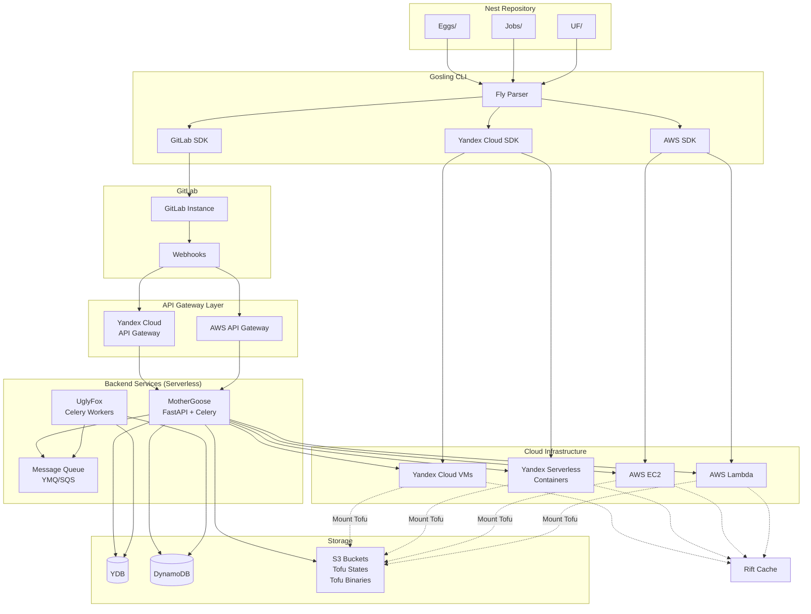
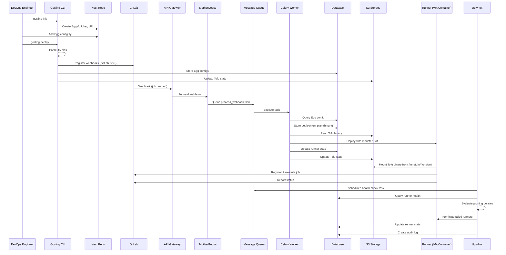

# Design Document

## Overview

The Polar Gosling GitOps Runner Orchestration system is a multi-cloud CI/CD runner management platform that uses a GitOps approach to provision and manage GitLab runners dynamically. The system consists of:

1. **Gosling CLI** - A Go-based command-line tool for bootstrapping Nest repositories, deploying resources, and managing GitLab Runner Agents (runner mode)
2. **Fly Language** - A custom DSL for declarative configuration with stronger typing than HCL
3. **MotherGoose Backend** - Python FastAPI + Celery serverless application for webhook handling and runner orchestration
4. **UglyFox Backend** - Python Celery workers for runner lifecycle management and pruning
5. **Rift Server** - Optional remote Docker context and artifact caching server
6. **Runners** - Serverless containers (60-minute limit) or autoscaling VMs (persistent agents) running Gosling CLI in runner mode

The system supports deployment to Yandex Cloud and AWS using native Go SDKs, with GitLab integration via the official GitLab Go SDK (gitlab.com/gitlab-org/api/client-go).

**Key Architectural Decisions**:

- **Serverless Backends**: MotherGoose and UglyFox run as serverless functions (Yandex Cloud Functions / AWS Lambda) for cost efficiency and automatic scaling
- **Event-Driven Processing**: Celery task queue enables asynchronous, scalable job processing triggered by webhooks and scheduled events
- **API Gateway**: All backend access goes through API Gateway (Yandex Cloud API Gateway / AWS API Gateway) with OpenAPI specifications and function-level authentication
- **State Management**: OpenTofu states stored exclusively in S3 buckets with state locking via DynamoDB/YDB
- **Deployment Plans**: Binary deployment plans stored in DynamoDB/YDB for proper rollback without re-planning
- **Binary Management**: OpenTofu binaries stored in S3 and mounted to runners at `/mnt/tofu/{version}` with version management and checksum verification
- **Message Queue Scaling**: Celery workers scale automatically based on message queue depth (YMQ for Yandex Cloud / SQS for AWS)
- **Runner Agent Management**: Gosling CLI runner mode manages GitLab Runner Agent lifecycle, version synchronization with Egg's GitLab server, and health metrics reporting
- **Metrics-Based Pruning**: UglyFox uses runner health metrics from database to make intelligent pruning decisions

## Architecture

### High-Level Architecture



### Component Interaction Flow



## Components and Interfaces

### Project Structure

The system is organized across multiple workspace directories:

```
Polar-Gosling/                          # Gosling CLI project
├── cmd/
│   └── gosling/
│       └── main.go
├── internal/
│   ├── parser/                         # Fly language parser
│   ├── deployer/                       # Cloud deployment logic
│   ├── runner/                         # Runner mode implementation
│   └── gitlab/                         # GitLab integration
├── Dockerfile                          # Container image for serverless runners
├── go.mod
├── go.sum
└── README.md

Polar-Gosling-MotherGoose/              # MotherGoose backend
├── mothergoose/
│   ├── src/
│   │   └── app/
│   │       ├── api/
│   │       ├── services/
│   │       ├── model/
│   │       ├── schema/
│   │       └── templates/              # Jinja2 templates
│   ├── tests/
│   ├── pyproject.toml                  # Project config including tox configuration
│   └── uv.lock
├── Dockerfile                          # Container image for serverless deployment
└── README.md

Polar-Gosling-Compute-Module/          # OpenTofu compute module
├── aws_resources.tf
├── yc_resources.tf
├── variables.tf
└── README.md
```

**Gosling CLI Dockerfile**:
```dockerfile
FROM golang:1.21-alpine AS builder

WORKDIR /app
COPY go.mod go.sum ./
RUN go mod download

COPY . .
RUN CGO_ENABLED=0 GOOS=linux go build -o gosling ./cmd/gosling

FROM alpine:latest
RUN apk --no-cache add ca-certificates git

# Copy Gosling CLI binary
COPY --from=builder /app/gosling /usr/local/bin/gosling

# Pre-install GitLab Runner Agent
ADD https://gitlab-runner-downloads.s3.amazonaws.com/latest/binaries/gitlab-runner-linux-amd64 /usr/local/bin/gitlab-runner
RUN chmod +x /usr/local/bin/gitlab-runner

# Pre-install OpenTofu (mounted from S3 at runtime)
RUN mkdir -p /mnt/tofu_binary

ENTRYPOINT ["/usr/local/bin/gosling", "runner"]
```

**MotherGoose Dockerfile**:
```dockerfile
FROM python:3.13-slim

WORKDIR /app

# Install uv for fast package management
RUN pip install uv

# Copy dependency files
COPY pyproject.toml uv.lock ./

# Install dependencies using uv
RUN uv sync --frozen

# Copy application code
COPY mothergoose/ ./mothergoose/

# Run FastAPI application
CMD ["uv", "run", "uvicorn", "mothergoose.src.app.main:app", "--host", "0.0.0.0", "--port", "8000"]
```

**Python Version Testing with tox**:

Tox configuration is defined in `pyproject.toml` under the `[tool.tox]` section, not in a separate `tox.ini` file:

```toml
# pyproject.toml
[project]
requires-python = ">=3.10,<3.14"

[tool.tox]
env_list = [
    "3.10",
    "3.11",
    "3.12",
    "3.13",
    "format",
    "type",
    "style",
]
skip_missing_interpreters = true

[tool.tox.env_run_base]
description = "Run tests under {base_python}"
dependency_groups = ["test"]
commands = [["pytest"]]
```

This configuration supports Python 3.10, 3.11, 3.12, and 3.13 for comprehensive compatibility testing.

### 1. Gosling CLI

**Technology**: Go 1.21+

**Project Location**: `Polar-Gosling/` workspace directory (separate from MotherGoose)

**Purpose**: Bootstrap Nest repositories, parse .fly configurations, and deploy resources using native cloud SDKs.

**Docker Support**: Includes Dockerfile for containerized deployment (serverless runners)

**Key Packages**:
- `github.com/yandex-cloud/go-sdk` - Yandex Cloud Go SDK
- `github.com/aws/aws-sdk-go-v2` - AWS SDK for Go v2
- `gitlab.com/gitlab-org/api/client-go` - Official GitLab Go SDK
- `github.com/hashicorp/hcl/v2` - HCL parser (base for .fly parser)
- `github.com/spf13/cobra` - CLI framework

**Commands**:
```go
gosling init [--path PATH]              // Initialize Nest repository
gosling add egg NAME [--type vm|serverless]  // Add Egg configuration
gosling add job NAME                    // Add Job definition
gosling validate                        // Validate .fly files
gosling deploy [--dry-run]              // Deploy resources
gosling rollback [--to VERSION]         // Rollback deployment
gosling status                          // Show deployment status
gosling runner [--runner-id ID] [--egg-name NAME]  // Run in runner mode (manages GitLab Runner Agent)
```

**Runner Mode**:

The `gosling runner` command runs the Gosling CLI in runner mode, which manages the GitLab Runner Agent lifecycle on each runner VM/container. This mode:

1. **GitLab Runner Agent Management**:
   - Installs and configures GitLab Runner Agent
   - Updates agent version to match Egg's GitLab server version
   - Handles graceful shutdown via SIGTERM signal
   - Restarts agent on configuration changes

2. **Version Synchronization**:
   - Queries Egg configuration from database to determine target GitLab version
   - Downloads appropriate GitLab Runner Agent version
   - Performs rolling updates without job interruption
   - Verifies agent compatibility with GitLab server

3. **Health Metrics Reporting**:
   - Periodically sends runner health metrics to database (YDB/DynamoDB)
   - Metrics include:
     - Runner state (active, idle, busy)
     - Job execution count
     - Last heartbeat timestamp
     - Resource utilization (CPU, memory, disk)
     - Agent version
     - Failure count
   - UglyFox monitors these metrics for pruning decisions

4. **Signal Handling**:
   - SIGTERM: Graceful shutdown (finish current job, then terminate)
   - SIGHUP: Reload configuration and restart agent
   - SIGINT: Immediate shutdown (for emergency situations)

**Runner Mode Usage**:
```bash
# Start Gosling in runner mode
gosling runner --runner-id runner-abc123 --egg-name my-app

# With custom metrics interval
gosling runner --runner-id runner-abc123 --egg-name my-app --metrics-interval 30s

# With custom update check interval
gosling runner --runner-id runner-abc123 --egg-name my-app --update-check-interval 5m
```

**Systemd Service Configuration** (for runner mode):
```ini
[Unit]
Description=Gosling Runner Service
After=network.target

[Service]
Type=simple
ExecStart=/usr/local/bin/gosling runner --runner-id=%i --egg-name=${EGG_NAME}
Restart=on-failure
RestartSec=10
KillMode=mixed
KillSignal=SIGTERM
TimeoutStopSec=300

[Install]
WantedBy=multi-user.target
```

**Interfaces**:
```go
// FlyParser parses .fly configuration files
type FlyParser interface {
    Parse(path string) (*Config, error)
    Validate(config *Config) error
}

// CloudDeployer deploys resources to cloud providers
type CloudDeployer interface {
    DeployVM(ctx context.Context, config *VMConfig) (*VM, error)
    DeployServerless(ctx context.Context, config *ServerlessConfig) (*Container, error)
    Destroy(ctx context.Context, resourceID string) error
}

// GitLabClient manages GitLab integration
type GitLabClient interface {
    RegisterRunner(ctx context.Context, config *RunnerConfig) (*Runner, error)
    CreateWebhook(ctx context.Context, projectID int, config *WebhookConfig) error
    DeleteWebhook(ctx context.Context, projectID int, hookID int) error
}

// RunnerMode manages GitLab Runner Agent lifecycle (gosling runner command)
type RunnerMode interface {
    Run(ctx context.Context, runnerID, eggName string) error
    InstallAgent(version string) error
    UpdateAgent(targetVersion string) error
    StartAgent() error
    StopAgent(graceful bool) error
    ReportMetrics(ctx context.Context, metrics RunnerMetrics) error
}

type RunnerMetrics struct {
    RunnerID         string
    State            string
    JobCount         int
    LastHeartbeat    time.Time
    CPUUsage         float64
    MemoryUsage      float64
    DiskUsage        float64
    AgentVersion     string
    FailureCount     int
    LastJobTimestamp time.Time
}
```

### 2. Fly Language

**Syntax**: HCL-like with stronger typing

**Example Egg Configuration**:
```hcl
egg "my-app" {
  type = "vm"  // or "serverless"
  
  cloud {
    provider = "yandex"  // or "aws"
    region   = "ru-central1-a"
  }
  
  resources {
    cpu    = 2
    memory = 4096  // MB
    disk   = 20    // GB
  }
  
  runner {
    tags = ["docker", "linux"]
    concurrent = 3
    idle_timeout = "10m"
  }
  
  gitlab {
    project_id = 12345
    token_secret = "vault://gitlab/runner-token"
  }
  
  environment {
    DOCKER_DRIVER = "overlay2"
    CUSTOM_VAR    = "value"
  }
}
```

**Example Job Configuration**:
```hcl
job "rotate-secrets" {
  schedule = "0 2 * * *"  // Cron expression
  
  runner {
    type = "vm"
    tags = ["privileged"]
  }
  
  script = <<-EOT
    #!/bin/bash
    # Rotate GitLab runner tokens
    gosling rotate-tokens --all
  EOT
  
  on_failure {
    notify = ["ops@example.com"]
  }
}
```

**Example UglyFox Configuration**:
```hcl
uglyfox {
  pruning {
    failed_threshold = 3
    max_age = "24h"
    check_interval = "5m"
  }
  
  apex {
    max_count = 10
    min_count = 2
  }
  
  nadir {
    max_count = 5
    idle_timeout = "30m"
  }
  
  policies {
    rule "terminate_old_failed" {
      condition = "failed_count >= 3 AND age > 1h"
      action    = "terminate"
    }
    
    rule "demote_idle" {
      condition = "state == 'apex' AND idle_time > 30m"
      action    = "demote_to_nadir"
    }
  }
}
```

**Grammar Specification**:
```ebnf
config       = block+
block        = identifier string "{" attribute* block* "}"
attribute    = identifier "=" value
value        = string | number | boolean | list | map
list         = "[" (value ("," value)*)? "]"
map          = "{" (identifier "=" value)* "}"
string       = quoted_string | heredoc
number       = integer | float
boolean      = "true" | "false"
identifier   = [a-zA-Z_][a-zA-Z0-9_]*
```

### 3. MotherGoose Backend

**Technology**: Python 3.10-3.13, FastAPI, Celery

**Python Version Compatibility**: Supports Python 3.10, 3.11, 3.12, and 3.13 for better extension compatibility

**Development Tools**:
- `tox` - Testing across multiple Python versions (configured in pyproject.toml, not tox.ini)
- `uv` - Fast Python package installer and resolver (required)
- `pytest` - Testing framework
- `mypy` - Static type checking

**Note**: Tox configuration is defined in `pyproject.toml` under `[tool.tox]` section rather than a separate `tox.ini` file. This provides a single source of truth for all project configuration.

**Deployment**: Serverless (Yandex Cloud Functions / AWS Lambda)

**Purpose**: Receive webhooks, orchestrate runner deployment, track state.

**Architecture**:
- **API Layer**: FastAPI application behind API Gateway (Yandex Cloud API Gateway / AWS API Gateway)
- **Job Processing**: Celery workers for event-driven task execution
- **Message Queue**: YMQ (Yandex Cloud) / SQS (AWS) for Celery task distribution
- **Scaling**: Event-driven autoscaling based on message queue depth

**API Gateway Configuration**:
- OpenAPI specification defines endpoints
- Function-level authentication configuration
- Direct connection to DynamoDB (AWS) / YDB (Yandex Cloud)
- Request/response transformation
- Rate limiting and throttling

**Key Dependencies**:
- `fastapi` - Web framework
- `celery` - Distributed task queue
- `pydantic` - Data validation
- `aioboto3` - Async AWS SDK (for DynamoDB, S3, SQS)
- `ydb` - Yandex Database async driver
- `jinja2` - Template rendering (existing)
- `tofupy` - OpenTofu Python wrapper (existing)
- `boto3` - AWS SDK (SQS for AWS, YMQ uses SQS-compatible API)

**Database Operations**:
- All database operations are async using `AsyncYDBOperations` (YDB) or `aioboto3` (DynamoDB)
- Prepared/parameterized queries for security and performance
- Connection pooling for efficient resource usage

**API Endpoints**:
```python
POST   /webhooks/gitlab          # Receive GitLab webhooks (triggers Celery task)
GET    /runners                  # List all runners
GET    /runners/{id}             # Get runner details
POST   /runners                  # Manually create runner (triggers Celery task)
DELETE /runners/{id}             # Terminate runner (triggers Celery task)
GET    /eggs                     # List Egg configurations
GET    /eggs/{name}              # Get Egg details
POST   /jobs/{name}/trigger      # Trigger self-management job (triggers Celery task)
GET    /health                   # Health check
```

**Celery Tasks**:
```python
@celery.task
def process_webhook(webhook_payload: dict):
    """Process GitLab webhook and provision runner"""
    pass

@celery.task
def deploy_runner(egg_name: str, runner_config: dict):
    """Deploy runner to cloud provider"""
    pass

@celery.task
def terminate_runner(runner_id: str):
    """Terminate runner and clean up resources"""
    pass

@celery.task
def execute_self_management_job(job_name: str):
    """Execute self-management job"""
    pass
```

**Data Models**:
```python
class RunnerState(str, Enum):
    PROVISIONING = "provisioning"
    ACTIVE = "active"
    IDLE = "idle"
    FAILED = "failed"
    TERMINATED = "terminated"

class RunnerType(str, Enum):
    VM = "vm"
    SERVERLESS = "serverless"

class Runner(BaseModel):
    id: str
    egg_name: str
    type: RunnerType
    state: RunnerState
    cloud_provider: str
    region: str
    gitlab_runner_id: int
    created_at: datetime
    last_heartbeat: datetime
    failure_count: int
    metadata: Dict[str, Any]

class EggConfig(BaseModel):
    name: str
    type: RunnerType
    cloud: CloudConfig
    resources: ResourceConfig
    runner: RunnerConfig
    gitlab: GitLabConfig
    environment: Dict[str, str]

class TofuBackendS3Options(BaseModel):
    """S3 backend configuration for OpenTofu state"""
    bucket: str
    key: str
    region: str
    endpoint: Optional[str]        # For Yandex Cloud S3-compatible storage
    profile: Optional[str]
    role_arn: Optional[str]
    dynamodb_table: Optional[str]  # For state locking

class TofuProvidersVer(BaseModel):
    """Provider version constraints"""
    name: str      # e.g., "aws", "yandex"
    version: str   # e.g., "~> 5.0", ">= 1.0.0"
    source: str    # e.g., "hashicorp/aws"

class OpenTofuBinFileInfo(BaseModel):
    """Binary file metadata"""
    bin_version: str   # Semantic version
    bin_sha256: str    # SHA256 checksum
    bin_url: str       # Download URL
```

### 4. UglyFox Backend

**Technology**: Python 3.11-3.13, Celery

**Python Version Compatibility**: Supports Python 3.11, 3.12, and 3.13 for better extension compatibility

**Development Tools**:
- `tox` - Testing across multiple Python versions (required)
- `uv` - Fast Python package installer and resolver (required)

**Deployment**: Serverless (Yandex Cloud Functions / AWS Lambda)

**Purpose**: Monitor runner health, prune failed runners, manage Apex/Nadir transitions.

**Architecture**:
- **Scheduled Tasks**: Celery Beat for periodic health checks
- **Event-Driven**: Triggered by runner state changes via message queue
- **API Access**: Via API Gateway (same as MotherGoose)

**Key Components**:
```python
class PruningPolicy:
    def evaluate(self, runner: Runner) -> PruningAction:
        """Evaluate if runner should be pruned"""
        pass

class LifecycleManager:
    async def check_runners(self):
        """Periodically check runner health"""
        pass
    
    async def apply_policies(self, runner: Runner):
        """Apply pruning policies to runner"""
        pass
    
    async def transition_state(self, runner: Runner, new_state: RunnerState):
        """Transition runner between Apex/Nadir"""
        pass
```

**Celery Tasks**:
```python
@celery.task
def check_runner_health():
    """Periodic task to check all runner health"""
    pass

@celery.task
def prune_failed_runners():
    """Evaluate and terminate failed runners"""
    pass

@celery.task
def manage_apex_nadir_pools():
    """Balance Apex and Nadir runner pools"""
    pass
```

### 5. Rift Server

**Technology**: Go 1.21+

**Purpose**: Provide remote Docker context and artifact caching.

**Key Features**:
- Docker API proxy
- Artifact caching (layers, images, build contexts)
- Authentication via runner tokens
- Cache eviction based on LRU and size limits

**Interfaces**:
```go
type CacheServer interface {
    GetArtifact(ctx context.Context, key string) (io.ReadCloser, error)
    PutArtifact(ctx context.Context, key string, data io.Reader) error
    Evict(ctx context.Context, policy EvictionPolicy) error
}

type DockerProxy interface {
    ProxyRequest(ctx context.Context, req *http.Request) (*http.Response, error)
    AuthenticateRunner(ctx context.Context, token string) (bool, error)
}
```

### 6. Runner Deployment Strategies

**VM Runners**:

VM runners are configured using cloud-init scripts generated from Jinja2 templates.

**Cloud-Init Template** (`yc-vm-deb-cloud-init-gitlab-docker-yml.tpl`):
```yaml
#cloud-config
groups:
- docker

users:
- name: ${useros}
  groups:
    - sudo
    - docker
  shell: /bin/bash
  sudo: ['ALL=(ALL) NOPASSWD:ALL']
  ssh-authorized-keys:
    - ${adm_pub_key}
- name: gitlab-runner
  groups: docker

package_upgrade: false
package_update: true

# Install required packages
packages:
  - docker.io
  - git
  - curl

# Download and install Gosling CLI
runcmd:
  - curl -L https://s3.../gosling-${version}-linux-amd64 -o /usr/local/bin/gosling
  - chmod +x /usr/local/bin/gosling
  - systemctl enable gosling-runner@${runner_id}
  - systemctl start gosling-runner@${runner_id}
```

**VM Setup Process**:
1. OpenTofu provisions VM using Compute Module
2. Cloud-init script runs on first boot
3. Installs Docker, Git, and dependencies
4. Downloads Gosling CLI binary from S3
5. Configures systemd service for `gosling runner` mode
6. Starts Gosling runner service
7. Gosling runner installs and manages GitLab Runner Agent
8. Reports health metrics to database

**Serverless Runners**:

Serverless runners use pre-built container images with all binaries pre-installed.

**Container Image Structure**:
```dockerfile
FROM debian:bookworm-slim

# Pre-install all required binaries
RUN apt-get update && apt-get install -y \
    docker.io \
    git \
    curl \
    ca-certificates

# Copy pre-built Gosling CLI
COPY gosling /usr/local/bin/gosling
RUN chmod +x /usr/local/bin/gosling

# Copy pre-built GitLab Runner Agent
COPY gitlab-runner /usr/local/bin/gitlab-runner
RUN chmod +x /usr/local/bin/gitlab-runner

# Copy OpenTofu binary
COPY tofu /usr/local/bin/tofu
RUN chmod +x /usr/local/bin/tofu

# Set entrypoint to Gosling runner mode
ENTRYPOINT ["/usr/local/bin/gosling", "runner"]
CMD ["--runner-id", "${RUNNER_ID}", "--egg-name", "${EGG_NAME}"]
```

**Serverless Setup Process**:
1. MotherGoose triggers serverless container deployment
2. Container starts with pre-installed binaries
3. Gosling runner mode starts immediately (no installation needed)
4. Registers with GitLab and executes job
5. Reports metrics to database
6. Container terminates after job completion or 60-minute timeout

**Key Differences**:

| Aspect | VM Runners | Serverless Runners |
|--------|-----------|-------------------|
| **Setup Time** | ~2-3 minutes (cloud-init) | ~10-30 seconds (pre-built image) |
| **Binary Installation** | Downloaded at runtime via cloud-init | Pre-installed in container image |
| **Lifecycle** | Long-lived, persistent | Ephemeral, 60-minute max |
| **Cost** | Pay for uptime | Pay per execution |
| **Use Case** | Long-running jobs, persistent cache | Short jobs, burst workloads |
| **Gosling Runner** | Systemd service | Container entrypoint |
| **Updates** | In-place via Gosling runner | New container image deployment |

## Data Models

### OpenTofu State Management

**State Storage**:
- All OpenTofu state files stored in S3 buckets (both Yandex Cloud and AWS)
- State locking via DynamoDB (AWS) / YDB (Yandex Cloud)
- Versioned state files for rollback capability

**Deployment Plan Storage**:
- Deployment plans stored as binary in DynamoDB / YDB
- Each plan includes:
  - Target runner/Rift configuration
  - OpenTofu plan output
  - Timestamp and version
  - Rollback metadata
- Plans enable proper rollback without re-planning

**S3 Bucket Structure**:
```
s3://polar-gosling-state/
├── tofu-states/
│   ├── {egg_name}/
│   │   └── terraform.tfstate
│   └── rift/
│       └── terraform.tfstate
├── tofu-binaries/
│   ├── 1.6.0/
│   │   └── tofu (or tofu.exe)
│   ├── 1.6.1/
│   │   └── tofu (or tofu.exe)
│   └── latest/
│       └── tofu (or tofu.exe)
└── tofu-cache/
    ├── terraform-plugins/
    │   ├── {provider}/{version}/
    │   │   └── terraform-provider-{name}_{version}_{os}_{arch}.zip
    │   └── lock.json
    ├── modules/
    │   ├── compute-module/
    │   │   └── {version}/
    │   └── lock.json
    └── .terraform/
        └── {egg_name}/
            ├── providers/
            └── modules/
```

**Note**: SHA256 checksums are stored in the database (YDB/DynamoDB) rather than as separate files in S3. The `tofu-cache/` directory stores provider plugins, modules, and `.terraform` directories to avoid re-downloading when version constraints match.

### OpenTofu Binary Management

**Existing Implementation**: The system includes a comprehensive module for OpenTofu binary management located in `app/services/opentofu_binary.py`.

**Binary Storage**:
- OpenTofu binaries stored in S3 bucket (configurable path)
- Default mount path: `/mnt/tofu_binary/{version}/`
- Each version includes:
  - `tofu` - The OpenTofu binary (or `tofu.exe` on Windows)
  - SHA256 checksum for verification

**Binary Sources**:
1. **GitHub Releases** (`OpenTofuDownloadGithub`):
   - Downloads from official OpenTofu GitHub releases
   - Automatically fetches SHA256 checksums from release assets
   - Supports latest version detection via GitHub API

2. **Other Sources** (`OpenTofuDownloadFromOtherSource`):
   - Downloads from custom URLs (e.g., private artifact repositories)
   - Supports authentication (token-based, bearer tokens, custom headers)
   - Requires manual SHA256 checksum specification

**Version Management Classes**:

```python
class OpenTofuBinFileInfo:
    """Binary file information"""
    bin_version: str      # Semantic version (e.g., "1.6.0")
    bin_sha256: str       # SHA256 checksum (64 hex chars)
    bin_url: str          # Download URL

class OpenTofuVersionTableYDB:
    """YDB table schema for version tracking"""
    columns: (
        "version_id",      # Generated hash ID
        "version",         # Version string
        "source",          # "github" or "other"
        "downloaded_at",   # ISO timestamp
        "sha256_hash",     # Binary checksum
        "active",          # Boolean - currently active version
    )

class OpenTofuUpdateGithub:
    """Update manager for GitHub source"""
    - get_current_version() -> (version_id, version, sha256)
    - download_available_versions() -> list[str]
    - check_required_actions() -> bool
    - start_update(rb: int = 3) -> None  # rb = rollback factor (1-3)

class OpenTofuUpdateOtherSource:
    """Update manager for custom sources"""
    - Supports authentication via URLAuthSchema
    - Configurable rollback behavior
    - start_update(auth_url: URLAuthSchema, rb: int) -> None
```

**Update Process**:
1. Check current version from YDB/DynamoDB
2. Fetch latest version from source (GitHub API or custom)
3. Download and verify SHA256 checksum
4. Extract binary to `/mnt/tofu_binary/{version}/`
5. Set executable permissions (chmod 0o755)
6. Update database with new version (set active=True)
7. Download rollback versions (1-3 previous versions)
8. Store rollback versions in database (set active=False)

**Rollback Capability**:
- Maintains 1-3 previous versions for rollback
- Rollback versions stored but marked inactive
- Version selection via database query (active=True)

**Platform Support**:
- Linux: Downloads `.tar.gz`, extracts `tofu` binary
- Windows: Downloads `.zip`, extracts `tofu.exe` binary
- Architecture detection: x86_64/amd64 and arm64

**Configuration Integration** (`OpenTofuConfiguration`):
```python
class OpenTofuConfiguration:
    """Manages OpenTofu configuration and execution"""
    - Integrates with updater classes
    - Generates Terraform configuration from Jinja2 templates
    - Configures S3 backend for state storage
    - Sets up provider constraints
    - Manages workspace directory
```

**Jinja2 Template System**:

The system uses Jinja2 templates to generate comprehensive OpenTofu configurations. Templates are located in `app/templates/`:

1. **tofu_versions_tf.j2** - Terraform version and backend configuration
2. **tofu_providers_tf.j2** - Provider configurations (AWS, Yandex Cloud)
3. **tofu_variables_tf.j2** - Variable definitions
4. **tofu_data_tf.j2** - Data source definitions
5. **tofu_resources_tf.j2** - Resource definitions (VMs, networks, etc.)
6. **tofu_checks_tf.j2** - Health checks to verify all elements are reachable
7. **tofu_rc.j2** - OpenTofu CLI configuration
8. **yc-vm-deb-cloud-init-gitlab-docker-yml.tpl** - Cloud-init script for VM setup

**Template Rendering Process**:
```python
from jinja2 import Environment, FileSystemLoader

template_loader = FileSystemLoader(searchpath="./templates")
template_env = Environment(loader=template_loader)

# Render version and backend configuration
template = template_env.get_template("tofu_versions_tf.j2")
version_tf_output = template.render(
    tofu_version=updater.c_version[1],
    tofu_s3_bucket=backend_options.bucket,
    tofu_s3_key=backend_options.key,
    tofu_s3_region=backend_options.region,
    tofu_s3_endpoint=backend_options.endpoint,
    tofu_s3_role_arn=backend_options.role_arn,
    tofu_s3_dynamodb_table=backend_options.dynamodb_table,
    tofu_providers=providers,
)
```

**Health Checks Template** (`tofu_checks_tf.j2`):
- Verifies all cloud resources are reachable
- Checks network connectivity
- Validates IAM permissions
- Ensures compute resources are accessible
- Confirms storage buckets are available

**Artifact Caching in S3**:

To avoid downloading artifacts repeatedly, the system caches OpenTofu artifacts in S3:

```
s3://polar-gosling-cache/
├── terraform-plugins/
│   ├── {provider}/{version}/
│   │   └── terraform-provider-{name}_{version}_{os}_{arch}.zip
│   └── lock.json
├── modules/
│   ├── compute-module/
│   │   └── {version}/
│   └── lock.json
└── .terraform/
    └── {egg_name}/
        └── providers/
```

**Caching Strategy**:
1. **Provider Plugins**: Downloaded once per version, cached in S3
2. **Compute Module**: Versioned and cached in S3
3. **.terraform Directory**: Cached per Egg to avoid re-initialization
4. **Lock Files**: Stored in S3 to ensure version consistency

**Version Constraint Matching**:
- If version constraints match cached artifacts, use cached version
- Skip download and initialization steps
- Significantly reduces deployment time
- Ensures consistency across runner deployments

**Cache Invalidation**:
- When provider version constraints change
- When module versions are updated
- When lock file checksums don't match
- Manual cache clear via CLI command

**S3 Backend Configuration** (`TofuBackendS3Options`):
```python
class TofuBackendS3Options:
    bucket: str                    # S3 bucket name
    key: str                       # State file key/path
    region: str                    # AWS/YC region
    endpoint: Optional[str]        # Custom S3 endpoint (for YC)
    profile: Optional[str]         # AWS profile
    role_arn: Optional[str]        # IAM role ARN
    dynamodb_table: Optional[str]  # State locking table
```

**Provider Configuration** (`TofuProvidersVer`):
```python
class TofuProvidersVer:
    name: str      # Provider name (e.g., "aws", "yandex")
    version: str   # Version constraint (e.g., "~> 5.0")
    source: str    # Provider source (e.g., "hashicorp/aws")
```

### Database Schema (YDB/DynamoDB)

**Database Access Pattern**:
- **Async Drivers**: All database operations use async drivers for non-blocking I/O
  - YDB: `ydb` async driver with `AsyncYDBOperations`
  - DynamoDB: `aioboto3` async AWS SDK
- **Prepared Queries**: All queries use parameterized/prepared statements for security and performance
  - Prevents SQL injection
  - Enables query plan caching
  - Improves performance for repeated queries

**YDB Implementation**:
```python
# Async operations with prepared queries
operation = AsyncYDBOperations(
    schema,
    AsyncYDBFunctionsCollections.select_parameterized_query,
)
await operation.process(
    selected_columns=["version_id", "version", "sha256_hash"],
    searching_columns=["active", "source"],
    searching_values=[True, "github"],
)
```

**DynamoDB Implementation**:
```python
# Async operations with aioboto3
async with aioboto3.Session().resource('dynamodb') as dynamodb:
    table = await dynamodb.Table('runners')
    response = await table.query(
        KeyConditionExpression=Key('egg_name').eq(egg_name),
        FilterExpression=Attr('state').eq('active')
    )
```

**Runners Table**:
```
runners {
    id: string (PK)
    egg_name: string (GSI)
    type: string
    state: string (GSI)
    cloud_provider: string
    region: string
    gitlab_runner_id: int
    gitlab_runner_token: string (encrypted)
    created_at: timestamp
    updated_at: timestamp
    last_heartbeat: timestamp
    failure_count: int
    metadata: json
}
```

**Eggs Table**:
```
eggs {
    name: string (PK)
    config: json
    created_at: timestamp
    updated_at: timestamp
    version: int
}
```

**Jobs Table**:
```
jobs {
    name: string (PK)
    schedule: string
    last_run: timestamp
    next_run: timestamp
    status: string
    config: json
}
```

**Audit Log Table**:
```
audit_logs {
    id: string (PK)
    timestamp: timestamp (GSI)
    actor: string
    action: string
    resource_type: string
    resource_id: string
    details: json
}
```

**Deployment Plans Table**:
```
deployment_plans {
    id: string (PK)
    egg_name: string (GSI)
    plan_type: string  // "runner" or "rift"
    plan_binary: binary  // OpenTofu plan output
    config_hash: string
    created_at: timestamp
    applied_at: timestamp (nullable)
    status: string  // "pending", "applied", "rolled_back"
    rollback_plan_id: string (nullable)
    metadata: json
}
```

**OpenTofu Versions Table**:
```
tofu_versions {
    version_id: string (PK)        // Generated hash from sha256_hash + version + source
    version: string                // Semantic version (e.g., "1.6.0")
    source: string                 // "github" or "other"
    downloaded_at: string          // ISO timestamp
    sha256_hash: string            // SHA256 checksum of binary
    active: boolean                // Currently active version flag
}
```

**Note**: The `version_id` is generated using a decorator that hashes the combination of `sha256_hash`, `version`, and `source` to create a unique identifier.

**Runner Metrics Table**:
```
runner_metrics {
    runner_id: string (PK)
    timestamp: timestamp (SK)      // Sort key for time-series data
    state: string                  // "active", "idle", "busy", "failed"
    job_count: int                 // Total jobs executed
    cpu_usage: float               // CPU utilization percentage
    memory_usage: float            // Memory utilization percentage
    disk_usage: float              // Disk utilization percentage
    agent_version: string          // GitLab Runner Agent version
    failure_count: int             // Cumulative failure count
    last_job_timestamp: timestamp  // Last job execution time
}
```

**Note**: Runner Gosling Service reports metrics every 30 seconds. UglyFox queries this table to evaluate pruning policies.


## Correctness Properties

A property is a characteristic or behavior that should hold true across all valid executions of a system—essentially, a formal statement about what the system should do. Properties serve as the bridge between human-readable specifications and machine-verifiable correctness guarantees.

### Property 1: Fly Parser Round-Trip Consistency

*For any* valid .fly configuration AST, printing then parsing should produce an equivalent AST structure.

**Validates: Requirements 2.1, 2.4**

### Property 2: Fly Parser Type Error Detection

*For any* .fly configuration with type errors, the parser should return a descriptive error message containing the error location and type mismatch details.

**Validates: Requirements 2.5**

### Property 3: Fly Parser Nested Block Support

*For any* valid nested block structure in a .fly file, parsing should correctly represent the hierarchy in the resulting AST.

**Validates: Requirements 2.6**

### Property 4: Fly Parser Variable Interpolation

*For any* .fly configuration with variable references, parsing and evaluation should correctly substitute variable values.

**Validates: Requirements 2.7**

### Property 5: Nest Initialization Structure

*For any* Nest repository initialization, the resulting directory structure should contain Eggs/, Jobs/, and UF/ directories.

**Validates: Requirements 3.3**

### Property 6: Egg Configuration Validation

*For any* invalid .fly configuration file, the CLI validation should reject it before committing.

**Validates: Requirements 3.6**

### Property 7: CLI Mode Equivalence

*For any* CLI operation, executing in interactive mode and non-interactive mode with equivalent inputs should produce the same result.

**Validates: Requirements 3.7**

### Property 8: Fly to Cloud SDK Conversion

*For any* valid .fly Egg configuration, conversion to cloud SDK objects should produce objects that pass SDK validation.

**Validates: Requirements 3.9, 9.3**

### Property 9: Webhook Event Matching

*For any* webhook event and set of Egg configurations, the matching algorithm should return all Eggs whose project_id matches the webhook source.

**Validates: Requirements 4.3**

### Property 10: Runner Type Determination

*For any* job requirements, the runner type determination logic should select serverless for jobs under 60 minutes and VM for longer jobs.

**Validates: Requirements 4.4**

### Property 11: Runner State Persistence

*For any* runner state update, querying the database immediately after should return the updated state.

**Validates: Requirements 4.6, 14.1**

### Property 12: Serverless Runner Timeout Enforcement

*For any* serverless runner, execution should be terminated if it exceeds 60 minutes.

**Validates: Requirements 5.2**

### Property 13: Serverless Runner Cleanup

*For any* serverless runner that completes or times out, all associated cloud resources should be cleaned up within 5 minutes.

**Validates: Requirements 5.6**

### Property 14: Apex Pool Size Limits

*For any* Apex pool configuration with max_count N, the number of active runners should never exceed N.

**Validates: Requirements 6.7**

### Property 15: Nadir to Apex Promotion

*For any* Nadir runner, when job demand increases and Apex pool is below max_count, the runner should be promoted to Apex state.

**Validates: Requirements 6.5**

### Property 16: Apex to Nadir Demotion

*For any* Apex runner that is idle beyond the configured idle_timeout, the runner should be demoted to Nadir state.

**Validates: Requirements 6.6**

### Property 17: UglyFox Failure Threshold Termination

*For any* runner with failure_count >= configured failed_threshold, UglyFox should terminate the runner.

**Validates: Requirements 7.3**

### Property 18: UglyFox Age-Based Termination

*For any* runner with age > configured max_age, UglyFox should terminate the runner.

**Validates: Requirements 7.5**

### Property 19: UglyFox Audit Logging

*For any* lifecycle action performed by UglyFox, an audit log entry should be created in the database.

**Validates: Requirements 7.7**

### Property 20: Rift Cache Hit Behavior

*For any* artifact request where the artifact exists in cache, Rift should serve from cache without fetching from origin.

**Validates: Requirements 8.4**

### Property 21: Rift Authentication Enforcement

*For any* request to Rift without valid authentication, the request should be rejected with 401 Unauthorized.

**Validates: Requirements 8.6**

### Property 22: Rift Optional Dependency

*For any* runner configuration without Rift, the runner should successfully execute jobs without attempting to connect to Rift.

**Validates: Requirements 8.7**

### Property 23: Multi-Cloud Deployment Consistency

*For any* Egg configuration, deploying to Yandex Cloud and AWS should result in runners with equivalent behavior (same job execution results).

**Validates: Requirements 9.8**

### Property 24: Dry-Run Non-Modification

*For any* deployment operation in dry-run mode, no cloud resources should be created or modified.

**Validates: Requirements 10.8**

### Property 25: Deployment Rollback

*For any* failed deployment, executing rollback should restore the system to the previous deployment state.

**Validates: Requirements 10.9**

### Property 26: GitLab Webhook Event Support

*For any* GitLab webhook event of type push, merge_request, or pipeline, the system should process the event and trigger appropriate actions.

**Validates: Requirements 11.2**

### Property 27: Runner Tag-Based Routing

*For any* GitLab job with tags, the system should provision a runner that has all matching tags.

**Validates: Requirements 11.7**

### Property 28: Egg Config Update Propagation

*For any* Egg configuration update in Nest, runners provisioned after the update should use the new configuration.

**Validates: Requirements 12.6**

### Property 29: Environment Variable Injection

*For any* Egg configuration with environment variables, runners should have those variables set in their execution environment.

**Validates: Requirements 12.7**

### Property 30: Cron Job Scheduling

*For any* self-management job with a cron expression, the job should be executed at times matching the cron schedule.

**Validates: Requirements 13.7**

### Property 31: Database State Recovery

*For any* backend server restart, the system should restore all runner states from the database and continue operations.

**Validates: Requirements 14.6**

### Property 32: Database Transaction Atomicity

*For any* state update operation, either all changes should be committed or none should be committed (no partial updates).

**Validates: Requirements 14.7**

### Property 33: Webhook Authentication

*For any* webhook request without a valid shared secret, the request should be rejected with 403 Forbidden.

**Validates: Requirements 16.1**

### Property 34: Data Encryption at Rest

*For any* sensitive data (runner tokens, secrets) stored in the database, the data should be encrypted using AES-256 or stronger.

**Validates: Requirements 16.4**

### Property 35: Communication Encryption

*For any* communication between runners and backend servers, the connection should use TLS 1.3 or higher.

**Validates: Requirements 16.5**

## Error Handling

### Fly Parser Errors

**Syntax Errors**:
- Return error with line number, column, and description
- Include snippet of problematic code
- Suggest corrections when possible

**Type Errors**:
- Report expected vs actual types
- Include context about where type was inferred
- Provide examples of valid values

**Validation Errors**:
- List all validation failures (not just first)
- Include requirement that was violated
- Suggest valid alternatives

### Gosling CLI Errors

**File System Errors**:
- Check permissions before operations
- Provide clear error messages for missing files/directories
- Suggest corrective actions (e.g., "Run 'gosling init' first")

**Network Errors**:
- Retry transient failures with exponential backoff
- Distinguish between client and server errors
- Provide offline mode for operations that don't require network

**SDK Errors**:
- Wrap SDK errors with context about operation
- Include resource identifiers in error messages
- Log full error details for debugging

### MotherGoose Backend Errors

**Webhook Processing Errors**:
- Log webhook payload for debugging
- Return 200 OK to GitLab even if processing fails (to avoid retries)
- Queue failed webhooks for retry with exponential backoff

**Runner Deployment Errors**:
- Mark runner as FAILED in database
- Trigger UglyFox cleanup
- Emit metrics for deployment failures
- Notify operators if failure rate exceeds threshold

**Database Errors**:
- Retry transient errors (connection timeouts, throttling)
- Use circuit breaker pattern for persistent failures
- Fall back to read-only mode if writes fail
- Cache critical data in memory for resilience

**API Errors**:
- Return appropriate HTTP status codes
- Include error details in response body
- Log errors with request context
- Rate limit error responses to prevent abuse

### UglyFox Backend Errors

**Policy Evaluation Errors**:
- Log policy that failed to evaluate
- Skip problematic policy and continue with others
- Alert operators about policy errors
- Use safe defaults if policy is ambiguous

**Runner Termination Errors**:
- Retry termination with exponential backoff
- Mark runner as "pending termination" in database
- Escalate to operators if termination fails repeatedly
- Force termination after maximum retry attempts

### Rift Server Errors

**Cache Errors**:
- Fall back to origin if cache read fails
- Continue serving requests if cache write fails
- Log cache errors for monitoring
- Implement cache warming for critical artifacts

**Authentication Errors**:
- Return 401 for invalid tokens
- Rate limit authentication attempts
- Log authentication failures for security monitoring
- Support token rotation without downtime

### Runner Errors

**Registration Errors**:
- Retry registration with exponential backoff
- Report failure to MotherGoose after max retries
- Include GitLab error details in logs
- Support manual registration as fallback

**Job Execution Errors**:
- Report job failure to GitLab with logs
- Update runner state in MotherGoose
- Clean up job artifacts
- Increment failure counter for UglyFox

**Communication Errors**:
- Buffer status updates during network outages
- Retry with exponential backoff
- Fall back to polling if push fails
- Terminate runner if communication fails for extended period

## Testing Strategy

### Testing Framework and Infrastructure

**Framework**: pytest 8.4.1+

**Test Containers**: All integration tests use Testcontainers 4.12.0+ for isolated, reproducible test environments:
- **YDB**: Custom YDB testcontainer implementation (see `tests/conftest.py`)
- **DynamoDB**: LocalStack testcontainer for AWS DynamoDB emulation
- **S3**: LocalStack testcontainer for S3 storage emulation

**YDB Testcontainer Implementation**:
```python
@pytest.fixture(scope="session", name="ydb_container")
def ydb_container():
    """Custom YDB testcontainer fixture"""
    image = "ydbplatform/local-ydb:latest"
    grpc_port = 2136
    with (
        DockerContainer(image, hostname="localhost")
        .with_name("ydb-test-container")
        .with_bind_ports(grpc_port, grpc_port)
        .with_env("YDB_USE_IN_MEMORY_PDISKS", "true")
        .with_env("GRPC_PORT", str(grpc_port)) as container
    ):
        time.sleep(30)  # Wait for container initialization
        yield container
```

**Key Testing Dependencies**:
- `pytest>=8.3.5` - Test framework
- `pytest-asyncio>=1.1.0` - Async test support
- `pytest-dependency>=0.6.0` - Test dependency management
- `testcontainers>=4.12.0` - Container-based test infrastructure
- `requests-mock>=1.12.1` - HTTP request mocking

### Dual Testing Approach

The system will use both unit tests and property-based tests to ensure comprehensive coverage:

- **Unit tests**: Verify specific examples, edge cases, and error conditions
- **Property tests**: Verify universal properties across all inputs

Both approaches are complementary and necessary. Unit tests catch concrete bugs in specific scenarios, while property tests verify general correctness across a wide input space.

### Property-Based Testing Configuration

**Framework Selection**:
- **Go components** (Gosling CLI, Rift): Use `gopter` (github.com/leanovate/gopter)
- **Python components** (MotherGoose, UglyFox): Use `hypothesis` (hypothesis.readthedocs.io)

**Test Configuration**:
- Minimum 100 iterations per property test
- Each property test must reference its design document property
- Tag format: `Feature: gitops-runner-orchestration, Property {number}: {property_text}`

**Example Property Test (Go)**:
```go
// Feature: gitops-runner-orchestration, Property 1: Fly Parser Round-Trip Consistency
func TestFlyParserRoundTrip(t *testing.T) {
    properties := gopter.NewProperties(nil)
    
    properties.Property("parse then print preserves structure", 
        prop.ForAll(
            func(ast *FlyAST) bool {
                printed := ast.Print()
                parsed, err := Parse(printed)
                if err != nil {
                    return false
                }
                return ast.Equals(parsed)
            },
            genValidFlyAST(),
        ))
    
    properties.TestingRun(t, gopter.ConsoleReporter(false))
}
```

**Example Property Test (Python)**:
```python
# Feature: gitops-runner-orchestration, Property 11: Runner State Persistence
@given(runner_state=st.sampled_from(RunnerState))
def test_runner_state_persistence(runner_state):
    """For any runner state update, querying immediately after should return updated state"""
    runner_id = create_test_runner()
    
    # Update state
    update_runner_state(runner_id, runner_state)
    
    # Query state
    retrieved_state = get_runner_state(runner_id)
    
    assert retrieved_state == runner_state
```

### Unit Testing Strategy

**Focus Areas**:
- Specific examples demonstrating correct behavior
- Edge cases (empty inputs, boundary values, null/None)
- Error conditions (invalid inputs, network failures, timeouts)
- Integration points between components

**Coverage Goals**:
- 80%+ line coverage for business logic
- 100% coverage for critical paths (authentication, state transitions)
- All error handlers must have tests

**Existing Test Structure**:
```
tests/
├── conftest.py              # Shared fixtures (YDB, DynamoDB, LocalStack)
├── unit/
│   ├── test_download_and_update_opentofu.py
│   └── test_configure_opentofu.py
└── integrations/
    └── (integration tests)
```

### Component-Specific Testing

**Gosling CLI**:
- Unit tests for each command
- Property tests for parser round-trip
- Property tests for SDK conversion
- Integration tests with Testcontainers (LocalStack for AWS/YC emulation)
- End-to-end tests with real Nest repository

**MotherGoose Backend**:
- Unit tests for webhook handlers
- Property tests for event matching
- Property tests for runner type determination
- Integration tests with YDB/DynamoDB testcontainers
- Load tests for webhook processing
- End-to-end tests with mocked GitLab webhooks

**UglyFox Backend**:
- Unit tests for policy evaluation
- Property tests for state transitions
- Property tests for termination logic
- Integration tests with YDB/DynamoDB testcontainers
- Chaos tests (random failures, network partitions)

**Rift Server**:
- Unit tests for cache operations
- Property tests for cache hit behavior
- Property tests for authentication
- Load tests for concurrent requests
- Integration tests with Docker/Podman/nerdctl

**Runners**:
- Unit tests for registration logic
- Property tests for environment variable injection
- Integration tests with mocked GitLab
- End-to-end tests with real GitLab jobs

### Integration Testing with Testcontainers

**Database Tests**:
```python
@pytest.fixture(scope="module")
def ydb_schema(ydb_container):
    """YDB schema fixture using testcontainer"""
    config = YDBConfig(
        endpoint=f"grpc://{ydb_container.get_container_host_ip()}:{ydb_container.get_exposed_port(2136)}",
        database="/local",
        credentials=AnonymousCredentials(),
    )
    model = OpenTofuModelYDB(tables=[OpenTofuVersionTableYDB()])
    return YDBSchema(config=config, model=model)

@pytest.mark.asyncio
async def test_runner_state_persistence(ydb_schema):
    """Test runner state is persisted to YDB"""
    # Test implementation using ydb_schema fixture
```

**LocalStack Tests** (for AWS services):
```python
@pytest.fixture(scope="session")
def localstack_container():
    """LocalStack container for AWS service emulation"""
    with LocalStackContainer(image="localstack/localstack:latest") as container:
        yield container

def test_s3_state_storage(localstack_container):
    """Test OpenTofu state storage in S3"""
    # Test implementation using LocalStack S3
```

**Cross-Component Tests**:
- Nest → Gosling CLI → Cloud deployment (with LocalStack)
- GitLab webhook → MotherGoose → Runner provisioning (with YDB testcontainer)
- Runner failure → UglyFox → Cleanup (with YDB testcontainer)
- Runner → Rift → Artifact caching

**Multi-Cloud Tests**:
- Deploy same Egg to Yandex Cloud and AWS (using LocalStack)
- Verify equivalent behavior
- Test failover between clouds

### Performance Testing

**Load Tests**:
- 1000 concurrent webhook events
- 100 concurrent runner deployments
- 10,000 cache requests per second (Rift)

**Stress Tests**:
- Database connection exhaustion
- Memory limits
- Disk space exhaustion

**Endurance Tests**:
- 24-hour continuous operation
- Memory leak detection
- Resource cleanup verification

### Security Testing

**Authentication Tests**:
- Invalid webhook signatures
- Expired runner tokens
- Missing credentials

**Authorization Tests**:
- Cross-tenant access attempts
- Privilege escalation attempts

**Encryption Tests**:
- Verify TLS configuration
- Verify data encryption at rest
- Test certificate rotation

### Chaos Engineering

**Failure Injection**:
- Random runner failures
- Network partitions
- Database unavailability
- Cloud API throttling

**Recovery Tests**:
- Backend server crashes
- Database failover
- Cloud region outages

### Continuous Testing

**Pre-Commit**:
- Unit tests
- Linting
- Type checking

**CI Pipeline**:
- All unit tests
- Property tests (100 iterations)
- Integration tests with Testcontainers
- Security scans

**Nightly**:
- Property tests (1000 iterations)
- Load tests
- Chaos tests
- Multi-cloud tests

**Release**:
- Full test suite
- Performance benchmarks
- Security audit
- End-to-end scenarios
