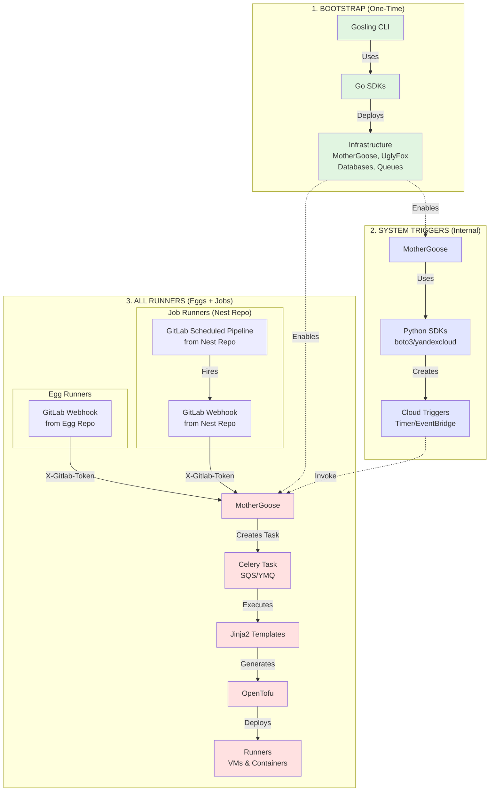
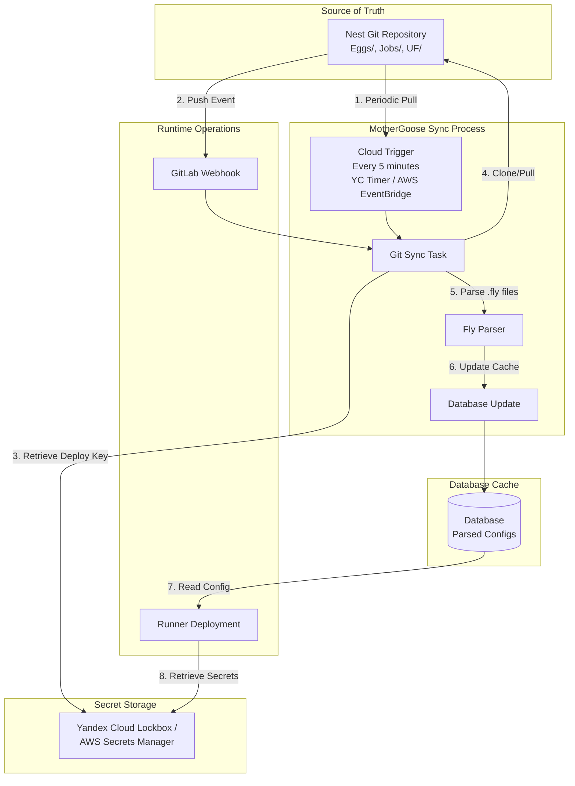
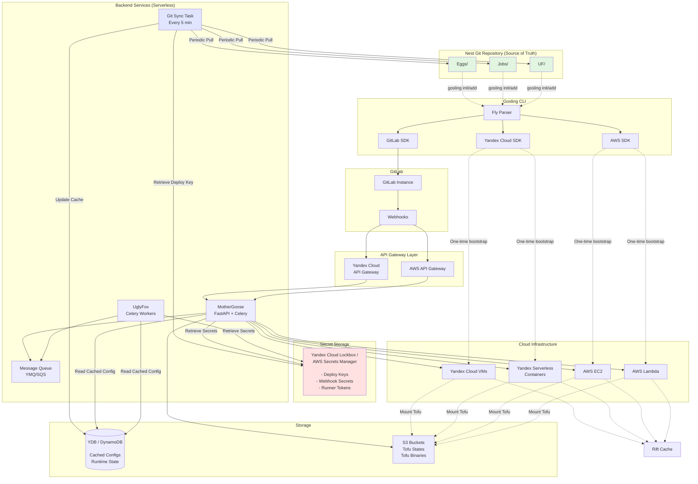
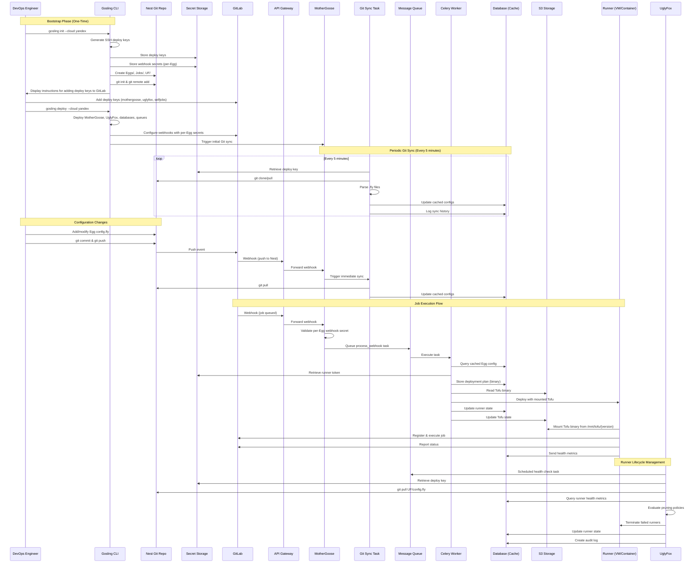

# Design Document

## Overview

The Polar Gosling GitOps Runner Orchestration system is a multi-cloud CI/CD runner management platform that uses a GitOps approach to provision and manage GitLab runners dynamically. The system consists of:

1. **Gosling CLI** - A Go-based command-line tool for bootstrapping Nest repositories, deploying resources, and managing GitLab Runner Agents (runner mode)
2. **Fly Language** - A custom DSL for declarative configuration with stronger typing than HCL
3. **MotherGoose Backend** - Python FastAPI + Celery serverless application for webhook handling and runner orchestration
4. **UglyFox Backend** - Python Celery workers for runner lifecycle management and pruning
5. **Rift Server** - Optional remote Docker context and artifact caching server
6. **Runners** - Serverless containers (60-minute limit) or autoscaling VMs (persistent agents) running Gosling CLI in runner mode

The system supports deployment to Yandex Cloud and AWS using native Go SDKs, with GitLab integration via the official GitLab Go SDK (gitlab.com/gitlab-org/api/client-go).

## Critical Architecture Distinction: Deployment Mechanisms

**IMPORTANT**: The system uses different deployment mechanisms for different purposes:

### 1. Bootstrap Phase (One-Time Setup) - Uses Go SDKs
- **Tool**: Gosling CLI
- **Mechanism**: Native Go SDKs (Yandex Cloud Go SDK, AWS SDK for Go v2)
- **Purpose**: Deploy MotherGoose, UglyFox, databases, message queues, API Gateway
- **Frequency**: Once during initial setup, rarely updated
- **Command**: `gosling deploy --cloud yandex`

### 2. System Triggers (Internal Operations) - Uses Python SDKs
- **Tool**: MotherGoose Backend
- **Mechanism**: Python SDKs (boto3 for AWS, yandexcloud for Yandex Cloud)
- **Purpose**: Create cloud triggers for internal system operations (git-sync, health checks)
- **Frequency**: During bootstrap, updated when trigger configuration changes
- **Examples**: Timer Triggers (Yandex Cloud), EventBridge Scheduler (AWS)
- **Note**: LIMITED to internal system operations only

### 3. ALL Runners (Eggs AND Jobs) - Uses OpenTofu
- **Tool**: MotherGoose Backend
- **Mechanism**: OpenTofu with Jinja2 templates
- **Purpose**: Deploy runners for ALL GitLab projects (both Eggs and Nest repo Jobs)
- **Frequency**: Continuously, triggered by GitLab webhooks
- **Process**: GitLab Webhook (X-Gitlab-Token) → MotherGoose → Celery Task (SQS/YMQ) → OpenTofu → Deploy Runner

**Key Insight: Jobs Folder**
- Jobs folder creates GitLab scheduled pipelines + runner tokens + webhooks for Nest repository
- When Nest pipeline fires → GitLab webhook → MotherGoose → Celery → OpenTofu (same as Eggs!)
- Jobs use the SAME OpenTofu deployment mechanism as Eggs, not a separate "self-runner" system

**Job Runner Constraints**:
- **Time Limit**: 10 minutes maximum execution time (vs 60 minutes for Egg serverless runners)
- **No Rift Access**: Job runners cannot use Rift servers for caching
- **Purpose**: Lightweight self-management tasks only (secret rotation, config updates)

**Why This Separation?**
- **Bootstrap (Go SDKs)**: Type-safe, idiomatic code for complex one-time infrastructure setup
- **System Triggers (Python SDKs)**: Simple cloud-native service configuration for internal operations
- **All Runners (OpenTofu)**: Unified declarative infrastructure for ALL GitLab runners (Eggs + Jobs)

**Deployment Flow Diagram**:



**Key Architectural Decisions**:

- **True GitOps Architecture**: Nest Git repository is the single source of truth for all configuration; database stores only runtime state
- **Periodic Git Sync**: MotherGoose periodically clones/pulls Nest repo (every 5 minutes via cloud triggers: Yandex Cloud Timer Trigger / AWS EventBridge Scheduler) to sync configurations to database cache
- **Event-Driven Sync**: GitLab webhooks trigger immediate Git sync on push events to Nest repository
- **Zero Secrets in Config**: All secrets stored in cloud secret managers (Yandex Cloud Lockbox / AWS Secrets Manager); configurations contain only secret URI references
- **Per-Egg Webhook Secrets**: Each Egg has its own webhook secret for security isolation and independent rotation
- **Deploy Key Authentication**: MotherGoose, UglyFox, and SelfJobs use SSH deploy keys stored in secret manager to access Nest repository
- **Serverless Backends**: MotherGoose and UglyFox run as serverless functions (Yandex Cloud Functions / AWS Lambda) for cost efficiency and automatic scaling
- **Event-Driven Processing**: Celery task queue enables asynchronous, scalable job processing triggered by webhooks and scheduled events
- **API Gateway**: All backend access goes through API Gateway (Yandex Cloud API Gateway / AWS API Gateway) with OpenAPI specifications and function-level authentication
- **Database as Cache**: Database caches parsed .fly configurations from Git for fast runtime access; Git remains authoritative
- **State Management**: OpenTofu states stored exclusively in S3 buckets with state locking via DynamoDB/YDB
- **Deployment Plans**: Binary deployment plans stored in DynamoDB/YDB for proper rollback without re-planning
- **Binary Management**: OpenTofu binaries stored in S3 and mounted to runners at `/mnt/tofu/{version}` with version management and checksum verification
- **Message Queue Scaling**: Celery workers scale automatically based on message queue depth (YMQ for Yandex Cloud / SQS for AWS)
- **Runner Agent Management**: Gosling CLI runner mode manages GitLab Runner Agent lifecycle, version synchronization with Egg's GitLab server, and health metrics reporting
- **Metrics-Based Pruning**: UglyFox uses runner health metrics from database to make intelligent pruning decisions

## Common Misconceptions

### Misconception 1: "Cloud SDKs are used for runner deployment"
**Reality**: Cloud SDKs are used for TWO specific purposes ONLY:
- **Go SDKs**: One-time bootstrap infrastructure deployment (MotherGoose, UglyFox, databases, queues)
- **Python SDKs**: System trigger creation (Timer Triggers, EventBridge) for internal operations

**ALL runner deployment (Eggs AND Jobs) uses OpenTofu**, not cloud SDKs.

### Misconception 2: "Jobs folder uses special self-runners"
**Reality**: Jobs folder uses the SAME OpenTofu deployment mechanism as Eggs:
- Jobs folder creates GitLab scheduled pipelines + runner tokens + webhooks for Nest repo
- When Nest pipeline fires → GitLab webhook → MotherGoose → Celery → OpenTofu
- No separate "self-runner" system - it's all unified through OpenTofu

### Misconception 3: "Gosling CLI deploys runners"
**Reality**: Gosling CLI has two distinct modes:
- **Bootstrap mode** (`gosling deploy`): One-time infrastructure setup using Go SDKs
- **Runner mode** (`gosling runner`): Manages GitLab Runner Agent lifecycle on deployed runners

**MotherGoose deploys ALL runners** (Eggs + Jobs), not Gosling CLI.

### Misconception 4: "OpenTofu is only for state management"
**Reality**: OpenTofu is the PRIMARY and ONLY deployment mechanism for ALL runners:
- Generates infrastructure configurations from Jinja2 templates
- Provisions VMs and serverless containers for ALL GitLab projects (Eggs + Nest)
- Manages infrastructure state in S3
- Enables declarative, idempotent deployments

### Misconception 5: "The system uses Terraform"
**Reality**: The system uses **OpenTofu**, not Terraform. This avoids license issues with HashiCorp's BSL license change. Always refer to "OpenTofu" in documentation and code.
- IAM authentication and secret retrieval

**Runner deployment uses OpenTofu**, not cloud SDKs directly.

### Misconception 2: "Gosling CLI deploys runners"
**Reality**: Gosling CLI has two distinct modes:
- **Bootstrap mode** (`gosling deploy`): One-time infrastructure setup using Go SDKs
- **Runner mode** (`gosling runner`): Manages GitLab Runner Agent lifecycle on deployed runners

**MotherGoose deploys runners**, not Gosling CLI. MotherGoose uses OpenTofu with Jinja2 templates.

### Misconception 3: "OpenTofu is only for state management"
**Reality**: OpenTofu is the PRIMARY deployment mechanism for runners. It:
- Generates infrastructure configurations from Jinja2 templates
- Provisions VMs and serverless containers
- Manages infrastructure state in S3
- Enables declarative, idempotent deployments

### Misconception 4: "The system uses Terraform"
**Reality**: The system uses **OpenTofu**, not Terraform. This avoids license issues with HashiCorp's BSL license change. Always refer to "OpenTofu" in documentation and code.

## Architecture

### GitOps Architecture and Data Flow

The system follows a true GitOps architecture where the Nest Git repository is the single source of truth for all configuration.

#### Configuration vs State Separation

**Git Repository (Configuration - Source of Truth)**:
- Egg configurations (.fly files in `Eggs/` directory)
- Job definitions (.fly files in `Jobs/` directory)
- UglyFox policies (.fly file in `UF/` directory)
- Version history (via Git commits)
- **NO secrets** - only secret URI references

**Database (Runtime State - Cache)**:
- Parsed Egg configurations (synced from Git every 5 minutes)
- Runner status (provisioning, active, idle, terminated)
- Runner metrics (CPU, memory, disk, heartbeats)
- Deployment history (which Git commit deployed which runner)
- Audit logs (who did what, when)
- **NO secrets** - only secret URI references

**Secret Storage (Yandex Cloud Lockbox / AWS Secrets Manager)**:
- SSH deploy keys (private and public)
- Nest repository URL
- Per-Egg webhook secrets
- GitLab runner tokens
- Application API keys
- All sensitive credentials

#### GitOps Sync Flow



#### Periodic Sync (Cloud Triggers)

MotherGoose runs a scheduled task every 5 minutes via cloud-native triggers to sync Git → Database:

**Yandex Cloud**: Timer Trigger invokes `/internal/sync-git` endpoint every 5 minutes
**AWS**: EventBridge Scheduler rule invokes `/internal/sync-git` endpoint every 5 minutes

```python
@app.post("/internal/sync-git")
async def trigger_git_sync():
    """
    Endpoint invoked by cloud triggers for periodic Git sync
    
    Triggered by:
    - Yandex Cloud Timer Trigger (every 5 minutes)
    - AWS EventBridge Scheduler (every 5 minutes)
    """
    # Queue Celery task for async processing
    await sync_nest_config.apply_async()
    return {"status": "sync_queued"}

@celery.task
async def sync_nest_config():
    """
    Celery task to sync Nest Git repo to database cache
    """
    # 1. Retrieve deploy key from secret storage
    deploy_key = await secret_manager.get_secret(
        "yc-lockbox://deploy-keys/mothergoose-private"
    )
    nest_repo_url = await secret_manager.get_secret(
        "yc-lockbox://nest/repo-url"
    )
    
    # 2. Clone/Pull Nest repository
    repo = git.Repo.clone_from(
        nest_repo_url,
        '/tmp/nest',
        env={'GIT_SSH_COMMAND': f'ssh -i {deploy_key}'}
    )
    
    # 3. Parse all .fly files
    eggs = parse_eggs_directory('/tmp/nest/Eggs')
    jobs = parse_jobs_directory('/tmp/nest/Jobs')
    uf_config = parse_uf_config('/tmp/nest/UF/config.fly')
    
    # 4. Update database cache
    for egg in eggs:
        await db.upsert_egg_config(
            name=egg.name,
            config=egg,
            git_commit=repo.head.commit.hexsha,
            synced_at=datetime.now()
        )
    
    # 5. Log sync event
    await db.create_sync_history(
        git_commit=repo.head.commit.hexsha,
        changes_detected=detect_changes(eggs, jobs, uf_config),
        status='success'
    )
```

#### Event-Driven Sync (GitLab Webhook)

When changes are pushed to Nest repository, GitLab webhook triggers immediate sync:

```python
@app.post("/webhooks/gitlab")
async def handle_nest_webhook(webhook: GitLabWebhook):
    """
    Immediate sync on Git push to Nest repository
    """
    if webhook.project_id == NEST_PROJECT_ID and webhook.ref == "refs/heads/main":
        # Trigger immediate sync (don't wait for periodic job)
        await sync_nest_config.apply_async()
        
        logger.info(f"Nest config synced from commit {webhook.after}")
```

#### Deploy Key Management

Three sets of SSH deploy keys are generated during `gosling init`:

1. **MotherGoose Deploy Key** (Read-Only)
   - Used for periodic Git sync
   - Stored in: `yc-lockbox://deploy-keys/mothergoose-private`
   - Added to GitLab with read-only access

2. **UglyFox Deploy Key** (Read-Only)
   - Used for reading UF/config.fly policies
   - Stored in: `yc-lockbox://deploy-keys/uglyfox-private`
   - Added to GitLab with read-only access

3. **SelfJobs Deploy Key** (Read-Write)
   - Used for self-management jobs that modify Nest repo
   - Stored in: `yc-lockbox://deploy-keys/selfjobs-private`
   - Added to GitLab with read-write access
   - Used for: secret rotation, config updates, automated maintenance

### Security Architecture

#### Zero Secrets in Configuration

**Critical Security Principle**: No secrets are ever stored in Git, configuration files, or database. All secrets are stored in cloud secret managers and referenced by URI.

#### Secret Storage Structure

```
Yandex Cloud Lockbox (or AWS Secrets Manager)
├── deploy-keys/
│   ├── mothergoose-private      (SSH private key for Git access)
│   ├── mothergoose-public       (SSH public key - add to GitLab)
│   ├── uglyfox-private          (SSH private key for Git access)
│   ├── uglyfox-public           (SSH public key - add to GitLab)
│   ├── selfjobs-private         (SSH private key for Git access)
│   └── selfjobs-public          (SSH public key - add to GitLab)
├── nest/
│   └── repo-url                 (git@gitlab.com:company/nest.git)
├── webhooks/
│   ├── my-app-secret            (Per-Egg webhook secret)
│   ├── team-bucket-secret       (Per-EggsBucket webhook secret)
│   ├── api-service-secret       (Per-Egg webhook secret)
│   └── auth-service-secret      (Per-Egg webhook secret)
├── gitlab-tokens/
│   ├── my-app-runner-token      (GitLab runner registration token)
│   ├── api-service-runner-token (GitLab runner registration token)
│   └── auth-service-runner-token(GitLab runner registration token)
└── api-keys/
    └── my-app-key               (Application API keys)
```

#### Per-Egg Webhook Secrets

Each Egg has its own webhook secret for security isolation:

**Benefits**:
- **Security Isolation**: Compromise of one Egg's webhook secret doesn't affect others
- **Independent Rotation**: Rotate webhook secrets per-Egg without affecting others
- **Audit Trail**: Track which Egg's webhook was accessed
- **Granular Access**: Different teams can manage different Eggs' secrets
- **Blast Radius Reduction**: Security incident limited to one Egg

**Fly Configuration Example (Project-Level)**:
```hcl
egg "my-app" {
  type = "vm"
  
  gitlab {
    server = "gitlab.com"  # GitLab server FQDN
    project_id = 12345     # Single project
  }
}
```

**Fly Configuration Example (Group-Level)**:
```hcl
egg "microservices-team" {
  type = "vm"
  
  gitlab {
    server = "gitlab.company.com"  # Self-hosted GitLab FQDN
    group_id = 789                  # GitLab group (mutually exclusive with project_id)
  }
  
  runner {
    tags = ["docker", "linux", "microservices"]
    concurrent = 10  # Shared across all group projects
  }
}
```

**Secret Management (Automatic)**:

The system automatically manages secrets based on egg name and GitLab server:
- **API Token**: `yc-lockbox://gitlab/{server}/{egg-name}/api-token`
- **Runner Token**: `yc-lockbox://gitlab/{server}/{egg-name}/runner-token`
- **Webhook Secret**: `yc-lockbox://gitlab/{server}/{egg-name}/webhook-secret`

Example for egg "my-app" on "gitlab.com":
- API Token: `yc-lockbox://gitlab/gitlab.com/my-app/api-token`
- Runner Token: `yc-lockbox://gitlab/gitlab.com/my-app/runner-token`
- Webhook Secret: `yc-lockbox://gitlab/gitlab.com/my-app/webhook-secret`

**Webhook Validation**:
**Webhook Validation**:
```python
@app.post("/webhooks/gitlab")
async def handle_webhook(request: Request, webhook: GitLabWebhook):
    # 1. Get webhook signature
    signature = request.headers.get("X-Gitlab-Token")
    
    # 2. Identify Egg by project_id or group_id
    if webhook.project_id:
        egg_config = await db.get_egg_by_project_id(webhook.project_id)
    elif webhook.group_id:
        egg_config = await db.get_egg_by_group_id(webhook.group_id)
    else:
        raise HTTPException(400, "Missing project_id or group_id")
    
    # 3. Build webhook secret URI automatically
    # Format: yc-lockbox://gitlab/{server}/{egg-name}/webhook-secret
    webhook_secret_uri = f"yc-lockbox://gitlab/{egg_config.gitlab.server}/{egg_config.name}/webhook-secret"
    expected_secret = await secret_manager.get_secret(webhook_secret_uri)
    
    # 4. Validate signature
    if signature != expected_secret:
        raise HTTPException(401, "Invalid webhook signature")
```

#### IAM Permissions Model

**MotherGoose Service Account**:
```yaml
permissions:
  - lockbox.payloadViewer  # Read deploy-keys/mothergoose-private
  - lockbox.payloadViewer  # Read nest/repo-url
  - lockbox.payloadViewer  # Read gitlab/*  (all GitLab secrets)
```

**UglyFox Service Account**:
```yaml
permissions:
  - lockbox.payloadViewer  # Read deploy-keys/uglyfox-private
  - lockbox.payloadViewer  # Read nest/repo-url
```

**SelfJobs Service Account**:
```yaml
permissions:
  - lockbox.payloadViewer  # Read deploy-keys/selfjobs-private
  - lockbox.payloadViewer  # Read nest/repo-url
  - lockbox.editor         # Write secrets (for rotation jobs)
```

#### Secret Rotation

Self-management jobs can rotate secrets automatically:

```hcl
# Jobs/rotate-webhook-secrets.fly
job "rotate-webhook-secrets" {
  schedule = "0 0 1 * *"  # Monthly rotation
  
  script = <<-EOT
    #!/bin/bash
    for egg in $(gosling list eggs); do
      # Generate new secret
      new_secret=$(openssl rand -hex 32)
      
      # Update in secret storage
      yc lockbox payload set \
        --name webhooks \
        --key "${egg}-secret" \
        --text-value "$new_secret"
      
      # Update GitLab webhook
      gitlab_project_id=$(gosling get egg $egg --field gitlab.project_id)
      curl -X PUT "https://gitlab.com/api/v4/projects/${gitlab_project_id}/hooks/${webhook_id}" \
        -H "PRIVATE-TOKEN: ${GITLAB_TOKEN}" \
        -d "token=$new_secret"
    done
  EOT
}
```

### High-Level Architecture



### Component Interaction Flow



## Components and Interfaces

### Project Structure

The system is organized across multiple workspace directories:

```
Polar-Gosling/                          # Gosling CLI project
├── cmd/
│   └── gosling/
│       └── main.go
├── internal/
│   ├── parser/                         # Fly language parser
│   ├── deployer/                       # Cloud deployment logic
│   ├── runner/                         # Runner mode implementation
│   └── gitlab/                         # GitLab integration
├── Dockerfile                          # Container image for serverless runners
├── go.mod
├── go.sum
└── README.md

Polar-Gosling-MotherGoose/              # MotherGoose backend
├── mothergoose/
│   ├── src/
│   │   └── app/
│   │       ├── api/
│   │       ├── services/
│   │       ├── model/
│   │       ├── schema/
│   │       └── templates/              # Jinja2 templates
│   ├── tests/
│   ├── pyproject.toml                  # Project config including tox configuration
│   └── uv.lock
├── Dockerfile                          # Container image for serverless deployment
└── README.md

Polar-Gosling-Compute-Module/          # OpenTofu compute module
├── aws_resources.tf
├── yc_resources.tf
├── variables.tf
└── README.md
```

**Gosling CLI Dockerfile**:
```dockerfile
FROM golang:1.21-alpine AS builder

WORKDIR /app
COPY go.mod go.sum ./
RUN go mod download

COPY . .
RUN CGO_ENABLED=0 GOOS=linux go build -o gosling ./cmd/gosling

FROM alpine:latest
RUN apk --no-cache add ca-certificates git

# Copy Gosling CLI binary
COPY --from=builder /app/gosling /usr/local/bin/gosling

# Pre-install GitLab Runner Agent
ADD https://gitlab-runner-downloads.s3.amazonaws.com/latest/binaries/gitlab-runner-linux-amd64 /usr/local/bin/gitlab-runner
RUN chmod +x /usr/local/bin/gitlab-runner

# Pre-install OpenTofu (mounted from S3 at runtime)
RUN mkdir -p /mnt/tofu_binary

ENTRYPOINT ["/usr/local/bin/gosling", "runner"]
```

**MotherGoose Dockerfile**:
```dockerfile
FROM python:3.13-slim

WORKDIR /app

# Install uv for fast package management
RUN pip install uv

# Copy dependency files
COPY pyproject.toml uv.lock ./

# Install dependencies using uv
RUN uv sync --frozen

# Copy application code
COPY mothergoose/ ./mothergoose/

# Run FastAPI application
CMD ["uv", "run", "uvicorn", "mothergoose.src.app.main:app", "--host", "0.0.0.0", "--port", "8000"]
```

**Python Version Testing with tox**:

Tox configuration is defined in `pyproject.toml` under the `[tool.tox]` section, not in a separate `tox.ini` file:

```toml
# pyproject.toml
[project]
requires-python = ">=3.10,<3.14"

[tool.tox]
env_list = [
    "3.10",
    "3.11",
    "3.12",
    "3.13",
    "format",
    "type",
    "style",
]
skip_missing_interpreters = true

[tool.tox.env_run_base]
description = "Run tests under {base_python}"
dependency_groups = ["test"]
commands = [["pytest"]]
```

This configuration supports Python 3.10, 3.11, 3.12, and 3.13 for comprehensive compatibility testing.

### 1. Gosling CLI

**Technology**: Go 1.21+

**Project Location**: `Polar-Gosling/` workspace directory (separate from MotherGoose)

**Purpose**: Bootstrap Nest repositories, parse .fly configurations, and deploy resources using native cloud SDKs.

**Docker Support**: Includes Dockerfile for containerized deployment (serverless runners)

**Key Packages**:
- `github.com/yandex-cloud/go-sdk` - Yandex Cloud Go SDK
- `github.com/aws/aws-sdk-go-v2` - AWS SDK for Go v2
- `gitlab.com/gitlab-org/api/client-go` - Official GitLab Go SDK
- `github.com/hashicorp/hcl/v2` - HCL parser (base for .fly parser)
- `github.com/spf13/cobra` - CLI framework

**Commands**:
```go
gosling init [--path PATH] [--cloud PROVIDER] [--secret-backend URI]  // Initialize Nest repository with security setup
gosling add egg NAME [--type vm|serverless] [--gitlab-project-id ID]  // Add Egg configuration with webhook secret
gosling add job NAME                                                   // Add Job definition
gosling validate                                                       // Validate .fly files
gosling deploy [--dry-run] [--cloud PROVIDER] [--region REGION]       // Deploy infrastructure (one-time bootstrap)
gosling rollback [--to VERSION]                                        // Rollback deployment
gosling status [--egg NAME]                                            // Show deployment status
gosling runner [--runner-id ID] [--egg-name NAME]                     // Run in runner mode (manages GitLab Runner Agent)
```

**`gosling init` - Bootstrap with Security**:

The `init` command sets up a complete GitOps environment with proper security:

```bash
gosling init --cloud yandex --secret-backend yc-lockbox
```

**What it does**:
1. **Create Nest Repository Structure**:
   - Creates `Eggs/`, `Jobs/`, `UF/`, `MG/` directories
   - Creates `README.md` with documentation
   - Creates `.gitignore` with security exclusions
   - Creates `MG/config.fly` with default MotherGoose infrastructure configuration

2. **Git Repository Validation**:
   - Checks if directory is a Git repository
   - If not, offers to run `git init`
   - Validates remote origin is configured
   - Ensures main/master branch exists

3. **Generate SSH Deploy Keys**:
   - Generates three SSH key pairs (Ed25519):
     - `mothergoose` (read-only access to Nest)
     - `uglyfox` (read-only access to Nest)
     - `selfjobs` (read-write access to Nest)

4. **Store Keys in Secret Manager**:
   - Stores all private keys in secret storage
   - Stores all public keys in secret storage
   - Stores Nest repository URL in secret storage
   - **NO secrets displayed to user**
   - **NO secrets stored in config files**

5. **Display Setup Instructions**:
   ```
   ✅ Nest repository initialized successfully!
   ✅ Deploy keys generated and stored in Yandex Cloud Lockbox
   
   Next steps:
   1. Add deploy keys to your GitLab repository:
      - Go to: Settings > Repository > Deploy Keys
      - Retrieve public keys from secret storage:
        yc lockbox payload get --name deploy-keys --key mothergoose-public
        yc lockbox payload get --name deploy-keys --key uglyfox-public
        yc lockbox payload get --name deploy-keys --key selfjobs-public
      - Add mothergoose and uglyfox with read-only access
      - Add selfjobs with read-write access
   
   2. Commit and push Nest repository:
      git add .
      git commit -m "Initialize Nest repository"
      git push origin main
   
   3. Add Egg configurations:
      gosling add egg my-app --type vm --gitlab-project-id 12345
   
   4. Deploy infrastructure:
      gosling deploy --cloud yandex --region ru-central1-a
   ```

**`gosling add egg` - Add Egg with Webhook Secret**:

The `add egg` command creates an Egg configuration with per-Egg webhook secret:

```bash
gosling add egg my-app --type vm --gitlab-project-id 12345
```

**What it does**:
1. **Generate Unique Webhook Secret**:
   - Generates cryptographically secure random secret
   - Stores in secret manager: `yc-lockbox://webhooks/my-app-secret`

2. **Create config.fly**:
   ```hcl
   egg "my-app" {
     type = "vm"
     
     gitlab {
       project_id = 12345
       token_secret = "yc-lockbox://gitlab-tokens/my-app-runner-token"
       webhook_secret = "yc-lockbox://webhooks/my-app-secret"  # Per-Egg secret
     }
   }
   ```

3. **Display Webhook Configuration Instructions**:
   ```
   ✅ Egg 'my-app' created
   
   Configure GitLab webhook:
     URL: https://api-gateway-url/webhooks/gitlab
     Secret: Retrieve from secret storage:
       yc lockbox payload get --name webhooks --key my-app-secret
     
     Events to trigger:
       - Push events
       - Job events
       - Pipeline events
   ```

**`gosling deploy` - One-Time Infrastructure Bootstrap**:

The `deploy` command is used **only once** to bootstrap the infrastructure:

```bash
gosling deploy --cloud yandex --region ru-central1-a
```

**First-time deployment**:
1. Deploys MotherGoose backend (FastAPI + Celery)
2. Deploys UglyFox backend (Celery workers)
3. Creates databases (YDB/DynamoDB)
4. Creates message queues (YMQ/SQS)
5. Sets up API Gateway with OpenAPI spec
6. Configures Celery Beat for periodic Git sync (every 5 minutes)
7. Triggers initial Git sync from Nest repo to database
8. Displays API Gateway URL for webhook configuration

**Subsequent runs**:
- Validates configuration
- Shows current deployment status
- Can update infrastructure if needed
- **Does NOT re-deploy everything**

### MG Folder - MotherGoose Infrastructure Configuration

The `MG/` directory in the Nest repository contains the infrastructure configuration for the MotherGoose and UglyFox backend services. This configuration is deployed once during bootstrap using `gosling deploy` and defines all serverless infrastructure components.

**MG/config.fly Structure**:

```hcl
# MG/config.fly - MotherGoose Infrastructure Configuration

mothergoose {
  # API Gateway Configuration
  api_gateway {
    name = "polar-gosling-api"
    
    # OpenAPI specification for API Gateway
    openapi_spec = "openapi.yaml"
    
    # Authentication function for webhook endpoints
    auth_function {
      name = "webhook-auth"
      runtime = "python312"
      handler = "auth.validate_webhook"
      memory = 128
      timeout = 5
      
      # Environment variables for auth function
      env {
        SECRET_BACKEND = "yc-lockbox"
      }
    }
    
    # CORS configuration
    cors {
      allowed_origins = ["*"]
      allowed_methods = ["GET", "POST", "PUT", "DELETE"]
      allowed_headers = ["*"]
    }
  }
  
  # MotherGoose FastAPI Application
  fastapi_app {
    name = "mothergoose-api"
    runtime = "python312"
    memory = 512
    timeout = 30
    min_instances = 1
    max_instances = 10
    
    # Container image from registry
    image = "cr.yandex/polar-gosling/mothergoose:latest"
    
    # Environment variables
    env {
      DATABASE_TYPE = "ydb"
      MESSAGE_QUEUE_TYPE = "ymq"
      SECRET_BACKEND = "yc-lockbox"
      LOG_LEVEL = "INFO"
    }
    
    # Service account for IAM permissions
    service_account = "mothergoose-sa"
  }
  
  # Celery Workers for Async Task Processing
  celery_workers {
    name = "mothergoose-celery"
    runtime = "python312"
    memory = 1024
    timeout = 300
    min_instances = 2
    max_instances = 20
    
    # Container image from registry
    image = "cr.yandex/polar-gosling/mothergoose:latest"
    
    # Celery command override
    command = ["celery", "-A", "mothergoose.celery_app", "worker", "--loglevel=info"]
    
    # Environment variables
    env {
      DATABASE_TYPE = "ydb"
      MESSAGE_QUEUE_TYPE = "ymq"
      SECRET_BACKEND = "yc-lockbox"
      CELERY_BROKER_URL = "sqs://ymq.yandexcloud.net"
      CELERY_RESULT_BACKEND = "ydb://database-endpoint"
      LOG_LEVEL = "INFO"
    }
    
    # Service account for IAM permissions
    service_account = "mothergoose-sa"
    
    # Auto-scaling based on queue depth
    scaling {
      metric = "queue_depth"
      target_value = 10
      scale_up_threshold = 20
      scale_down_threshold = 5
    }
  }
  
  # UglyFox Celery Workers for Runner Lifecycle Management
  uglyfox_workers {
    name = "uglyfox-celery"
    runtime = "python312"
    memory = 512
    timeout = 180
    min_instances = 1
    max_instances = 5
    
    # Container image from registry
    image = "cr.yandex/polar-gosling/mothergoose:latest"
    
    # Celery command for UglyFox tasks
    command = ["celery", "-A", "mothergoose.celery_app", "worker", "-Q", "uglyfox", "--loglevel=info"]
    
    # Environment variables
    env {
      DATABASE_TYPE = "ydb"
      MESSAGE_QUEUE_TYPE = "ymq"
      SECRET_BACKEND = "yc-lockbox"
      CELERY_BROKER_URL = "sqs://ymq.yandexcloud.net"
      LOG_LEVEL = "INFO"
    }
    
    # Service account for IAM permissions
    service_account = "uglyfox-sa"
  }
  
  # Message Queues
  message_queues {
    # Main webhook processing queue
    webhook_queue {
      name = "mothergoose-webhooks"
      visibility_timeout = 300
      message_retention = 86400
      max_receives = 3
      dead_letter_queue = "mothergoose-dlq"
    }
    
    # UglyFox pruning queue
    uglyfox_queue {
      name = "uglyfox-tasks"
      visibility_timeout = 180
      message_retention = 86400
      max_receives = 3
      dead_letter_queue = "uglyfox-dlq"
    }
    
    # Dead letter queues
    dead_letter_queue {
      name = "mothergoose-dlq"
      message_retention = 604800  # 7 days
    }
    
    dead_letter_queue {
      name = "uglyfox-dlq"
      message_retention = 604800  # 7 days
    }
  }
  
  # Cloud Triggers for Periodic Tasks
  triggers {
    # Git sync trigger (every 5 minutes)
    git_sync {
      name = "git-sync-trigger"
      schedule = "*/5 * * * *"  # Cron expression
      target_function = "mothergoose-api"
      endpoint = "/internal/sync-git"
      method = "POST"
      
      # Authentication for internal endpoint
      service_account = "mothergoose-sa"
    }
    
    # UglyFox health check trigger (every 10 minutes)
    health_check {
      name = "uglyfox-health-trigger"
      schedule = "*/10 * * * *"  # Cron expression
      target_function = "mothergoose-api"
      endpoint = "/internal/uglyfox/health-check"
      method = "POST"
      
      # Authentication for internal endpoint
      service_account = "uglyfox-sa"
    }
    
    # Runner metrics collection (every 1 minute)
    metrics_collection {
      name = "metrics-collection-trigger"
      schedule = "* * * * *"  # Every minute
      target_function = "mothergoose-api"
      endpoint = "/internal/metrics/collect"
      method = "POST"
      
      # Authentication for internal endpoint
      service_account = "mothergoose-sa"
    }
  }
  
  # Database Configuration
  database {
    type = "ydb"
    name = "polar-gosling-db"
    mode = "serverless"
    
    # Tables
    tables {
      eggs_config {
        name = "eggs_config"
        primary_key = ["egg_name"]
        columns = [
          {name = "egg_name", type = "String"},
          {name = "config_json", type = "Json"},
          {name = "git_commit", type = "String"},
          {name = "synced_at", type = "Timestamp"}
        ]
      }
      
      runners {
        name = "runners"
        primary_key = ["runner_id"]
        columns = [
          {name = "runner_id", type = "String"},
          {name = "egg_name", type = "String"},
          {name = "state", type = "String"},
          {name = "cloud_provider", type = "String"},
          {name = "created_at", type = "Timestamp"},
          {name = "last_heartbeat", type = "Timestamp"}
        ]
        
        # Secondary index for querying by egg_name
        global_secondary_index {
          name = "egg_name_index"
          partition_key = "egg_name"
          sort_key = "created_at"
        }
      }
      
      deployment_plans {
        name = "deployment_plans"
        primary_key = ["plan_id"]
        columns = [
          {name = "plan_id", type = "String"},
          {name = "egg_name", type = "String"},
          {name = "plan_binary", type = "Bytes"},
          {name = "created_at", type = "Timestamp"},
          {name = "applied_at", type = "Timestamp"}
        ]
      }
    }
  }
  
  # S3 Buckets for State and Binaries
  storage {
    state_bucket {
      name = "polar-gosling-state"
      versioning = true
      lifecycle_rules {
        old_versions {
          expiration_days = 90
        }
      }
    }
    
    binary_bucket {
      name = "polar-gosling-binaries"
      versioning = false
    }
  }
  
  # IAM Service Accounts
  service_accounts {
    mothergoose {
      name = "mothergoose-sa"
      roles = [
        "lockbox.payloadViewer",
        "ydb.editor",
        "ymq.reader",
        "ymq.writer",
        "storage.editor",
        "compute.admin",
        "serverless.containers.admin"
      ]
    }
    
    uglyfox {
      name = "uglyfox-sa"
      roles = [
        "lockbox.payloadViewer",
        "ydb.viewer",
        "ymq.reader",
        "ymq.writer",
        "compute.admin"
      ]
    }
  }
}
```

**AWS Equivalent Configuration**:

For AWS deployments, the MG/config.fly uses AWS-specific services:

```hcl
mothergoose {
  api_gateway {
    type = "aws_api_gateway_v2"  # HTTP API
    # ... similar structure
  }
  
  fastapi_app {
    type = "aws_lambda"
    # ... similar structure
  }
  
  celery_workers {
    type = "aws_lambda"
    # ... similar structure
  }
  
  message_queues {
    type = "aws_sqs"
    # ... similar structure
  }
  
  triggers {
    git_sync {
      type = "aws_eventbridge_scheduler"
      # ... similar structure
    }
  }
  
  database {
    type = "dynamodb"
    # ... similar structure
  }
  
  storage {
    type = "aws_s3"
    # ... similar structure
  }
}
```

**Deployment Process**:

When `gosling deploy` is executed:

1. **Parse MG/config.fly**: Gosling CLI reads and validates the MG configuration
2. **Generate Cloud Resources**: Converts .fly configuration to cloud-specific SDK calls
3. **Deploy Infrastructure**:
   - Create IAM service accounts and roles
   - Create databases (YDB/DynamoDB)
   - Create message queues (YMQ/SQS)
   - Create S3 buckets for state and binaries
   - Deploy API Gateway with OpenAPI spec
   - Deploy MotherGoose FastAPI container
   - Deploy Celery worker containers
   - Deploy UglyFox worker containers
   - Create cloud triggers (Timer Triggers/EventBridge)
4. **Configure Networking**: Set up VPC, subnets, security groups (if needed)
5. **Trigger Initial Sync**: Call `/internal/sync-git` to populate database from Nest repo
6. **Display Endpoints**: Show API Gateway URL for webhook configuration

**Configuration Updates**:

To update the MG infrastructure configuration:

```bash
# Modify MG/config.fly
vim MG/config.fly

# Validate changes
gosling validate MG/config.fly

# Apply changes
gosling deploy --cloud yandex --update-mg

# Or for specific components
gosling deploy --cloud yandex --update-mg --components api_gateway,celery_workers
```

**Key Design Decisions**:

- **Serverless-First**: All components run as serverless functions/containers for cost efficiency
- **Auto-Scaling**: Celery workers scale automatically based on queue depth
- **Separation of Concerns**: MotherGoose and UglyFox have separate service accounts and permissions
- **Internal Endpoints**: Cloud triggers invoke internal endpoints (not exposed via API Gateway)
- **Dead Letter Queues**: Failed tasks are moved to DLQ for manual inspection
- **Versioned State**: S3 buckets use versioning for rollback capability
- Can update infrastructure if needed
- **Does NOT re-deploy everything**

**Runner Mode**:

The `gosling runner` command runs the Gosling CLI in runner mode, which manages the GitLab Runner Agent lifecycle on each runner VM/container. This mode:

1. **GitLab Runner Agent Management**:
   - Installs and configures GitLab Runner Agent
   - Updates agent version to match Egg's GitLab server version
   - Handles graceful shutdown via SIGTERM signal
   - Restarts agent on configuration changes

2. **Version Synchronization**:
   - Queries Egg configuration from database to determine target GitLab version
   - Downloads appropriate GitLab Runner Agent version
   - Performs rolling updates without job interruption
   - Verifies agent compatibility with GitLab server

3. **Health Metrics Reporting**:
   - Periodically sends runner health metrics to database (YDB/DynamoDB)
   - Metrics include:
     - Runner state (active, idle, busy)
     - Job execution count
     - Last heartbeat timestamp
     - Resource utilization (CPU, memory, disk)
     - Agent version
     - Failure count
   - UglyFox monitors these metrics for pruning decisions

4. **Signal Handling**:
   - SIGTERM: Graceful shutdown (finish current job, then terminate)
   - SIGHUP: Reload configuration and restart agent
   - SIGINT: Immediate shutdown (for emergency situations)

**Runner Mode Usage**:
```bash
# Start Gosling in runner mode
gosling runner --runner-id runner-abc123 --egg-name my-app

# With custom metrics interval
gosling runner --runner-id runner-abc123 --egg-name my-app --metrics-interval 30s

# With custom update check interval
gosling runner --runner-id runner-abc123 --egg-name my-app --update-check-interval 5m
```

**Systemd Service Configuration** (for runner mode):
```ini
[Unit]
Description=Gosling Runner Service
After=network.target

[Service]
Type=simple
ExecStart=/usr/local/bin/gosling runner --runner-id=%i --egg-name=${EGG_NAME}
Restart=on-failure
RestartSec=10
KillMode=mixed
KillSignal=SIGTERM
TimeoutStopSec=300

[Install]
WantedBy=multi-user.target
```

**Interfaces**:
```go
// FlyParser parses .fly configuration files
type FlyParser interface {
    Parse(path string) (*Config, error)
    Validate(config *Config) error
}

// CloudDeployer deploys resources to cloud providers
type CloudDeployer interface {
    DeployVM(ctx context.Context, config *VMConfig) (*VM, error)
    DeployServerless(ctx context.Context, config *ServerlessConfig) (*Container, error)
    Destroy(ctx context.Context, resourceID string) error
}

// GitLabClient manages GitLab integration
type GitLabClient interface {
    RegisterRunner(ctx context.Context, config *RunnerConfig) (*Runner, error)
    CreateWebhook(ctx context.Context, projectID int, config *WebhookConfig) error
    DeleteWebhook(ctx context.Context, projectID int, hookID int) error
}

// MotherGooseClient communicates with MotherGoose API
// CRITICAL: Gosling CLI MUST use this interface to query deployment status
// Gosling CLI MUST NOT access the database directly
type MotherGooseClient interface {
    // GetEggStatus retrieves deployment status for an Egg
    GetEggStatus(ctx context.Context, eggName string) (*EggStatus, error)
    
    // ListEggs lists all Egg configurations
    ListEggs(ctx context.Context) ([]*EggConfig, error)
    
    // CreateOrUpdateEgg creates or updates an Egg configuration
    CreateOrUpdateEgg(ctx context.Context, config *EggConfig) error
    
    // GetDeploymentPlan retrieves a specific deployment plan
    GetDeploymentPlan(ctx context.Context, eggName, planID string) (*DeploymentPlan, error)
    
    // ListDeploymentPlans lists all deployment plans for an Egg
    ListDeploymentPlans(ctx context.Context, eggName string) ([]*DeploymentPlan, error)
}

type EggStatus struct {
    EggName           string
    LatestPlan        *DeploymentPlan
    DeploymentHistory []*DeploymentPlan
    ActiveRunners     []*Runner
    ConfigHash        string
}

type DeploymentPlan struct {
    ID             string
    EggName        string
    PlanType       string
    ConfigHash     string
    CreatedAt      time.Time
    AppliedAt      *time.Time
    Status         string
    RollbackPlanID string
    Metadata       map[string]interface{}
}

// RunnerMode manages GitLab Runner Agent lifecycle (gosling runner command)
type RunnerMode interface {
    Run(ctx context.Context, runnerID, eggName string) error
    InstallAgent(version string) error
    UpdateAgent(targetVersion string) error
    StartAgent() error
    StopAgent(graceful bool) error
    ReportMetrics(ctx context.Context, metrics RunnerMetrics) error
}

type RunnerMetrics struct {
    RunnerID         string
    State            string
    JobCount         int
    LastHeartbeat    time.Time
    CPUUsage         float64
    MemoryUsage      float64
    DiskUsage        float64
    AgentVersion     string
    FailureCount     int
    LastJobTimestamp time.Time
}
```

**MotherGoose Client Implementation**:

```go
package mothergoose

import (
    "context"
    "encoding/json"
    "fmt"
    "net/http"
    "time"
)

type Client struct {
    baseURL    string
    httpClient *http.Client
    apiKey     string
}

func NewClient(baseURL, apiKey string) *Client {
    return &Client{
        baseURL: baseURL,
        httpClient: &http.Client{
            Timeout: 30 * time.Second,
        },
        apiKey: apiKey,
    }
}

func (c *Client) GetEggStatus(ctx context.Context, eggName string) (*EggStatus, error) {
    url := fmt.Sprintf("%s/eggs/%s/status", c.baseURL, eggName)
    
    req, err := http.NewRequestWithContext(ctx, "GET", url, nil)
    if err != nil {
        return nil, fmt.Errorf("failed to create request: %w", err)
    }
    
    req.Header.Set("Authorization", fmt.Sprintf("Bearer %s", c.apiKey))
    req.Header.Set("Content-Type", "application/json")
    
    resp, err := c.httpClient.Do(req)
    if err != nil {
        return nil, fmt.Errorf("failed to execute request: %w", err)
    }
    defer resp.Body.Close()
    
    if resp.StatusCode != http.StatusOK {
        return nil, fmt.Errorf("unexpected status code: %d", resp.StatusCode)
    }
    
    var status EggStatus
    if err := json.NewDecoder(resp.Body).Decode(&status); err != nil {
        return nil, fmt.Errorf("failed to decode response: %w", err)
    }
    
    return &status, nil
}

func (c *Client) CreateOrUpdateEgg(ctx context.Context, config *EggConfig) error {
    url := fmt.Sprintf("%s/eggs", c.baseURL)
    
    body, err := json.Marshal(config)
    if err != nil {
        return fmt.Errorf("failed to marshal config: %w", err)
    }
    
    req, err := http.NewRequestWithContext(ctx, "POST", url, bytes.NewReader(body))
    if err != nil {
        return fmt.Errorf("failed to create request: %w", err)
    }
    
    req.Header.Set("Authorization", fmt.Sprintf("Bearer %s", c.apiKey))
    req.Header.Set("Content-Type", "application/json")
    
    resp, err := c.httpClient.Do(req)
    if err != nil {
        return fmt.Errorf("failed to execute request: %w", err)
    }
    defer resp.Body.Close()
    
    if resp.StatusCode != http.StatusOK && resp.StatusCode != http.StatusCreated {
        return fmt.Errorf("unexpected status code: %d", resp.StatusCode)
    }
    
    return nil
}
```

### 2. Fly Language

**Syntax**: HCL-like with stronger typing

**Example Egg Configuration (Project-Level)**:
```hcl
egg "my-app" {
  type = "vm"  // or "serverless"
  
  cloud {
    provider = "yandex"  // or "aws"
    region   = "ru-central1-a"
  }
  
  resources {
    cpu    = 2
    memory = 4096  // MB
    disk   = 20    // GB
  }
  
  runner {
    tags = ["docker", "linux"]
    concurrent = 3
    idle_timeout = "10m"
  }
  
  gitlab {
    server = "gitlab.com"  // GitLab server FQDN (required)
    project_id = 12345     // Single project
  }
  
  environment {
    DOCKER_DRIVER = "overlay2"
    CUSTOM_VAR    = "value"
  }
}
```

**Example Egg Configuration (Group-Level)**:
```hcl
egg "platform-team" {
  type = "vm"
  
  cloud {
    provider = "yandex"
    region   = "ru-central1-a"
  }
  
  resources {
    cpu    = 4
    memory = 8192
    disk   = 40
  }
  
  runner {
    tags = ["docker", "linux", "platform"]
    concurrent = 10  // Shared across all group projects
    idle_timeout = "15m"
  }
  
  gitlab {
    server = "gitlab.company.com"  // Self-hosted GitLab FQDN
    group_id = 789                  // GitLab group (mutually exclusive with project_id)
  }
  
  environment {
    DOCKER_DRIVER = "overlay2"
    SHARED_CACHE  = "s3://platform-cache-bucket"
  }
}
```

**Example EggsBucket Configuration**:
```hcl
eggsbucket "microservices-team" {
  type = "vm"  // Shared runner type for all repositories
  
  cloud {
    provider = "yandex"
    region   = "ru-central1-a"
  }
  
  resources {
    cpu    = 4
    memory = 8192
    disk   = 40
  }
  
  runner {
    tags = ["docker", "linux", "microservices"]
    concurrent = 10  // Total concurrent jobs across all repos
    idle_timeout = "15m"
  }
  
  repositories {
    repo "api-service" {
      gitlab {
        server = "gitlab.com"  // GitLab server FQDN
        project_id = 12345     // Single project
      }
    }
    
    repo "frontend-team" {
      gitlab {
        server = "gitlab.com"
        group_id = 789         // Entire group (all projects auto-discovered)
      }
    }
    
    repo "notification-service" {
      gitlab {
        server = "gitlab.internal.com"  // Different GitLab instance
        project_id = 12347
      }
    }
  }
  
  environment {
    DOCKER_DRIVER = "overlay2"
    SHARED_CACHE  = "s3://team-cache-bucket"
    TEAM_NAME     = "microservices"
  }
}
```

**Note**: Each repository in an EggsBucket can specify either `project_id` (single project) OR `group_id` (entire group), allowing you to mix individual projects and entire groups in the same EggsBucket.

**GitLab Group-Level Runner Support**:

The system supports registering runners at the GitLab group level, making them available to all projects within that group. This is useful for teams that want to share runner infrastructure across multiple repositories.

**How Group-Level Runners Work**:

1. **Group Discovery**: When `group_id` is specified, Gosling CLI uses the GitLab API to discover all projects in that group
2. **Runner Registration**: A single group-level runner is registered with the GitLab group
3. **Webhook Configuration**: Webhooks are automatically configured for all projects in the group
4. **Shared Resources**: All projects in the group share the same runner pool and configuration

**Group-Level vs Project-Level**:

| Aspect | Project-Level | Group-Level |
|--------|--------------|-------------|
| **Configuration** | `project_id` in gitlab block | `group_id` in gitlab block |
| **Runner Scope** | Single project | All projects in group |
| **Webhook Setup** | Manual per project | Automatic for all group projects |
| **API Token** | Project access | Group access (requires `api` scope) |
| **Use Case** | Single repository | Team with multiple repositories |

**API Token Permissions for Group-Level**:

The `api_token_secret` for group-level operations requires:
- `api` scope (full API access) OR
- `read_api` + `write_repository` + `manage_runners` scopes

**Deployment Flow for Group-Level Runners**:

```go
// 1. Initialize GitLab client with server FQDN
serverURL := fmt.Sprintf("https://%s", eggConfig.GitLab.Server)
gitlabClient, _ := gitlab.NewClient(apiToken, gitlab.WithBaseURL(serverURL))

// 2. Fetch all projects in the group
projects, _, _ := gitlabClient.Groups.ListGroupProjects(groupID, &gitlab.ListGroupProjectsOptions{
    PerPage: 100,
})

// 3. Register group-level runner (once)
runner, _, _ := gitlabClient.Runners.RegisterNewRunner(&gitlab.RegisterNewRunnerOptions{
    Token:       runnerToken,
    Description: fmt.Sprintf("Gosling Group Runner - %s", eggName),
    RunnerType:  "group_type",
    GroupID:     groupID,
    TagList:     eggConfig.Runner.Tags,
})

// 4. Configure webhooks for each project in the group
for _, project := range projects {
    gitlabClient.Projects.AddProjectHook(project.ID, &gitlab.AddProjectHookOptions{
        URL:          mothergooseWebhookURL,
        Token:        webhookSecret,
        PushEvents:   true,
        JobEvents:    true,
        PipelineEvents: true,
    })
}
```

**EggsBucket vs Group-Level Egg: Key Differences**

The system supports two ways to manage multiple repositories with shared runner configuration:

1. **EggsBucket**: Manually group specific repositories or groups
   - Explicitly list each repository in the configuration
   - Each repository can be a `project_id` (single project) OR `group_id` (entire group)
   - Can mix repositories from different GitLab groups or instances
   - Can combine individual projects with entire groups
   - Requires manual updates when adding/removing repositories
   - Use when you need fine-grained control over which repositories share runners

2. **Group-Level Egg**: Automatically manage entire GitLab group
   - Specify only the `group_id`, system discovers all projects automatically
   - All repositories must be in the same GitLab group
   - Automatically includes new repositories added to the group
   - Use when managing an entire team's infrastructure as one unit

**Comparison Table**:

| Aspect | EggsBucket | Group-Level Egg |
|--------|-----------|-----------------|
| **Configuration** | `eggsbucket` block with `repositories` list | `egg` block with `group_id` |
| **Repository Discovery** | Manual (explicit list) | Automatic (GitLab API) |
| **Supports project_id** | Yes (per repo) | No |
| **Supports group_id** | Yes (per repo) | Yes |
| **Mix projects & groups** | Yes | No |
| **GitLab Scope** | Can span multiple groups/instances | Single GitLab group only |
| **Maintenance** | Update config when repos change | Automatic when group changes |
| **Flexibility** | High (cherry-pick repos/groups) | Low (all or nothing) |
| **Use Case** | Curated project/group selection | Entire team/org group |

**Example: EggsBucket (Manual Grouping with Mixed project_id and group_id)**
```hcl
eggsbucket "selected-microservices" {
  type = "vm"
  
  runner {
    tags = ["docker", "microservices"]
    concurrent = 10
  }
  
  repositories {
    repo "api-service" {
      gitlab {
        server = "gitlab.com"
        project_id = 12345  # Single project
      }
    }
    
    repo "frontend-team" {
      gitlab {
        server = "gitlab.company.com"  # Different GitLab instance!
        group_id = 67890                # Entire group (auto-discovered)
      }
    }
    
    repo "payment-service" {
      gitlab {
        server = "gitlab.com"
        project_id = 11111  # Another single project
      }
    }
  }
}
```

**Example: Group-Level Egg (Automatic Discovery)**
```hcl
egg "platform-team" {
  type = "vm"
  
  gitlab {
    server = "gitlab.company.com"
    group_id = 789  # All projects in this group automatically included
  }
  
  runner {
    tags = ["docker", "platform"]
    concurrent = 10
  }
}
```

**When to use EggsBucket**:
- Grouping specific repositories OR entire groups from different GitLab groups
- Mixing repositories from different GitLab instances
- Combining individual projects with entire groups
- Need fine-grained control over repository/group selection
- Want to cherry-pick which projects and groups share runners

**When to use Group-Level Egg**:
- All repositories are in a single GitLab group
- Want automatic discovery of new repositories
- Managing entire team's infrastructure as one unit
- Minimal configuration maintenance desired
- Don't need to mix with other projects/groups

**Secret URI Schemes**:

The system supports three secret storage backends with corresponding URI schemes:

1. **Yandex Cloud Lockbox**: `yc-lockbox://{secret-id}/{key}`
   - Example: `yc-lockbox://gitlab-tokens/runner-token`
   - Used for Yandex Cloud deployments
   - Requires IAM service account with `lockbox.payloadViewer` role

2. **AWS Secrets Manager**: `aws-sm://{secret-name}/{key}`
   - Example: `aws-sm://gitlab/runner-token`
   - Used for AWS deployments
   - Requires IAM role with `secretsmanager:GetSecretValue` permission

3. **HashiCorp Vault**: `vault://{path}/{key}`
   - Example: `vault://gitlab/runner-token`
   - Optional backend for hybrid or on-premises deployments
   - Requires Vault token or AppRole authentication

**Secret Masking**:

All secret values are automatically masked in:
- Log outputs (replaced with `***MASKED***`)
- API responses
- Error messages
- Metrics and traces

**Example Job Configuration**:
```hcl
job "rotate-secrets" {
  schedule = "0 2 * * *"  // Cron expression
  
  runner {
    type = "vm"
    tags = ["privileged"]
  }
  
  script = <<-EOT
    #!/bin/bash
    # Rotate GitLab runner tokens
    gosling rotate-tokens --all
  EOT
  
  on_failure {
    notify = ["ops@example.com"]
  }
}
```

**Example UglyFox Configuration**:
```hcl
uglyfox {
  pruning {
    failed_threshold = 3
    max_age = "24h"
    check_interval = "5m"
  }
  
  runners_condition "default" {
    eggs_entities = ["Egg1", "EggsBucket2"]
    
    apex {
      max_count = 10
      min_count = 2
      cpu_threshold = 80
      memory_threshold = 70
    }
    
    nadir {
      max_count = 5
      min_count = 0
      idle_timeout = "30m"
    }
  }
  
  runners_condition "high-performance" {
    eggs_entities = ["Egg3", "CriticalApp"]
    
    apex {
      max_count = 20
      min_count = 5
      cpu_threshold = 90
      memory_threshold = 80
    }
    
    nadir {
      max_count = 10
      min_count = 2
      idle_timeout = "15m"
    }
  }
  
  policies {
    rule "terminate_old_failed" {
      condition = "failed_count >= 3 AND age > 1h"
      action    = "terminate"
    }
    
    rule "demote_idle" {
      condition = "state == 'apex' AND idle_time > 30m"
      action    = "demote_to_nadir"
    }
  }
}
```

**Grammar Specification**:
```ebnf
config       = block+
block        = identifier string "{" attribute* block* "}"
attribute    = identifier "=" value
value        = string | number | boolean | list | map
list         = "[" (value ("," value)*)? "]"
map          = "{" (identifier "=" value)* "}"
string       = quoted_string | heredoc
number       = integer | float
boolean      = "true" | "false"
identifier   = [a-zA-Z_][a-zA-Z0-9_]*
```

### 3. MotherGoose Backend

**Technology**: Python 3.10-3.13, FastAPI, Celery

**Python Version Compatibility**: Supports Python 3.10, 3.11, 3.12, and 3.13 for better extension compatibility

**Development Tools**:
- `tox` - Testing across multiple Python versions (configured in pyproject.toml, not tox.ini)
- `uv` - Fast Python package installer and resolver (required)
- `pytest` - Testing framework
- `mypy` - Static type checking

**Note**: Tox configuration is defined in `pyproject.toml` under `[tool.tox]` section rather than a separate `tox.ini` file. This provides a single source of truth for all project configuration.

**Deployment**: Serverless (Yandex Cloud Functions / AWS Lambda)

**Purpose**: Receive webhooks, orchestrate runner deployment, track state.

**Architecture**:
- **API Layer**: FastAPI application behind API Gateway (Yandex Cloud API Gateway / AWS API Gateway)
- **Job Processing**: Celery workers for event-driven task execution
- **Message Queue**: YMQ (Yandex Cloud) / SQS (AWS) for Celery task distribution
- **Scaling**: Event-driven autoscaling based on message queue depth

**API Gateway Configuration**:
- OpenAPI specification defines endpoints
- Function-level authentication configuration
- Direct connection to DynamoDB (AWS) / YDB (Yandex Cloud)
- Request/response transformation
- Rate limiting and throttling

**Key Dependencies**:
- `fastapi` - Web framework
- `celery` - Distributed task queue
- `pydantic` - Data validation
- `aioboto3` - Async AWS SDK (for DynamoDB, S3, SQS)
- `ydb` - Yandex Database async driver
- `jinja2` - Template rendering (existing)
- `tofupy` - OpenTofu Python wrapper (existing)
- `boto3` - AWS SDK (SQS for AWS, YMQ uses SQS-compatible API)

**Database Operations**:
- All database operations are async using `AsyncYDBOperations` (YDB) or `aioboto3` (DynamoDB)
- Prepared/parameterized queries for security and performance
- Connection pooling for efficient resource usage

**API Endpoints**:
```python
POST   /webhooks/gitlab          # Receive GitLab webhooks (triggers Celery task)
POST   /internal/sync-git        # Triggered by cloud triggers for periodic Git sync
POST   /internal/health-check    # Triggered by cloud triggers for runner health checks
GET    /runners                  # List all runners
GET    /runners/{id}             # Get runner details
POST   /runners                  # Manually create runner (triggers Celery task)
DELETE /runners/{id}             # Terminate runner (triggers Celery task)
GET    /eggs                     # List Egg configurations
GET    /eggs/{name}              # Get Egg details
GET    /eggs/{name}/status       # Get deployment status for an Egg (used by Gosling CLI)
GET    /eggs/{name}/plans        # List all deployment plans for an Egg
GET    /eggs/{name}/plans/{id}   # Get specific deployment plan details
POST   /eggs                     # Create or update Egg configuration (used by Gosling CLI during deploy)
POST   /jobs/{name}/trigger      # Trigger self-management job (triggers Celery task)
GET    /health                   # Health check
```

**Cloud Trigger Configuration**:

For serverless deployments, periodic tasks are triggered by cloud-native schedulers instead of Celery Beat:

**Yandex Cloud Timer Triggers**:
```yaml
# Configured via Yandex Cloud Console or Terraform
triggers:
  - name: git-sync-trigger
    type: timer
    schedule: "*/5 * * * *"  # Every 5 minutes (cron format)
    invoke:
      function_id: mothergoose-function-id
      service_account_id: mothergoose-sa-id
      http:
        method: POST
        path: /internal/sync-git
        headers:
          X-Trigger-Auth: "yc-lockbox://api-keys/trigger-auth-token"
  
  - name: runner-health-check-trigger
    type: timer
    schedule: "*/10 * * * *"  # Every 10 minutes
    invoke:
      function_id: uglyfox-function-id
      service_account_id: uglyfox-sa-id
      http:
        method: POST
        path: /internal/health-check
        headers:
          X-Trigger-Auth: "yc-lockbox://api-keys/trigger-auth-token"
```

**AWS EventBridge Scheduler**:
```json
{
  "Name": "git-sync-schedule",
  "ScheduleExpression": "rate(5 minutes)",
  "Target": {
    "Arn": "arn:aws:lambda:region:account:function:mothergoose",
    "RoleArn": "arn:aws:iam::account:role/EventBridgeRole",
    "Input": "{\"path\": \"/internal/sync-git\", \"httpMethod\": \"POST\"}"
  },
  "FlexibleTimeWindow": {
    "Mode": "OFF"
  }
}
```

**Internal Endpoint Authentication**:

Internal endpoints invoked by cloud triggers require authentication to prevent unauthorized access:

```python
from fastapi import Header, HTTPException

async def verify_trigger_auth(x_trigger_auth: str = Header(...)):
    """Verify cloud trigger authentication"""
    expected_token = await secret_manager.get_secret(
        "yc-lockbox://api-keys/trigger-auth-token"
    )
    if x_trigger_auth != expected_token.value:
        raise HTTPException(status_code=401, detail="Invalid trigger authentication")

@app.post("/internal/sync-git", dependencies=[Depends(verify_trigger_auth)])
async def trigger_git_sync():
    """Endpoint invoked by cloud triggers for periodic Git sync"""
    await sync_nest_config.apply_async()
    return {"status": "sync_queued"}

@app.post("/internal/health-check", dependencies=[Depends(verify_trigger_auth)])
async def trigger_health_check():
    """Endpoint invoked by cloud triggers for runner health checks"""
    await check_runner_health.apply_async()
    return {"status": "health_check_queued"}
```

**Status Query Endpoints** (for Gosling CLI):

The `GET /eggs/{name}/status` endpoint returns comprehensive deployment status:

```python
@app.get("/eggs/{name}/status")
async def get_egg_status(name: str) -> EggStatusResponse:
    """Get deployment status for an Egg
    
    Used by: Gosling CLI `status` command
    
    Returns:
        - Latest deployment plan
        - Current runner state
        - Deployment history
        - Configuration hash
    """
    # Query database for latest plan
    latest_plan = await db.get_latest_plan(egg_name=name)
    
    # Query all plans for history
    all_plans = await db.list_plans(egg_name=name)
    
    # Query active runners
    runners = await db.get_runners_by_egg(egg_name=name)
    
    return EggStatusResponse(
        egg_name=name,
        latest_plan=latest_plan,
        deployment_history=all_plans,
        active_runners=runners,
        config_hash=latest_plan.config_hash if latest_plan else None
    )
```

**Response Models**:

```python
class DeploymentPlanResponse(BaseModel):
    id: str
    egg_name: str
    plan_type: str
    config_hash: str
    created_at: datetime
    applied_at: Optional[datetime]
    status: str  # "pending", "applied", "rolled_back"
    rollback_plan_id: Optional[str]
    metadata: Dict[str, Any]

class EggStatusResponse(BaseModel):
    egg_name: str
    latest_plan: Optional[DeploymentPlanResponse]
    deployment_history: List[DeploymentPlanResponse]
    active_runners: List[RunnerResponse]
    config_hash: Optional[str]

class RunnerResponse(BaseModel):
    id: str
    egg_name: str
    type: str
    state: str
    cloud_provider: str
    region: str
    created_at: datetime
    last_heartbeat: datetime
```

**Celery Tasks**:
```python
@celery.task
def process_webhook(webhook_payload: dict):
    """Process GitLab webhook and provision runner"""
    pass

@celery.task
def deploy_runner(egg_name: str, runner_config: dict):
    """Deploy runner to cloud provider"""
    pass

@celery.task
def terminate_runner(runner_id: str):
    """Terminate runner and clean up resources"""
    pass

@celery.task
def execute_self_management_job(job_name: str):
    """Execute self-management job"""
    pass
```

**Data Models**:
```python
class RunnerState(str, Enum):
    PROVISIONING = "provisioning"
    ACTIVE = "active"
    IDLE = "idle"
    FAILED = "failed"
    TERMINATED = "terminated"

class RunnerType(str, Enum):
    VM = "vm"
    SERVERLESS = "serverless"

class Runner(BaseModel):
    id: str
    egg_name: str
    type: RunnerType
    state: RunnerState
    cloud_provider: str
    region: str
    gitlab_runner_id: int
    created_at: datetime
    last_heartbeat: datetime
    failure_count: int
    metadata: Dict[str, Any]

class EggConfig(BaseModel):
    name: str
    type: RunnerType
    cloud: CloudConfig
    resources: ResourceConfig
    runner: RunnerConfig
    gitlab: GitLabConfig
    environment: Dict[str, str]

class TofuBackendS3Options(BaseModel):
    """S3 backend configuration for OpenTofu state"""
    bucket: str
    key: str
    region: str
    endpoint: Optional[str]        # For Yandex Cloud S3-compatible storage
    profile: Optional[str]
    role_arn: Optional[str]
    dynamodb_table: Optional[str]  # For state locking

class TofuProvidersVer(BaseModel):
    """Provider version constraints"""
    name: str      # e.g., "aws", "yandex"
    version: str   # e.g., "~> 5.0", ">= 1.0.0"
    source: str    # e.g., "hashicorp/aws"

class OpenTofuBinFileInfo(BaseModel):
    """Binary file metadata"""
    bin_version: str   # Semantic version
    bin_sha256: str    # SHA256 checksum
    bin_url: str       # Download URL
```

### 4. UglyFox Backend

**Technology**: Python 3.11-3.13, Celery

**Python Version Compatibility**: Supports Python 3.11, 3.12, and 3.13 for better extension compatibility

**Development Tools**:
- `tox` - Testing across multiple Python versions (required)
- `uv` - Fast Python package installer and resolver (required)

**Deployment**: Serverless (Yandex Cloud Functions / AWS Lambda)

**Purpose**: Monitor runner health, prune failed runners, manage Apex/Nadir transitions.

**Architecture**:
- **Scheduled Tasks**: Cloud triggers (Yandex Cloud Timer Trigger / AWS EventBridge Scheduler) for periodic health checks
- **Event-Driven**: Triggered by runner state changes via message queue
- **API Access**: Via API Gateway (same as MotherGoose)

**Key Components**:
```python
class PruningPolicy:
    def evaluate(self, runner: Runner) -> PruningAction:
        """Evaluate if runner should be pruned"""
        pass

class LifecycleManager:
    async def check_runners(self):
        """Periodically check runner health"""
        pass
    
    async def apply_policies(self, runner: Runner):
        """Apply pruning policies to runner"""
        pass
    
    async def transition_state(self, runner: Runner, new_state: RunnerState):
        """Transition runner between Apex/Nadir"""
        pass
```

**Celery Tasks**:
```python
@celery.task
def check_runner_health():
    """Periodic task to check all runner health"""
    pass

@celery.task
def prune_failed_runners():
    """Evaluate and terminate failed runners"""
    pass

@celery.task
def manage_apex_nadir_pools():
    """Balance Apex and Nadir runner pools"""
    pass
```

### 5. Rift Server

**Technology**: Go 1.21+

**Purpose**: Provide remote Docker context and artifact caching.

**Key Features**:
- Docker API proxy
- Artifact caching (layers, images, build contexts)
- Authentication via runner tokens
- Cache eviction based on LRU and size limits

**Interfaces**:
```go
type CacheServer interface {
    GetArtifact(ctx context.Context, key string) (io.ReadCloser, error)
    PutArtifact(ctx context.Context, key string, data io.Reader) error
    Evict(ctx context.Context, policy EvictionPolicy) error
}

type DockerProxy interface {
    ProxyRequest(ctx context.Context, req *http.Request) (*http.Response, error)
    AuthenticateRunner(ctx context.Context, token string) (bool, error)
}
```

### 6. Runner Deployment Strategies

**VM Runners**:

VM runners are configured using cloud-init scripts generated from Jinja2 templates.

**Cloud-Init Template** (`yc-vm-deb-cloud-init-gitlab-docker-yml.tpl`):
```yaml
#cloud-config
groups:
- docker

users:
- name: ${useros}
  groups:
    - sudo
    - docker
  shell: /bin/bash
  sudo: ['ALL=(ALL) NOPASSWD:ALL']
  ssh-authorized-keys:
    - ${adm_pub_key}
- name: gitlab-runner
  groups: docker

package_upgrade: false
package_update: true

# Install required packages
packages:
  - docker.io
  - git
  - curl

# Download and install Gosling CLI
runcmd:
  - curl -L https://s3.../gosling-${version}-linux-amd64 -o /usr/local/bin/gosling
  - chmod +x /usr/local/bin/gosling
  - systemctl enable gosling-runner@${runner_id}
  - systemctl start gosling-runner@${runner_id}
```

**VM Setup Process**:
1. OpenTofu provisions VM using Compute Module
2. Cloud-init script runs on first boot
3. Installs Docker, Git, and dependencies
4. Downloads Gosling CLI binary from S3
5. Configures systemd service for `gosling runner` mode
6. Starts Gosling runner service
7. Gosling runner installs and manages GitLab Runner Agent
8. Reports health metrics to database

**Serverless Runners**:

Serverless runners use pre-built container images with all binaries pre-installed.

**Container Image Structure**:
```dockerfile
FROM debian:bookworm-slim

# Pre-install all required binaries
RUN apt-get update && apt-get install -y \
    docker.io \
    git \
    curl \
    ca-certificates

# Copy pre-built Gosling CLI
COPY gosling /usr/local/bin/gosling
RUN chmod +x /usr/local/bin/gosling

# Copy pre-built GitLab Runner Agent
COPY gitlab-runner /usr/local/bin/gitlab-runner
RUN chmod +x /usr/local/bin/gitlab-runner

# Copy OpenTofu binary
COPY tofu /usr/local/bin/tofu
RUN chmod +x /usr/local/bin/tofu

# Set entrypoint to Gosling runner mode
ENTRYPOINT ["/usr/local/bin/gosling", "runner"]
CMD ["--runner-id", "${RUNNER_ID}", "--egg-name", "${EGG_NAME}"]
```

**Serverless Setup Process**:
1. MotherGoose triggers serverless container deployment
2. Container starts with pre-installed binaries
3. Gosling runner mode starts immediately (no installation needed)
4. Registers with GitLab and executes job
5. Reports metrics to database
6. Container terminates after job completion or 60-minute timeout

**Key Differences**:

| Aspect | VM Runners | Serverless Runners |
|--------|-----------|-------------------|
| **Setup Time** | ~2-3 minutes (cloud-init) | ~10-30 seconds (pre-built image) |
| **Binary Installation** | Downloaded at runtime via cloud-init | Pre-installed in container image |
| **Lifecycle** | Long-lived, persistent | Ephemeral, 60-minute max |
| **Cost** | Pay for uptime | Pay per execution |
| **Use Case** | Long-running jobs, persistent cache | Short jobs, burst workloads |
| **Gosling Runner** | Systemd service | Container entrypoint |
| **Updates** | In-place via Gosling runner | New container image deployment |

## Data Models

### OpenTofu State Management

**State Storage**:
- All OpenTofu state files stored in S3 buckets (both Yandex Cloud and AWS)
- State locking via DynamoDB (AWS) / YDB (Yandex Cloud)
- Versioned state files for rollback capability

**Deployment Plan Storage**:
- Deployment plans stored as binary in DynamoDB / YDB
- Each plan includes:
  - Target runner/Rift configuration
  - OpenTofu plan output
  - Timestamp and version
  - Rollback metadata
- Plans enable proper rollback without re-planning

**S3 Bucket Structure**:
```
s3://polar-gosling-state/
├── tofu-states/
│   ├── {egg_name}/
│   │   └── terraform.tfstate
│   └── rift/
│       └── terraform.tfstate
├── tofu-binaries/
│   ├── 1.6.0/
│   │   └── tofu (or tofu.exe)
│   ├── 1.6.1/
│   │   └── tofu (or tofu.exe)
│   └── latest/
│       └── tofu (or tofu.exe)
└── tofu-cache/
    ├── terraform-plugins/
    │   ├── {provider}/{version}/
    │   │   └── terraform-provider-{name}_{version}_{os}_{arch}.zip
    │   └── lock.json
    ├── modules/
    │   ├── compute-module/
    │   │   └── {version}/
    │   └── lock.json
    └── .terraform/
        └── {egg_name}/
            ├── providers/
            └── modules/
```

**Note**: SHA256 checksums are stored in the database (YDB/DynamoDB) rather than as separate files in S3. The `tofu-cache/` directory stores provider plugins, modules, and `.terraform` directories to avoid re-downloading when version constraints match.

### OpenTofu Binary Management

**Existing Implementation**: The system includes a comprehensive module for OpenTofu binary management located in `app/services/opentofu_binary.py`.

**Binary Storage**:
- OpenTofu binaries stored in S3 bucket (configurable path)
- Default mount path: `/mnt/tofu_binary/{version}/`
- Each version includes:
  - `tofu` - The OpenTofu binary (or `tofu.exe` on Windows)
  - SHA256 checksum for verification

**Binary Sources**:
1. **GitHub Releases** (`OpenTofuDownloadGithub`):
   - Downloads from official OpenTofu GitHub releases
   - Automatically fetches SHA256 checksums from release assets
   - Supports latest version detection via GitHub API

2. **Other Sources** (`OpenTofuDownloadFromOtherSource`):
   - Downloads from custom URLs (e.g., private artifact repositories)
   - Supports authentication (token-based, bearer tokens, custom headers)
   - Requires manual SHA256 checksum specification

**Version Management Classes**:

```python
class OpenTofuBinFileInfo:
    """Binary file information"""
    bin_version: str      # Semantic version (e.g., "1.6.0")
    bin_sha256: str       # SHA256 checksum (64 hex chars)
    bin_url: str          # Download URL

class OpenTofuVersionTableYDB:
    """YDB table schema for version tracking"""
    columns: (
        "version_id",      # Generated hash ID
        "version",         # Version string
        "source",          # "github" or "other"
        "downloaded_at",   # ISO timestamp
        "sha256_hash",     # Binary checksum
        "active",          # Boolean - currently active version
    )

class OpenTofuUpdateGithub:
    """Update manager for GitHub source"""
    - get_current_version() -> (version_id, version, sha256)
    - download_available_versions() -> list[str]
    - check_required_actions() -> bool
    - start_update(rb: int = 3) -> None  # rb = rollback factor (1-3)

class OpenTofuUpdateOtherSource:
    """Update manager for custom sources"""
    - Supports authentication via URLAuthSchema
    - Configurable rollback behavior
    - start_update(auth_url: URLAuthSchema, rb: int) -> None
```

**Update Process**:
1. Check current version from YDB/DynamoDB
2. Fetch latest version from source (GitHub API or custom)
3. Download and verify SHA256 checksum
4. Extract binary to `/mnt/tofu_binary/{version}/`
5. Set executable permissions (chmod 0o755)
6. Update database with new version (set active=True)
7. Download rollback versions (1-3 previous versions)
8. Store rollback versions in database (set active=False)

**Rollback Capability**:
- Maintains 1-3 previous versions for rollback
- Rollback versions stored but marked inactive
- Version selection via database query (active=True)

**Platform Support**:
- Linux: Downloads `.tar.gz`, extracts `tofu` binary
- Windows: Downloads `.zip`, extracts `tofu.exe` binary
- Architecture detection: x86_64/amd64 and arm64

### Gosling CLI Binary Management

**Implementation**: The system includes a `gosling_binary.py` module in `app/services/` that mirrors the structure of `opentofu_binary.py`.

**Class Hierarchy** (analogous to OpenTofu factory):

```python
class GoslingBinary(ABC):
    """Abstract base class for Gosling CLI binary management"""
    # abstract: _download_and_extract(extract_to: str)
    # abstract: store_downloaded_bin() -> tuple[str, str]

class GoslingDownloadGithub(GoslingBinary):
    """Downloads Gosling CLI from GitHub releases with SHA256 verification"""
    # install_dir default: /mnt/gosling_binary/{version}/
    # binary filename: gosling (Linux) or gosling.exe (Windows)

class GoslingDownloadFromOtherSource(GoslingBinary):
    """Downloads from custom URL with optional token authentication"""

class GoslingUpdate(ABC):
    """Abstract base class for Gosling CLI update management"""
    # Uses gosling_version table (not opentofu_version)
    # abstract: download_available_versions() -> list[str]
    # abstract: check_required_actions() -> bool
    # abstract: start_update() -> None

class GoslingUpdateGithub(GoslingUpdate):
    """Update manager for GitHub source"""
    _source = "github"
    # Queries gosling_version table for current version

class GoslingUpdateOtherSource(GoslingUpdate):
    """Update manager for custom sources with authentication"""
```

**Version Table**: `GoslingVersionTableYDB` dataclass (in `app/model/gosling_models.py`) mirrors `OpenTofuVersionTableYDB` with table name `gosling_version`.

**Install Path**: `/mnt/gosling_binary/{version}/gosling`

**Configuration Integration** (`OpenTofuConfiguration`):
```python
class OpenTofuConfiguration:
    """Manages OpenTofu configuration and execution"""
    - Integrates with updater classes
    - Generates Terraform configuration from Jinja2 templates
    - Configures S3 backend for state storage
    - Sets up provider constraints
    - Manages workspace directory
```

**Jinja2 Template System**:

The system uses Jinja2 templates to generate comprehensive OpenTofu configurations. Templates are located in `app/templates/`:

1. **tofu_versions_tf.j2** - Terraform version and backend configuration
2. **tofu_providers_tf.j2** - Provider configurations (AWS, Yandex Cloud)
3. **tofu_variables_tf.j2** - Variable definitions
4. **tofu_data_tf.j2** - Data source definitions
5. **tofu_resources_tf.j2** - Resource definitions (VMs, networks, etc.)
6. **tofu_checks_tf.j2** - Health checks to verify all elements are reachable
7. **tofu_rc.j2** - OpenTofu CLI configuration
8. **yc-vm-deb-cloud-init-gitlab-docker-yml.tpl** - Cloud-init script for VM setup

**Template Rendering Process**:
```python
from jinja2 import Environment, FileSystemLoader

template_loader = FileSystemLoader(searchpath="./templates")
template_env = Environment(loader=template_loader)

# Render version and backend configuration
template = template_env.get_template("tofu_versions_tf.j2")
version_tf_output = template.render(
    tofu_version=updater.c_version[1],
    tofu_s3_bucket=backend_options.bucket,
    tofu_s3_key=backend_options.key,
    tofu_s3_region=backend_options.region,
    tofu_s3_endpoint=backend_options.endpoint,
    tofu_s3_role_arn=backend_options.role_arn,
    tofu_s3_dynamodb_table=backend_options.dynamodb_table,
    tofu_providers=providers,
)
```

**Health Checks Template** (`tofu_checks_tf.j2`):
- Verifies all cloud resources are reachable
- Checks network connectivity
- Validates IAM permissions
- Ensures compute resources are accessible
- Confirms storage buckets are available

**Artifact Caching in S3**:

To avoid downloading artifacts repeatedly, the system caches OpenTofu artifacts in S3:

```
s3://polar-gosling-cache/
├── terraform-plugins/
│   ├── {provider}/{version}/
│   │   └── terraform-provider-{name}_{version}_{os}_{arch}.zip
│   └── lock.json
├── modules/
│   ├── compute-module/
│   │   └── {version}/
│   └── lock.json
└── .terraform/
    └── {egg_name}/
        └── providers/
```

**Caching Strategy**:
1. **Provider Plugins**: Downloaded once per version, cached in S3
2. **Compute Module**: Versioned and cached in S3
3. **.terraform Directory**: Cached per Egg to avoid re-initialization
4. **Lock Files**: Stored in S3 to ensure version consistency

**Version Constraint Matching**:
- If version constraints match cached artifacts, use cached version
- Skip download and initialization steps
- Significantly reduces deployment time
- Ensures consistency across runner deployments

**Cache Invalidation**:
- When provider version constraints change
- When module versions are updated
- When lock file checksums don't match
- Manual cache clear via CLI command

**S3 Backend Configuration** (`TofuBackendS3Options`):
```python
class TofuBackendS3Options:
    bucket: str                    # S3 bucket name
    key: str                       # State file key/path
    region: str                    # AWS/YC region
    endpoint: Optional[str]        # Custom S3 endpoint (for YC)
    profile: Optional[str]         # AWS profile
    role_arn: Optional[str]        # IAM role ARN
    dynamodb_table: Optional[str]  # State locking table
```

**Provider Configuration** (`TofuProvidersVer`):
```python
class TofuProvidersVer:
    name: str      # Provider name (e.g., "aws", "yandex")
    version: str   # Version constraint (e.g., "~> 5.0")
    source: str    # Provider source (e.g., "hashicorp/aws")
```

### Database Schema (YDB/DynamoDB)

**Database Access Pattern**:
- **Async Drivers**: All database operations use async drivers for non-blocking I/O
  - YDB: `ydb` async driver with `AsyncYDBOperations`
  - DynamoDB: `aioboto3` async AWS SDK
- **Prepared Queries**: All queries use parameterized/prepared statements for security and performance
  - Prevents SQL injection
  - Enables query plan caching
  - Improves performance for repeated queries

### Secret Management Models

**Secret URI Parsing**:

The system supports three secret storage backends with corresponding URI schemes:

```python
from enum import Enum
from typing import Optional
from pydantic import BaseModel, validator

class SecretBackend(str, Enum):
    YC_LOCKBOX = "yc-lockbox"
    AWS_SM = "aws-sm"
    VAULT = "vault"

class SecretReference(BaseModel):
    """Parsed secret URI reference"""
    backend: SecretBackend
    secret_id: str      # Secret ID or name
    key: str            # Key within the secret
    raw_uri: str        # Original URI string
    
    @classmethod
    def parse(cls, uri: str) -> "SecretReference":
        """Parse secret URI into components
        
        Examples:
            yc-lockbox://gitlab-tokens/runner-token
            aws-sm://gitlab/runner-token
            vault://secret/data/gitlab/runner-token
        """
        if "://" not in uri:
            raise ValueError(f"Invalid secret URI format: {uri}")
        
        backend_str, path = uri.split("://", 1)
        backend = SecretBackend(backend_str)
        
        # Parse path into secret_id and key
        parts = path.split("/")
        if len(parts) < 2:
            raise ValueError(f"Secret URI must have format: {backend}://secret-id/key")
        
        secret_id = parts[0]
        key = "/".join(parts[1:])
        
        return cls(
            backend=backend,
            secret_id=secret_id,
            key=key,
            raw_uri=uri
        )

class SecretValue(BaseModel):
    """Retrieved secret value with metadata"""
    value: str
    version: Optional[str] = None
    created_at: Optional[str] = None
    backend: SecretBackend
    
    def masked(self) -> str:
        """Return masked representation for logging"""
        return "***MASKED***"

class SecretCache(BaseModel):
    """Cached secret with TTL"""
    secret_ref: SecretReference
    value: SecretValue
    cached_at: float  # Unix timestamp
    ttl: int = 300    # Default 5 minutes
    
    def is_expired(self, current_time: float) -> bool:
        """Check if cache entry is expired"""
        return (current_time - self.cached_at) > self.ttl
```

**Secret Retrieval Interface**:

```python
from abc import ABC, abstractmethod

class SecretManager(ABC):
    """Abstract interface for secret management"""
    
    @abstractmethod
    async def get_secret(self, ref: SecretReference) -> SecretValue:
        """Retrieve secret value from backend"""
        pass
    
    @abstractmethod
    async def put_secret(self, ref: SecretReference, value: str) -> None:
        """Store secret value in backend"""
        pass
    
    @abstractmethod
    async def rotate_secret(self, ref: SecretReference) -> SecretValue:
        """Rotate secret and return new value"""
        pass

class YandexLockboxManager(SecretManager):
    """Yandex Cloud Lockbox implementation"""
    
    def __init__(self, service_account_key: str):
        self.client = yandexcloud.SDK(service_account_key=service_account_key)
        self.lockbox = self.client.client(lockbox_v1.payload_service_pb2_grpc.PayloadServiceStub)
    
    async def get_secret(self, ref: SecretReference) -> SecretValue:
        """Retrieve secret from Yandex Cloud Lockbox"""
        response = await self.lockbox.Get(
            lockbox_v1.payload_service_pb2.GetPayloadRequest(
                secret_id=ref.secret_id
            )
        )
        
        # Find the specific key in the payload
        for entry in response.entries:
            if entry.key == ref.key:
                return SecretValue(
                    value=entry.text_value,
                    version=response.version_id,
                    backend=SecretBackend.YC_LOCKBOX
                )
        
        raise KeyError(f"Key {ref.key} not found in secret {ref.secret_id}")

class AWSSecretsManager(SecretManager):
    """AWS Secrets Manager implementation"""
    
    def __init__(self, region: str):
        self.client = aioboto3.Session().client('secretsmanager', region_name=region)
    
    async def get_secret(self, ref: SecretReference) -> SecretValue:
        """Retrieve secret from AWS Secrets Manager"""
        async with self.client as sm:
            response = await sm.get_secret_value(SecretId=ref.secret_id)
            
            # Parse JSON secret and extract key
            import json
            secret_data = json.loads(response['SecretString'])
            
            if ref.key not in secret_data:
                raise KeyError(f"Key {ref.key} not found in secret {ref.secret_id}")
            
            return SecretValue(
                value=secret_data[ref.key],
                version=response.get('VersionId'),
                created_at=response.get('CreatedDate'),
                backend=SecretBackend.AWS_SM
            )

class SecretManagerFactory:
    """Factory for creating appropriate secret manager"""
    
    @staticmethod
    def create(backend: SecretBackend, **kwargs) -> SecretManager:
        if backend == SecretBackend.YC_LOCKBOX:
            return YandexLockboxManager(kwargs['service_account_key'])
        elif backend == SecretBackend.AWS_SM:
            return AWSSecretsManager(kwargs['region'])
        elif backend == SecretBackend.VAULT:
            return VaultManager(kwargs['vault_addr'], kwargs['vault_token'])
        else:
            raise ValueError(f"Unsupported secret backend: {backend}")
```

**Secret Masking Utility**:

```python
import re
from typing import Any, Dict

class SecretMasker:
    """Utility for masking secrets in logs and outputs"""
    
    # Patterns that might contain secrets
    SECRET_PATTERNS = [
        r'token[_-]?secret\s*=\s*["\']([^"\']+)["\']',
        r'password\s*=\s*["\']([^"\']+)["\']',
        r'api[_-]?key\s*=\s*["\']([^"\']+)["\']',
        r'secret\s*=\s*["\']([^"\']+)["\']',
    ]
    
    # Secret URI patterns
    SECRET_URI_PATTERN = r'(yc-lockbox|aws-sm|vault)://[^\s"\']+'
    
    @staticmethod
    def mask_string(text: str) -> str:
        """Mask secrets in a string"""
        masked = text
        
        # Mask secret URIs
        masked = re.sub(
            SecretMasker.SECRET_URI_PATTERN,
            lambda m: f"{m.group(1)}://***MASKED***",
            masked
        )
        
        # Mask secret values
        for pattern in SecretMasker.SECRET_PATTERNS:
            masked = re.sub(pattern, r'\1=***MASKED***', masked)
        
        return masked
    
    @staticmethod
    def mask_dict(data: Dict[str, Any]) -> Dict[str, Any]:
        """Recursively mask secrets in a dictionary"""
        masked = {}
        
        for key, value in data.items():
            # Check if key suggests it's a secret
            if any(secret_word in key.lower() for secret_word in ['token', 'password', 'secret', 'key']):
                masked[key] = "***MASKED***"
            elif isinstance(value, str):
                masked[key] = SecretMasker.mask_string(value)
            elif isinstance(value, dict):
                masked[key] = SecretMasker.mask_dict(value)
            elif isinstance(value, list):
                masked[key] = [
                    SecretMasker.mask_dict(item) if isinstance(item, dict)
                    else SecretMasker.mask_string(item) if isinstance(item, str)
                    else item
                    for item in value
                ]
            else:
                masked[key] = value
        
        return masked
```

**YDB Implementation**:
```python
# Async operations with prepared queries
operation = AsyncYDBOperations(
    schema,
    AsyncYDBFunctionsCollections.select_parameterized_query,
)
await operation.process(
    selected_columns=["version_id", "version", "sha256_hash"],
    searching_columns=["active", "source"],
    searching_values=[True, "github"],
)
```

**DynamoDB Implementation**:
```python
# Async operations with aioboto3
async with aioboto3.Session().resource('dynamodb') as dynamodb:
    table = await dynamodb.Table('runners')
    response = await table.query(
        KeyConditionExpression=Key('egg_name').eq(egg_name),
        FilterExpression=Attr('state').eq('active')
    )
```

**Runners Table** (Runtime State):
```
runners {
    id: string (PK)
    egg_name: string (GSI)
    type: string
    state: string (GSI)
    cloud_provider: string
    region: string
    gitlab_runner_id: int
    deployed_from_commit: string       // Git commit hash that deployed this runner
    created_at: timestamp
    updated_at: timestamp
    last_heartbeat: timestamp
    failure_count: int
    metadata: json
}
```

**Egg Configs Table** (Cached from Git):
```
egg_configs {
    name: string (PK)
    config: jsonb                      // Parsed .fly configuration (contains secret URIs, NOT actual secrets)
    git_commit: string                 // Git commit hash this config came from
    git_repo_url_secret: string        // Secret URI: "yc-lockbox://nest/repo-url"
    
    // GitLab configuration (extracted from config for fast access)
    gitlab_project_id: int (GSI)       // For webhook routing
    gitlab_webhook_id: int             // GitLab webhook ID
    gitlab_token_secret_uri: string    // Secret URI: "yc-lockbox://gitlab-tokens/my-app-runner-token"
    gitlab_webhook_secret_uri: string  // Secret URI: "yc-lockbox://webhooks/my-app-secret" (per-Egg)
    
    synced_at: timestamp               // Last sync from Git
    created_at: timestamp
    updated_at: timestamp
}
```

**Sync History Table** (Audit Trail):
```
sync_history {
    id: string (PK)
    git_commit: string (GSI)           // Git commit hash that was synced
    synced_at: timestamp
    changes_detected: jsonb            // What changed in this sync (added/modified/deleted Eggs)
    status: string                     // "success", "failed"
    error_message: string (nullable)   // Error details if sync failed
}
```

**Jobs Table** (Cached from Git):
```
jobs {
    name: string (PK)
    config: jsonb                      // Parsed .fly configuration
    schedule: string                   // Cron expression
    git_commit: string                 // Git commit hash this job came from
    last_run: timestamp
    next_run: timestamp
    status: string
    synced_at: timestamp
}
```

**Audit Log Table**:
```
audit_logs {
    id: string (PK)
    timestamp: timestamp (GSI)
    actor: string
    action: string
    resource_type: string
    resource_id: string
    details: json
}
```

**Deployment Plans Table**:
```
deployment_plans {
    id: string (PK)
    egg_name: string (GSI)
    plan_type: string                  // "runner" or "rift"
    plan_binary: binary                // OpenTofu plan output
    config_hash: string
    git_commit: string                 // Git commit hash used for this deployment
    created_at: timestamp
    applied_at: timestamp (nullable)
    status: string                     // "pending", "applied", "rolled_back"
    rollback_plan_id: string (nullable)
    metadata: json
}
```

**OpenTofu Versions Table**:
```
tofu_versions {
    version_id: string (PK)            // Generated hash from sha256_hash + version + source
    version: string                    // Semantic version (e.g., "1.6.0")
    source: string                     // "github" or "other"
    downloaded_at: string              // ISO timestamp
    sha256_hash: string                // SHA256 checksum of binary
    active: boolean                    // Currently active version flag
}
```

**Note**: The `version_id` is generated using a decorator that hashes the combination of `sha256_hash`, `version`, and `source` to create a unique identifier. This table is used exclusively by the `OpenTofuBinary` factory pattern (`opentofu_binary.py`) for local binary download/update lifecycle management. The `GoslingBinary` factory pattern (`gosling_binary.py`) uses an analogous `gosling_version` table with the same structure.

**Gosling Versions Table** (Gosling CLI binary lifecycle management):
```
gosling_version {
    version_id: string (PK)            // Generated hash from sha256_hash + version + source
    version: string                    // Semantic version (e.g., "1.2.3")
    source: string                     // "github" or "other"
    downloaded_at: string              // ISO timestamp
    sha256_hash: string                // SHA256 checksum of binary
    active: boolean                    // Currently active version flag
}
```

**Note**: The `gosling_version` table mirrors the `opentofu_version` table structure exactly. It is managed exclusively by the `GoslingBinary` factory pattern (`gosling_binary.py`) — analogous to how `opentofu_version` is managed by `OpenTofuBinary` (`opentofu_binary.py`). Each binary type has its own separate table and factory hierarchy; there is no shared/unified table.

**Runner Metrics Table**:
```
runner_metrics {
    runner_id: string (PK)
    timestamp: timestamp (SK)          // Sort key for time-series data
    state: string                      // "active", "idle", "busy", "failed"
    job_count: int                     // Total jobs executed
    cpu_usage: float                   // CPU utilization percentage
    memory_usage: float                // Memory utilization percentage
    disk_usage: float                  // Disk utilization percentage
    agent_version: string              // GitLab Runner Agent version
    failure_count: int                 // Cumulative failure count
    last_job_timestamp: timestamp      // Last job execution time
}
```

**Note**: Runner Gosling Service reports metrics every 30 seconds. UglyFox queries this table to evaluate pruning policies.

**Key Database Design Principles**:
1. **Configuration Cached from Git**: `egg_configs` and `jobs` tables cache parsed .fly files for fast runtime access
2. **Git Commit Tracking**: All cached configs track which Git commit they came from
3. **No Secrets in Database**: Only secret URI references stored, never actual secrets
4. **Runtime State Separate**: `runners` and `runner_metrics` tables store runtime state only
5. **Audit Trail**: `sync_history` tracks all Git sync operations for debugging and compliance
6. **Two Separate Binary Version Tables**: `opentofu_version` (managed by `OpenTofuBinary` factory in `opentofu_binary.py`) and `gosling_version` (managed by `GoslingBinary` factory in `gosling_binary.py`) — each binary type has its own dedicated table and factory hierarchy, mirroring the same structure


## Correctness Properties

A property is a characteristic or behavior that should hold true across all valid executions of a system—essentially, a formal statement about what the system should do. Properties serve as the bridge between human-readable specifications and machine-verifiable correctness guarantees.

### Property 1: Fly Parser Round-Trip Consistency

*For any* valid .fly configuration AST, printing then parsing should produce an equivalent AST structure.

**Validates: Requirements 2.1, 2.4**

### Property 2: Fly Parser Type Error Detection

*For any* .fly configuration with type errors, the parser should return a descriptive error message containing the error location and type mismatch details.

**Validates: Requirements 2.5**

### Property 3: Fly Parser Nested Block Support

*For any* valid nested block structure in a .fly file, parsing should correctly represent the hierarchy in the resulting AST.

**Validates: Requirements 2.6**

### Property 4: Fly Parser Variable Interpolation

*For any* .fly configuration with variable references, parsing and evaluation should correctly substitute variable values.

**Validates: Requirements 2.7**

### Property 4a: Fly Parser EggsBucket Support

*For any* valid eggsbucket configuration with multiple repositories, parsing should correctly represent all repository blocks in the AST.

**Validates: Requirements 1.6, 1.7, 2.8**

### Property 4b: Secret URI Parsing

*For any* valid secret URI (yc-lockbox://, aws-sm://, vault://), parsing should correctly extract the backend, secret_id, and key components.

**Validates: Requirements 2.9, 16.8**

### Property 4c: Secret Masking in Logs

*For any* log output or error message containing secret values or secret URIs, the masked output should replace sensitive data with "***MASKED***".

**Validates: Requirements 16.9**

### Property 5: Nest Initialization Structure

*For any* Nest repository initialization, the resulting directory structure should contain Eggs/, Jobs/, and UF/ directories.

**Validates: Requirements 3.3**

### Property 6: Egg Configuration Validation

*For any* invalid .fly configuration file, the CLI validation should reject it before committing.

**Validates: Requirements 3.6**

### Property 7: CLI Mode Equivalence

*For any* CLI operation, executing in interactive mode and non-interactive mode with equivalent inputs should produce the same result.

**Validates: Requirements 3.7**

### Property 8: Fly to Cloud SDK Conversion

*For any* valid .fly Egg configuration, conversion to cloud SDK objects should produce objects that pass SDK validation.

**Validates: Requirements 3.9, 9.3**

### Property 9: Webhook Event Matching

*For any* webhook event and set of Egg configurations, the matching algorithm should return all Eggs whose project_id matches the webhook source.

**Validates: Requirements 4.3**

### Property 10: Runner Type Determination

*For any* job requirements, the runner type determination logic should select serverless for jobs under 60 minutes and VM for longer jobs.

**Validates: Requirements 4.4**

### Property 11: Runner State Persistence

*For any* runner state update, querying the database immediately after should return the updated state.

**Validates: Requirements 4.6, 14.1**

### Property 12: Serverless Runner Timeout Enforcement

*For any* serverless runner, execution should be terminated if it exceeds 60 minutes.

**Validates: Requirements 5.2**

### Property 13: Serverless Runner Cleanup

*For any* serverless runner that completes or times out, all associated cloud resources should be cleaned up within 5 minutes.

**Validates: Requirements 5.6**

### Property 14: Apex Pool Size Limits

*For any* Apex pool configuration with max_count N, the number of active runners should never exceed N.

**Validates: Requirements 6.7**

### Property 15: Nadir to Apex Promotion

*For any* Nadir runner, when job demand increases and Apex pool is below max_count, the runner should be promoted to Apex state.

**Validates: Requirements 6.5**

### Property 16: Apex to Nadir Demotion

*For any* Apex runner that is idle beyond the configured idle_timeout, the runner should be demoted to Nadir state.

**Validates: Requirements 6.6**

### Property 17: UglyFox Failure Threshold Termination

*For any* runner with failure_count >= configured failed_threshold, UglyFox should terminate the runner.

**Validates: Requirements 7.3**

### Property 18: UglyFox Age-Based Termination

*For any* runner with age > configured max_age, UglyFox should terminate the runner.

**Validates: Requirements 7.5**

### Property 19: UglyFox Audit Logging

*For any* lifecycle action performed by UglyFox, an audit log entry should be created in the database.

**Validates: Requirements 7.7**

### Property 20: Rift Cache Hit Behavior

*For any* artifact request where the artifact exists in cache, Rift should serve from cache without fetching from origin.

**Validates: Requirements 8.4**

### Property 21: Rift Authentication Enforcement

*For any* request to Rift without valid authentication, the request should be rejected with 401 Unauthorized.

**Validates: Requirements 8.6**

### Property 22: Rift Optional Dependency

*For any* runner configuration without Rift, the runner should successfully execute jobs without attempting to connect to Rift.

**Validates: Requirements 8.7**

### Property 23: Multi-Cloud Deployment Consistency

*For any* Egg configuration, deploying to Yandex Cloud and AWS should result in runners with equivalent behavior (same job execution results).

**Validates: Requirements 9.8**

### Property 24: Dry-Run Non-Modification

*For any* deployment operation in dry-run mode, no cloud resources should be created or modified.

**Validates: Requirements 10.8**

### Property 25: Deployment Rollback

*For any* failed deployment, executing rollback should restore the system to the previous deployment state.

**Validates: Requirements 10.9**

### Property 26: GitLab Webhook Event Support

*For any* GitLab webhook event of type push, merge_request, or pipeline, the system should process the event and trigger appropriate actions.

**Validates: Requirements 11.2**

### Property 27: Runner Tag-Based Routing

*For any* GitLab job with tags, the system should provision a runner that has all matching tags.

**Validates: Requirements 11.7**

### Property 28: Egg Config Update Propagation

*For any* Egg configuration update in Nest, runners provisioned after the update should use the new configuration.

**Validates: Requirements 12.6**

### Property 29: Environment Variable Injection

*For any* Egg configuration with environment variables, runners should have those variables set in their execution environment.

**Validates: Requirements 12.7**

### Property 30: Cron Job Scheduling

*For any* self-management job with a cron expression, the job should be executed at times matching the cron schedule.

**Validates: Requirements 13.7**

### Property 31: Database State Recovery

*For any* backend server restart, the system should restore all runner states from the database and continue operations.

**Validates: Requirements 14.6**

### Property 32: Database Transaction Atomicity

*For any* state update operation, either all changes should be committed or none should be committed (no partial updates).

**Validates: Requirements 14.7**

### Property 33: Webhook Authentication

*For any* webhook request without a valid shared secret, the request should be rejected with 403 Forbidden.

**Validates: Requirements 16.1**

### Property 34: Data Encryption at Rest

*For any* sensitive data (runner tokens, secrets) stored in the database, the data should be encrypted using AES-256 or stronger.

**Validates: Requirements 16.4**

### Property 35: Communication Encryption

*For any* communication between runners and backend servers, the connection should use TLS 1.3 or higher.

**Validates: Requirements 16.5**

### Property 36: Secret Retrieval from Yandex Cloud Lockbox

*For any* secret reference with yc-lockbox:// URI, the system should retrieve the secret value from Yandex Cloud Lockbox using the specified secret_id and key.

**Validates: Requirements 16.7, 17.1**

### Property 37: Secret Retrieval from AWS Secrets Manager

*For any* secret reference with aws-sm:// URI, the system should retrieve the secret value from AWS Secrets Manager using the specified secret_name and key.

**Validates: Requirements 16.7, 17.2**

### Property 38: Secret Cache TTL

*For any* cached secret, querying after the TTL expires should trigger a fresh retrieval from the secret backend.

**Validates: Requirements 16.11**

### Property 39: Invalid Secret Reference Error

*For any* invalid or inaccessible secret reference, deployment should fail with a descriptive error message indicating which secret could not be retrieved.

**Validates: Requirements 16.12**

### Property 40: Secret Rotation Propagation

*For any* rotated secret, all active runners using that secret should be updated with the new value within the configured update interval.

**Validates: Requirements 17.6**

### Property 41: EggsBucket Repository Isolation

*For any* EggsBucket with multiple repositories, webhook events should only trigger runners for the specific repository that generated the event.

**Validates: Requirements 1.6, 1.7**

### Property 42: EggsBucket Shared Configuration

*For any* EggsBucket configuration, all repositories in the bucket should share the same runner type, resources, and cloud configuration.

**Validates: Requirements 1.6**

## Error Handling

### Fly Parser Errors

**Syntax Errors**:
- Return error with line number, column, and description
- Include snippet of problematic code
- Suggest corrections when possible

**Type Errors**:
- Report expected vs actual types
- Include context about where type was inferred
- Provide examples of valid values

**Validation Errors**:
- List all validation failures (not just first)
- Include requirement that was violated
- Suggest valid alternatives

### Gosling CLI Errors

**File System Errors**:
- Check permissions before operations
- Provide clear error messages for missing files/directories
- Suggest corrective actions (e.g., "Run 'gosling init' first")

**Network Errors**:
- Retry transient failures with exponential backoff
- Distinguish between client and server errors
- Provide offline mode for operations that don't require network

**SDK Errors**:
- Wrap SDK errors with context about operation
- Include resource identifiers in error messages
- Log full error details for debugging

### MotherGoose Backend Errors

**Webhook Processing Errors**:
- Log webhook payload for debugging
- Return 200 OK to GitLab even if processing fails (to avoid retries)
- Queue failed webhooks for retry with exponential backoff

**Runner Deployment Errors**:
- Mark runner as FAILED in database
- Trigger UglyFox cleanup
- Emit metrics for deployment failures
- Notify operators if failure rate exceeds threshold

**Database Errors**:
- Retry transient errors (connection timeouts, throttling)
- Use circuit breaker pattern for persistent failures
- Fall back to read-only mode if writes fail
- Cache critical data in memory for resilience

**API Errors**:
- Return appropriate HTTP status codes
- Include error details in response body
- Log errors with request context
- Rate limit error responses to prevent abuse

### UglyFox Backend Errors

**Policy Evaluation Errors**:
- Log policy that failed to evaluate
- Skip problematic policy and continue with others
- Alert operators about policy errors
- Use safe defaults if policy is ambiguous

**Runner Termination Errors**:
- Retry termination with exponential backoff
- Mark runner as "pending termination" in database
- Escalate to operators if termination fails repeatedly
- Force termination after maximum retry attempts

### Rift Server Errors

**Cache Errors**:
- Fall back to origin if cache read fails
- Continue serving requests if cache write fails
- Log cache errors for monitoring
- Implement cache warming for critical artifacts

**Authentication Errors**:
- Return 401 for invalid tokens
- Rate limit authentication attempts
- Log authentication failures for security monitoring
- Support token rotation without downtime

### Runner Errors

**Registration Errors**:
- Retry registration with exponential backoff
- Report failure to MotherGoose after max retries
- Include GitLab error details in logs
- Support manual registration as fallback

**Job Execution Errors**:
- Report job failure to GitLab with logs
- Update runner state in MotherGoose
- Clean up job artifacts
- Increment failure counter for UglyFox

**Communication Errors**:
- Buffer status updates during network outages
- Retry with exponential backoff
- Fall back to polling if push fails
- Terminate runner if communication fails for extended period

## Testing Strategy

### Testing Framework and Infrastructure

**Framework**: pytest 8.4.1+

**Test Containers**: All integration tests use Testcontainers 4.12.0+ for isolated, reproducible test environments:
- **YDB**: Custom YDB testcontainer implementation (see `tests/conftest.py`)
- **DynamoDB**: LocalStack testcontainer for AWS DynamoDB emulation
- **S3**: LocalStack testcontainer for S3 storage emulation

**YDB Testcontainer Implementation**:
```python
@pytest.fixture(scope="session", name="ydb_container")
def ydb_container():
    """Custom YDB testcontainer fixture"""
    image = "ydbplatform/local-ydb:latest"
    grpc_port = 2136
    with (
        DockerContainer(image, hostname="localhost")
        .with_name("ydb-test-container")
        .with_bind_ports(grpc_port, grpc_port)
        .with_env("YDB_USE_IN_MEMORY_PDISKS", "true")
        .with_env("GRPC_PORT", str(grpc_port)) as container
    ):
        time.sleep(30)  # Wait for container initialization
        yield container
```

**Key Testing Dependencies**:
- `pytest>=8.3.5` - Test framework
- `pytest-asyncio>=1.1.0` - Async test support
- `pytest-dependency>=0.6.0` - Test dependency management
- `testcontainers>=4.12.0` - Container-based test infrastructure
- `requests-mock>=1.12.1` - HTTP request mocking

### Dual Testing Approach

The system will use both unit tests and property-based tests to ensure comprehensive coverage:

- **Unit tests**: Verify specific examples, edge cases, and error conditions
- **Property tests**: Verify universal properties across all inputs

Both approaches are complementary and necessary. Unit tests catch concrete bugs in specific scenarios, while property tests verify general correctness across a wide input space.

### Property-Based Testing Configuration

**Framework Selection**:
- **Go components** (Gosling CLI, Rift): Use `gopter` (github.com/leanovate/gopter)
- **Python components** (MotherGoose, UglyFox): Use `hypothesis` (hypothesis.readthedocs.io)

**Test Configuration**:
- Minimum 100 iterations per property test
- Each property test must reference its design document property
- Tag format: `Feature: gitops-runner-orchestration, Property {number}: {property_text}`

**Example Property Test (Go)**:
```go
// Feature: gitops-runner-orchestration, Property 1: Fly Parser Round-Trip Consistency
func TestFlyParserRoundTrip(t *testing.T) {
    properties := gopter.NewProperties(nil)
    
    properties.Property("parse then print preserves structure", 
        prop.ForAll(
            func(ast *FlyAST) bool {
                printed := ast.Print()
                parsed, err := Parse(printed)
                if err != nil {
                    return false
                }
                return ast.Equals(parsed)
            },
            genValidFlyAST(),
        ))
    
    properties.TestingRun(t, gopter.ConsoleReporter(false))
}
```

**Example Property Test (Python)**:
```python
# Feature: gitops-runner-orchestration, Property 11: Runner State Persistence
@given(runner_state=st.sampled_from(RunnerState))
def test_runner_state_persistence(runner_state):
    """For any runner state update, querying immediately after should return updated state"""
    runner_id = create_test_runner()
    
    # Update state
    update_runner_state(runner_id, runner_state)
    
    # Query state
    retrieved_state = get_runner_state(runner_id)
    
    assert retrieved_state == runner_state
```

### Unit Testing Strategy

**Focus Areas**:
- Specific examples demonstrating correct behavior
- Edge cases (empty inputs, boundary values, null/None)
- Error conditions (invalid inputs, network failures, timeouts)
- Integration points between components

**Coverage Goals**:
- 80%+ line coverage for business logic
- 100% coverage for critical paths (authentication, state transitions)
- All error handlers must have tests

**Existing Test Structure**:
```
tests/
├── conftest.py              # Shared fixtures (YDB, DynamoDB, LocalStack)
├── unit/
│   ├── test_download_and_update_opentofu.py
│   └── test_configure_opentofu.py
└── integrations/
    └── (integration tests)
```

### Component-Specific Testing

**Gosling CLI**:
- Unit tests for each command
- Property tests for parser round-trip
- Property tests for SDK conversion
- Integration tests with Testcontainers (LocalStack for AWS/YC emulation)
- End-to-end tests with real Nest repository

**MotherGoose Backend**:
- Unit tests for webhook handlers
- Property tests for event matching
- Property tests for runner type determination
- Integration tests with YDB/DynamoDB testcontainers
- Load tests for webhook processing
- End-to-end tests with mocked GitLab webhooks

**UglyFox Backend**:
- Unit tests for policy evaluation
- Property tests for state transitions
- Property tests for termination logic
- Integration tests with YDB/DynamoDB testcontainers
- Chaos tests (random failures, network partitions)

**Rift Server**:
- Unit tests for cache operations
- Property tests for cache hit behavior
- Property tests for authentication
- Load tests for concurrent requests
- Integration tests with Docker/Podman/nerdctl

**Runners**:
- Unit tests for registration logic
- Property tests for environment variable injection
- Integration tests with mocked GitLab
- End-to-end tests with real GitLab jobs

### Integration Testing with Testcontainers

**Database Tests**:
```python
@pytest.fixture(scope="module")
def ydb_schema(ydb_container):
    """YDB schema fixture using testcontainer"""
    config = YDBConfig(
        endpoint=f"grpc://{ydb_container.get_container_host_ip()}:{ydb_container.get_exposed_port(2136)}",
        database="/local",
        credentials=AnonymousCredentials(),
    )
    model = OpenTofuModelYDB(tables=[OpenTofuVersionTableYDB()])
    return YDBSchema(config=config, model=model)

@pytest.mark.asyncio
async def test_runner_state_persistence(ydb_schema):
    """Test runner state is persisted to YDB"""
    # Test implementation using ydb_schema fixture
```

**LocalStack Tests** (for AWS services):
```python
@pytest.fixture(scope="session")
def localstack_container():
    """LocalStack container for AWS service emulation"""
    with LocalStackContainer(image="localstack/localstack:latest") as container:
        yield container

def test_s3_state_storage(localstack_container):
    """Test OpenTofu state storage in S3"""
    # Test implementation using LocalStack S3
```

**Cross-Component Tests**:
- Nest → Gosling CLI → Cloud deployment (with LocalStack)
- GitLab webhook → MotherGoose → Runner provisioning (with YDB testcontainer)
- Runner failure → UglyFox → Cleanup (with YDB testcontainer)
- Runner → Rift → Artifact caching

**Multi-Cloud Tests**:
- Deploy same Egg to Yandex Cloud and AWS (using LocalStack)
- Verify equivalent behavior
- Test failover between clouds

### Performance Testing

**Load Tests**:
- 1000 concurrent webhook events
- 100 concurrent runner deployments
- 10,000 cache requests per second (Rift)

**Stress Tests**:
- Database connection exhaustion
- Memory limits
- Disk space exhaustion

**Endurance Tests**:
- 24-hour continuous operation
- Memory leak detection
- Resource cleanup verification

### Security Testing

**Authentication Tests**:
- Invalid webhook signatures
- Expired runner tokens
- Missing credentials

**Authorization Tests**:
- Cross-tenant access attempts
- Privilege escalation attempts

**Encryption Tests**:
- Verify TLS configuration
- Verify data encryption at rest
- Test certificate rotation

### Chaos Engineering

**Failure Injection**:
- Random runner failures
- Network partitions
- Database unavailability
- Cloud API throttling

**Recovery Tests**:
- Backend server crashes
- Database failover
- Cloud region outages

### Continuous Testing

**Pre-Commit**:
- Unit tests
- Linting
- Type checking

**CI Pipeline**:
- All unit tests
- Property tests (100 iterations)
- Integration tests with Testcontainers
- Security scans

**Nightly**:
- Property tests (1000 iterations)
- Load tests
- Chaos tests
- Multi-cloud tests

**Release**:
- Full test suite
- Performance benchmarks
- Security audit
- End-to-end scenarios
