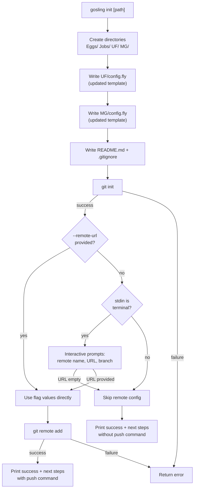

# Design Document: gosling-init-upstream

## Overview

This feature enhances the `gosling init` command in two ways:

1. **Git initialization + upstream remote**: After scaffolding the Nest directory structure, the command runs `git init` and interactively prompts the user for an upstream remote (name, URL, branch). Non-interactive usage is supported via `--remote-name`, `--remote-url`, and `--branch` flags.

2. **Updated .fly templates**: The default `UF/config.fly` and `MG/config.fly` templates are replaced with versions that conform to the current .fly language specification — labeled blocks, correct attribute names, and proper nesting.

All changes are scoped to `Polar-Gosling/dev-new-features/internal/cli/init.go`.

## Architecture

The feature is entirely contained within the `init.go` file in the CLI package. No new packages or external services are introduced.



### Design Decisions

- **`os/exec` for git commands**: We shell out to `git` via `os/exec.Command` rather than importing a Go git library. The CLI already has no git library dependency, and `git init` / `git remote add` are simple, well-defined commands. This avoids adding a new dependency.
- **Terminal detection via `os.Stdin.Stat()`**: We check `os.Stdin.Stat()` for `os.ModeCharDevice` to determine if stdin is a terminal. This is the standard Go approach and avoids importing `golang.org/x/term`.
- **`bufio.Scanner` for interactive input**: Simple line-based reading from stdin. No third-party prompt library needed for three straightforward prompts.
- **Template strings as Go functions**: The existing pattern uses `defaultUglyFoxConfig()` and `defaultMotherGooseConfig()` functions returning string literals. We keep this pattern and update the string content.

## Components and Interfaces

### Modified Components

**`init.go`** (in `Polar-Gosling/dev-new-features/internal/cli/init.go`)

New package-level flag variables:
```go
var (
    initPath   string
    remoteName string
    remoteURL  string
    branchName string
)
```

New flags registered in `init()`:
```go
initCmd.Flags().StringVar(&remoteName, "remote-name", "main", "Name for the upstream remote")
initCmd.Flags().StringVar(&remoteURL, "remote-url", "", "URL for the upstream remote repository")
initCmd.Flags().StringVar(&branchName, "branch", "main", "Default branch name")
```

Modified `runInit` function — after file creation, calls:
1. `initGitRepo(absPath string) error` — runs `git init` in the target directory
2. `configureUpstreamRemote(absPath string) error` — handles flag-based or interactive remote setup

New helper functions:
- `initGitRepo(dir string) error` — executes `git init` via `os/exec`
- `configureUpstreamRemote(dir string) error` — orchestrates remote configuration
- `isTerminal() bool` — checks if stdin is a terminal
- `promptWithDefault(prompt, defaultVal string) string` — reads a line from stdin, returns default if empty
- `addGitRemote(dir, name, url string) error` — executes `git remote add` via `os/exec`

Updated template functions:
- `defaultUglyFoxConfig() string` — returns corrected .fly syntax
- `defaultMotherGooseConfig() string` — returns corrected .fly syntax

### Updated UglyFox Template (`UF/config.fly`)

```fly
# UglyFox Configuration
# Runner lifecycle management: pruning policies and Apex/Nadir pool rules

uglyfox "default" {
  mothergoose = "default"

  pruning {
    failed_threshold = 3
    max_age          = "24h"
    check_interval   = "5m"
  }

  runners_condition "default" {
    eggs_entities = ["my-app"]

    apex {
      max_count        = 5
      min_count        = 1
      cpu_threshold    = 80
      memory_threshold = 70
    }

    nadir {
      max_count    = 3
      min_count    = 0
      idle_timeout = "30m"
    }
  }

  policies {
    rule "terminate_old_failed" {
      condition = "failed_count >= 3 AND age > 1h"
      action    = "terminate"
    }
  }
}
```

Changes from current template:
- Added block label: `uglyfox "default" {`
- Added `mothergoose = "default"` attribute
- Added `cpu_threshold` and `memory_threshold` to `apex` block
- Added `policies` block with example `rule` sub-block

### Updated MotherGoose Template (`MG/config.fly`)

```fly
# MotherGoose Infrastructure Configuration
# Cloud provider, API Gateway, serverless containers, queues, triggers, database, storage

mothergoose "default" {
  cloud {
    provider     = "yandex"
    yc_folder_id = "b1gxxxxxxxxxxxxxxx"
    yc_cloud_id  = "b1gyyyyyyyyyyyyyyy"
  }

  api_gateway {
    name            = "polar-gosling-gw"
    description     = "Main API gateway"
    service_account = "mg-sa"
  }

  fastapi_app {
    name              = "mothergoose-api"
    image             = "ghcr.io/polar-team/mothergoose:latest"
    memory            = 512
    cores             = 1
    execution_timeout = "60s"
    concurrency       = 4
    service_account   = "mg-sa"
  }

  celery_workers {
    memory            = 1024
    cores             = 2
    execution_timeout = "300s"
    concurrency       = 2
  }

  git_sync_trigger {
    schedule        = "*/5 * * * *"
    service_account = "mg-sa"
  }

  mothergoose_queues {
    task_queue {
      name               = "mg-tasks"
      visibility_timeout = 30
      message_retention  = 86400
    }
    dlq {
      name              = "mg-tasks-dlq"
      message_retention = 86400
    }
  }

  database {
    name            = "polar-gosling-db"
    type            = "ydb"
    serverless_mode = true
  }

  storage {
    bucket_name = "polar-gosling-storage"
    region      = "ru-central1"
  }

  service_account "mg-sa" {
    description = "MotherGoose service account"
    roles       = ["lockbox.payloadViewer", "ydb.editor"]
  }

  service_account "uf-sa" {
    description = "UglyFox service account"
    roles       = ["lockbox.payloadViewer", "ydb.viewer"]
  }
}
```

Changes from current template:
- Added block label: `mothergoose "default" {`
- Added `cloud` block with `provider`, `yc_folder_id`, `yc_cloud_id`
- `fastapi_app`: added `image`, `cores`, `execution_timeout`, `concurrency`, `service_account`
- `celery_workers`: added `cores`, `execution_timeout`, `concurrency`; removed `name`, `runtime`, `timeout`
- Replaced `triggers` with `git_sync_trigger` block
- Replaced `message_queues` with `mothergoose_queues` containing `task_queue` and `dlq`
- Replaced `service_accounts` wrapper with labeled `service_account "name"` blocks
- `database`: replaced `mode = "serverless"` with `serverless_mode = true`
- Removed `uglyfox_workers` (belongs in UF config, not MG)

## Data Models

No new data models are introduced. The feature modifies CLI behavior and template string content only.

The only "data" involved are:
- **Flag values**: `remoteName` (string, default `"main"`), `remoteURL` (string, no default), `branchName` (string, default `"main"`)
- **Template strings**: Static string literals returned by `defaultUglyFoxConfig()` and `defaultMotherGooseConfig()`


## Correctness Properties

*A property is a characteristic or behavior that should hold true across all valid executions of a system — essentially, a formal statement about what the system should do. Properties serve as the bridge between human-readable specifications and machine-verifiable correctness guarantees.*

### Property 1: Git initialization creates a valid repository

*For any* valid directory path name, running `initGitRepo` on that path SHALL result in a `.git` directory existing within the target path, confirming a valid Git repository was created.

**Validates: Requirements 1.1**

### Property 2: Prompt default value preservation

*For any* non-empty default value string and an empty user input (empty string or whitespace-only), `promptWithDefault` SHALL return the original default value unchanged.

**Validates: Requirements 2.2**

### Property 3: Git remote registration round-trip

*For any* valid Git remote name and valid Git remote URL, calling `addGitRemote` and then querying `git remote -v` SHALL show the remote name mapped to the provided URL.

**Validates: Requirements 2.5, 3.4**

## Error Handling

| Scenario | Behavior | User-Facing Message |
|---|---|---|
| `git init` fails (e.g., `git` not on PATH, permission denied) | Return error immediately, do not proceed to remote config | `"failed to initialize git repository: <underlying error>"` |
| `git remote add` fails (e.g., remote name already exists, invalid URL) | Return error | `"failed to add upstream remote: <underlying error>"` |
| User provides empty URL in interactive mode | Skip remote configuration gracefully | `"No remote URL provided — skipping upstream remote configuration."` |
| stdin is not a terminal and no `--remote-url` flag | Skip remote configuration silently | No error message; success output notes no remote was configured |
| Directory creation fails | Existing behavior — return error | `"failed to create directory <path>: <underlying error>"` |
| File write fails | Existing behavior — return error | `"failed to create <filename>: <underlying error>"` |

All errors from git commands are wrapped with `fmt.Errorf("...: %w", err)` to preserve the original error chain for debugging.

## Testing Strategy

### Property-Based Tests (gopter)

The project uses `github.com/leanovate/gopter` for property-based testing. Each property test runs a minimum of 100 iterations.

| Property | Test Function | Generator |
|---|---|---|
| Property 1: Git init creates valid repo | `TestGitInitCreatesRepository` | `genValidPathName()` (reuse existing generator) |
| Property 2: Prompt default preservation | `TestPromptDefaultPreservation` | `gen.AnyString()` for defaults × `genWhitespaceString()` for input |
| Property 3: Remote registration round-trip | `TestGitRemoteRegistrationRoundTrip` | `genValidRemoteName()` × `genValidRemoteURL()` |

Each test is tagged with:
```
// Feature: gosling-init-upstream, Property N: <property text>
```

### Unit Tests (example-based)

| Test | Validates |
|---|---|
| `TestInitRunsGitInit` | Req 1.2 — confirmation message printed after git init |
| `TestInitGitFailureStopsExecution` | Req 1.3 — error returned, no remote config attempted |
| `TestInteractivePromptSequence` | Req 2.1, 2.3, 2.4 — prompts appear in correct order with defaults |
| `TestEmptyURLSkipsRemoteConfig` | Req 2.7 — empty URL skips remote, prints skip message |
| `TestGitRemoteAddFailure` | Req 2.8 — error returned with underlying git error |
| `TestFlagSkipsPrompts` | Req 3.4, 3.5 — --remote-url flag bypasses interactive prompts |
| `TestNonTerminalSkipsPrompts` | Req 3.6 — non-terminal stdin skips remote config |
| `TestSuccessOutputWithRemote` | Req 6.1, 6.2 — output includes remote info and push command |
| `TestSuccessOutputWithoutRemote` | Req 6.3 — output suggests manual remote addition |

### Smoke Tests (template validation)

| Test | Validates |
|---|---|
| `TestUglyFoxTemplateHasBlockLabel` | Req 4.1 — `uglyfox "default" {` present |
| `TestUglyFoxTemplateHasMothergooseAttr` | Req 4.2 — `mothergoose = "default"` present |
| `TestUglyFoxTemplateHasThresholds` | Req 4.3 — `cpu_threshold` and `memory_threshold` in apex |
| `TestUglyFoxTemplateHasPolicies` | Req 4.4 — `policies` block with `rule` sub-block |
| `TestMotherGooseTemplateHasBlockLabel` | Req 5.1 — `mothergoose "default" {` present |
| `TestMotherGooseTemplateHasCloudBlock` | Req 5.2 — `cloud` block with provider attributes |
| `TestMotherGooseTemplateHasFastapiAttrs` | Req 5.3 — all required fastapi_app attributes |
| `TestMotherGooseTemplateHasCeleryAttrs` | Req 5.4 — cores, execution_timeout, concurrency |
| `TestMotherGooseTemplateUsesGitSyncTrigger` | Req 5.5 — `git_sync_trigger`, not `triggers` |
| `TestMotherGooseTemplateUsesMothergooseQueues` | Req 5.6 — `mothergoose_queues` with `task_queue` + `dlq` |
| `TestMotherGooseTemplateUsesLabeledServiceAccounts` | Req 5.7 — `service_account "name"`, not `service_accounts` |
| `TestMotherGooseTemplateUsesServerlessMode` | Req 5.8 — `serverless_mode = true`, not `mode = "serverless"` |

All template smoke tests call the template function and use `strings.Contains` / `!strings.Contains` assertions on the returned string.
