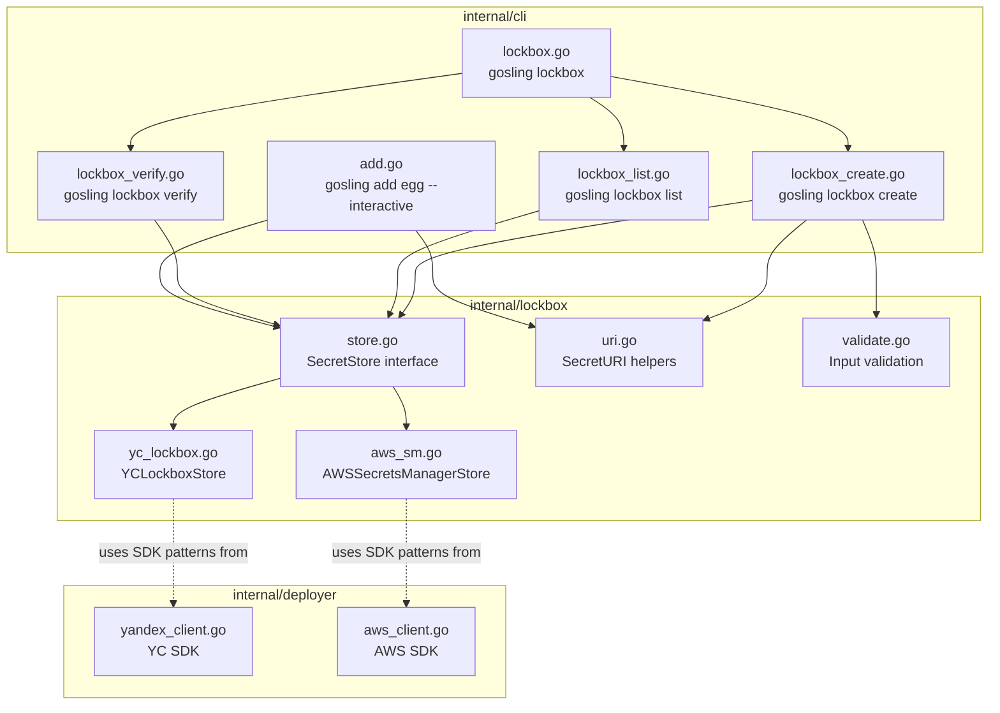
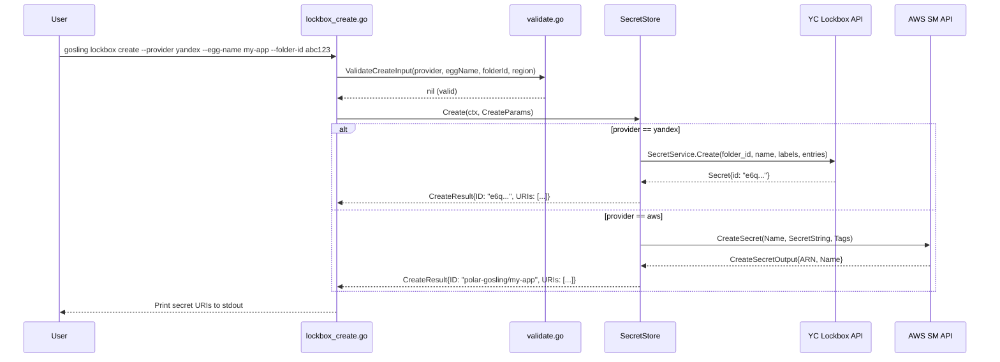
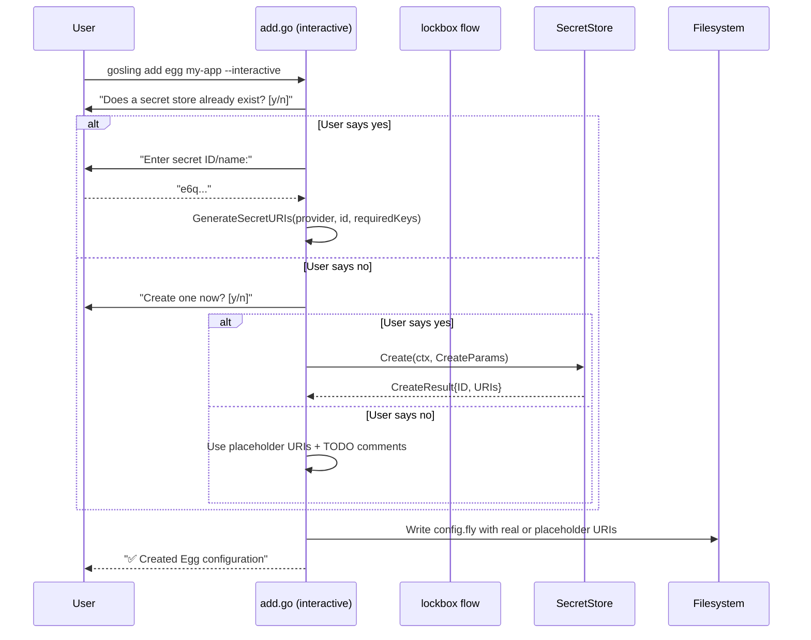

# Design Document: gosling-lockbox

## Overview

This feature adds cloud secret store management to the Gosling CLI through a `gosling lockbox` command family (`create`, `list`, `verify`) and integrates secret provisioning into the `gosling add egg --interactive` workflow. The design introduces a `SecretStore` interface that abstracts Yandex Cloud Lockbox and AWS Secrets Manager behind a unified API, enabling the CLI to create, list, and verify secret stores without provider-specific command logic.

The implementation lives entirely in `dev-new-features/internal/` following existing patterns: Cobra commands in `internal/cli/`, a new `internal/lockbox/` package for the secret store abstraction, and integration with the existing `internal/deployer/` SDK clients.

### Design Rationale

- **Interface-based abstraction**: A `SecretStore` interface decouples command logic from cloud provider specifics, making it straightforward to add new providers (e.g., Vault) later.
- **Reuse existing SDK clients**: The Yandex Cloud Go SDK (`ycsdk`) and AWS SDK for Go v2 are already integrated in `internal/deployer/`. The lockbox package creates thin wrappers that leverage the same SDK initialization patterns.
- **Validation-first**: Input validation runs before any cloud API call, providing fast feedback and avoiding partial state from failed API calls.
- **Secret URI generation as pure function**: URI construction is a pure function of (provider, identifier, key), making it trivially testable via property-based tests.

## Architecture



### Command Flow: `gosling lockbox create`



### Command Flow: `gosling add egg --interactive` (with lockbox integration)



## Components and Interfaces

### SecretStore Interface (`internal/lockbox/store.go`)

```go
package lockbox

import (
    "context"
    "time"
)

// RequiredEntries defines the secret keys every egg needs.
var RequiredEntries = []string{"runner-token", "webhook-secret", "repo-url"}

// CreateParams holds input for creating a new secret store.
type CreateParams struct {
    Provider string // "yandex" or "aws"
    EggName  string
    FolderID string // YC only
    Region   string // AWS only
}

// CreateResult holds the output of a successful secret creation.
type CreateResult struct {
    ID   string            // Secret UUID (YC) or secret name (AWS)
    URIs map[string]string // key -> full secret URI
}

// SecretInfo represents a single secret store entry in list output.
type SecretInfo struct {
    Name      string
    ID        string // Secret UUID (YC) or ARN (AWS)
    EggName   string // From egg-name label/tag
    CreatedAt time.Time
}

// VerifyResult holds the output of a secret verification.
type VerifyResult struct {
    Present []string
    Missing []string
}

// SecretStore abstracts cloud secret store operations.
type SecretStore interface {
    // Create provisions a new secret store with placeholder entries.
    Create(ctx context.Context, params CreateParams) (*CreateResult, error)

    // List returns all Polar Gosling-tagged secrets.
    List(ctx context.Context) ([]SecretInfo, error)

    // Verify checks that a secret exists and contains all RequiredEntries.
    Verify(ctx context.Context, secretRef string) (*VerifyResult, error)
}
```

### YCLockboxStore (`internal/lockbox/yc_lockbox.go`)

Wraps the Yandex Cloud Go SDK. Uses `SecretService.Create` with `version_payload_entries` to create the secret and its initial version in one call. Uses `SecretService.List` with folder filtering and label matching for listing. Uses `PayloadService.Get` to retrieve entry keys for verification.

Key SDK calls:
- `sdk.Lockbox().Secret().Create()` — creates secret with entries and labels
- `sdk.Lockbox().Secret().List()` — lists secrets in a folder
- `sdk.Lockbox().Payload().Payload().Get()` — retrieves payload entries for verification

Naming: `pg-{egg-name}-secrets`
Labels: `{"polar-gosling": "true", "egg-name": "{egg-name}"}`

### AWSSecretsManagerStore (`internal/lockbox/aws_sm.go`)

Wraps the AWS SDK for Go v2 `secretsmanager` client. Uses `CreateSecret` with a JSON string value containing the three required keys. Uses `ListSecrets` with tag filters for listing. Uses `GetSecretValue` and JSON parsing for verification.

Key SDK calls:
- `secretsmanager.CreateSecret()` — creates secret with JSON value and tags
- `secretsmanager.ListSecrets()` — lists secrets with tag filter
- `secretsmanager.GetSecretValue()` — retrieves JSON value for verification

Naming: `polar-gosling/{egg-name}`
Tags: `[{Key: "polar-gosling", Value: "true"}, {Key: "egg-name", Value: "{egg-name}"}]`

### Input Validation (`internal/lockbox/validate.go`)

```go
package lockbox

import "fmt"

// ValidateCreateInput validates all inputs before any cloud API call.
func ValidateCreateInput(params CreateParams) error {
    if params.Provider != "yandex" && params.Provider != "aws" {
        return fmt.Errorf("invalid provider %q: must be 'yandex' or 'aws'", params.Provider)
    }
    if params.EggName == "" {
        return fmt.Errorf("egg-name is required")
    }
    if !IsValidEggName(params.EggName) {
        return fmt.Errorf("invalid egg-name %q: must contain only alphanumeric characters, hyphens, or underscores", params.EggName)
    }
    if params.Provider == "yandex" && params.FolderID == "" {
        return fmt.Errorf("folder-id is required for Yandex Cloud provider")
    }
    // AWS region: if empty, SDK uses default from config (Requirement 4.5)
    return nil
}

// IsValidEggName checks that a name contains only [a-zA-Z0-9_-].
func IsValidEggName(name string) bool {
    for _, ch := range name {
        if !((ch >= 'a' && ch <= 'z') || (ch >= 'A' && ch <= 'Z') ||
            (ch >= '0' && ch <= '9') || ch == '-' || ch == '_') {
            return false
        }
    }
    return len(name) > 0
}
```

### Secret URI Helpers (`internal/lockbox/uri.go`)

```go
package lockbox

import (
    "fmt"
    "strings"
)

// GenerateSecretURI builds a secret URI for the given provider, identifier, and key.
func GenerateSecretURI(provider, identifier, key string) string {
    switch provider {
    case "yandex":
        return fmt.Sprintf("yc-lockbox://%s/%s", identifier, key)
    case "aws":
        return fmt.Sprintf("aws-sm://%s/%s", identifier, key)
    default:
        return ""
    }
}

// GenerateAllURIs returns a map of key -> URI for all RequiredEntries.
func GenerateAllURIs(provider, identifier string) map[string]string {
    uris := make(map[string]string, len(RequiredEntries))
    for _, key := range RequiredEntries {
        uris[key] = GenerateSecretURI(provider, identifier, key)
    }
    return uris
}

// ParseSecretURI splits a secret URI into (scheme, identifier, key).
// Returns an error if the URI does not have exactly 3 components.
func ParseSecretURI(uri string) (scheme, identifier, key string, err error) {
    parts := strings.SplitN(uri, "://", 2)
    if len(parts) != 2 {
        return "", "", "", fmt.Errorf("invalid secret URI %q: missing ://", uri)
    }
    scheme = parts[0]
    rest := parts[1]
    lastSlash := strings.LastIndex(rest, "/")
    if lastSlash < 0 || lastSlash == 0 || lastSlash == len(rest)-1 {
        return "", "", "", fmt.Errorf("invalid secret URI %q: must have format scheme://identifier/key", uri)
    }
    identifier = rest[:lastSlash]
    key = rest[lastSlash+1:]
    return scheme, identifier, key, nil
}

// SecretNameForProvider returns the conventional secret name for a given egg.
func SecretNameForProvider(provider, eggName string) string {
    switch provider {
    case "yandex":
        return fmt.Sprintf("pg-%s-secrets", eggName)
    case "aws":
        return fmt.Sprintf("polar-gosling/%s", eggName)
    default:
        return ""
    }
}
```

### Cobra Command Registration (`internal/cli/lockbox.go`)

```go
// lockboxCmd is the parent command: gosling lockbox
var lockboxCmd = &cobra.Command{
    Use:   "lockbox",
    Short: "Manage cloud secret stores for Egg configurations",
}

func init() {
    rootCmd.AddCommand(lockboxCmd)
    lockboxCmd.AddCommand(lockboxCreateCmd)
    lockboxCmd.AddCommand(lockboxListCmd)
    lockboxCmd.AddCommand(lockboxVerifyCmd)
}
```

Subcommand files: `lockbox_create.go`, `lockbox_list.go`, `lockbox_verify.go` — each defines its own `*cobra.Command` with flags and `RunE` handler that delegates to the `lockbox` package.

## Data Models

### Secret Store Naming Conventions

| Provider | Secret Name Pattern | Example |
|----------|-------------------|---------|
| Yandex Cloud | `pg-{egg-name}-secrets` | `pg-my-app-secrets` |
| AWS | `polar-gosling/{egg-name}` | `polar-gosling/my-app` |

### Secret Entry Structure

| Key | Description | Initial Value |
|-----|-------------|---------------|
| `runner-token` | GitLab runner registration token | `""` (empty placeholder) |
| `webhook-secret` | GitLab webhook validation secret | `""` (empty placeholder) |
| `repo-url` | Git repository clone URL | `""` (empty placeholder) |

### Tags/Labels Applied

| Tag Key | Value | Purpose |
|---------|-------|---------|
| `polar-gosling` | `"true"` | Identifies secrets managed by Polar Gosling |
| `egg-name` | `"{egg-name}"` | Associates secret with specific egg |

### Config.fly Secret Attributes

The egg config.fly uses these attribute names (matching the .fly schema):

```
egg "my-app" {
  gitlab_token_secret   = "yc-lockbox://e6q.../runner-token"
  gitlab_webhook_secret = "yc-lockbox://e6q.../webhook-secret"
  git_repo_url_secret   = "yc-lockbox://e6q.../repo-url"
}
```

Mapping from RequiredEntries to config.fly attributes:
- `runner-token` → `gitlab_token_secret`
- `webhook-secret` → `gitlab_webhook_secret`
- `repo-url` → `git_repo_url_secret`


## Correctness Properties

*A property is a characteristic or behavior that should hold true across all valid executions of a system — essentially, a formal statement about what the system should do. Properties serve as the bridge between human-readable specifications and machine-verifiable correctness guarantees.*

### Property 1: Secret naming convention is deterministic and follows provider patterns

*For any* valid egg name and *for any* supported provider ("yandex" or "aws"), `SecretNameForProvider(provider, eggName)` shall produce `"pg-{eggName}-secrets"` for Yandex Cloud and `"polar-gosling/{eggName}"` for AWS, and the egg name shall appear verbatim in the result.

**Validates: Requirements 2.4, 3.4**

### Property 2: Secret URI generation/parse round-trip

*For any* valid provider ("yandex" or "aws"), *for any* non-empty identifier string (not containing "://"), and *for any* non-empty key string (not containing "/"), `ParseSecretURI(GenerateSecretURI(provider, identifier, key))` shall return the original scheme, identifier, and key without error. The scheme shall be `"yc-lockbox"` for Yandex and `"aws-sm"` for AWS.

**Validates: Requirements 9.1, 9.2, 9.3**

### Property 3: Invalid inputs are rejected before cloud API calls

*For any* `CreateParams` where the provider is not "yandex" or "aws", OR the egg-name is empty, OR the egg-name contains characters outside `[a-zA-Z0-9_-]`, OR the provider is "yandex" and folder-id is empty, `ValidateCreateInput` shall return a non-nil error.

**Validates: Requirements 4.1, 4.2, 4.3, 4.4**

### Property 4: Valid inputs pass validation

*For any* `CreateParams` where the provider is "yandex" or "aws", the egg-name is non-empty and contains only `[a-zA-Z0-9_-]`, and provider-specific required fields are present (folder-id for Yandex), `ValidateCreateInput` shall return nil.

**Validates: Requirements 4.1, 4.2, 4.3, 4.4, 4.5**

### Property 5: Verify correctly partitions entries into present and missing

*For any* subset of `RequiredEntries` present in a secret payload, the `VerifyResult` shall list exactly those keys in `Present` and the complement in `Missing`, with `len(Present) + len(Missing) == len(RequiredEntries)`.

**Validates: Requirements 6.3, 6.4**

### Property 6: Config.fly generation includes all secret attributes

*For any* valid provider and identifier, the generated egg config.fly content shall contain the strings `gitlab_token_secret`, `gitlab_webhook_secret`, and `git_repo_url_secret`, each followed by a correctly formatted Secret_URI for that provider.

**Validates: Requirements 7.6, 10.1**

## Error Handling

### Error Categories

| Category | Behavior | Exit Code |
|----------|----------|-----------|
| Input validation failure | Print descriptive error to stderr, do not call cloud API | 1 |
| Cloud API error (create) | Print cloud error message to stderr | 1 |
| Secret already exists | Print "secret already exists" + suggest `gosling lockbox verify` | 1 |
| Secret not found (verify) | Print "secret not found" error | 1 |
| Missing entries (verify) | Print present/missing report | 1 |
| Network/auth failure | Print underlying SDK error to stderr | 1 |
| Success | Print results to stdout | 0 |

### Error Handling Strategy

1. **Validation-first**: All input validation runs before any cloud API call. This prevents partial state (e.g., a secret created with wrong parameters) and gives fast feedback.

2. **Wrap cloud errors**: Cloud SDK errors are wrapped with `fmt.Errorf("context: %w", err)` to provide context while preserving the original error for debugging. The CLI layer prints the error to stderr via Cobra's standard error handling.

3. **Idempotency check on create**: Before creating, the implementation checks if a secret with the expected name already exists. If so, it returns a descriptive error rather than letting the cloud API return a cryptic duplicate error.

4. **Graceful degradation in interactive mode**: If secret creation fails during `gosling add egg --interactive`, the flow falls back to placeholder URIs with TODO comments rather than aborting the entire egg creation.

5. **Stderr vs stdout separation**: Error messages go to stderr. Secret URIs and success output go to stdout. This enables piping stdout to other tools in CI/CD pipelines.

### Error Flow Example

```
$ gosling lockbox create --provider gcp --egg-name my-app
Error: invalid provider "gcp": must be 'yandex' or 'aws'

$ gosling lockbox create --provider yandex --egg-name my-app --folder-id abc123
Error: failed to create Lockbox secret: rpc error: code = PermissionDenied ...

$ gosling lockbox create --provider yandex --egg-name my-app --folder-id abc123
Error: secret "pg-my-app-secrets" already exists in folder abc123. Use 'gosling lockbox verify --secret-id <id>' to check its entries.
```

## Testing Strategy

### Property-Based Tests (gopter)

The project uses `github.com/leanovate/gopter` for property-based testing, consistent with existing tests in `internal/cli/` and `internal/deployer/`.

Each correctness property maps to a single gopter property test in `internal/lockbox/lockbox_property_test.go`:

- **Property 1** (naming): Generate random valid egg names, verify `SecretNameForProvider` output matches expected patterns for both providers.
- **Property 2** (URI round-trip): Generate random (provider, identifier, key) tuples, verify `ParseSecretURI(GenerateSecretURI(...))` returns the original values.
- **Property 3** (invalid input rejection): Generate `CreateParams` with at least one invalid field, verify `ValidateCreateInput` returns error.
- **Property 4** (valid input acceptance): Generate fully valid `CreateParams`, verify `ValidateCreateInput` returns nil.
- **Property 5** (verify partitioning): Generate random subsets of `RequiredEntries`, build a mock payload, verify `VerifyResult` partitions correctly.
- **Property 6** (config.fly attributes): Generate random provider/identifier pairs, verify generated config contains all three secret attributes.

Configuration: minimum 100 iterations per property. Each test tagged with:
```go
// Feature: gosling-lockbox, Property N: {property_text}
```

### Unit Tests (example-based)

Located in `internal/lockbox/lockbox_test.go` and `internal/cli/lockbox_test.go`:

- Command registration: verify `lockbox` is a subcommand of root, with `create`, `list`, `verify` children.
- Help output: verify `gosling lockbox` shows subcommand list.
- Error scenarios: mock SDK returning errors, verify stderr output and exit codes.
- Already-exists scenario: mock SDK returning existing secret, verify error message.
- Interactive flow: simulate stdin input for `gosling add egg --interactive` secret prompts.
- Non-interactive mode: verify no stdin reads when all flags provided.
- Placeholder vs real URI config generation: verify TODO comments present/absent.

### Integration Tests

Located in `internal/lockbox/lockbox_integration_test.go`:

- Mock YC SDK and AWS SM clients implementing the `SecretStore` interface.
- End-to-end create → verify flow for each provider.
- List with mixed tagged/untagged secrets.

### Test File Layout

```
dev-new-features/internal/lockbox/
  store.go                      # SecretStore interface
  yc_lockbox.go                 # YC implementation
  aws_sm.go                     # AWS implementation
  uri.go                        # URI generation/parsing
  validate.go                   # Input validation
  lockbox_property_test.go      # Property-based tests (gopter)
  lockbox_test.go               # Unit tests
  lockbox_integration_test.go   # Integration tests with mocks

dev-new-features/internal/cli/
  lockbox.go                    # Parent command
  lockbox_create.go             # Create subcommand
  lockbox_list.go               # List subcommand
  lockbox_verify.go             # Verify subcommand
  lockbox_test.go               # CLI-level tests
```
