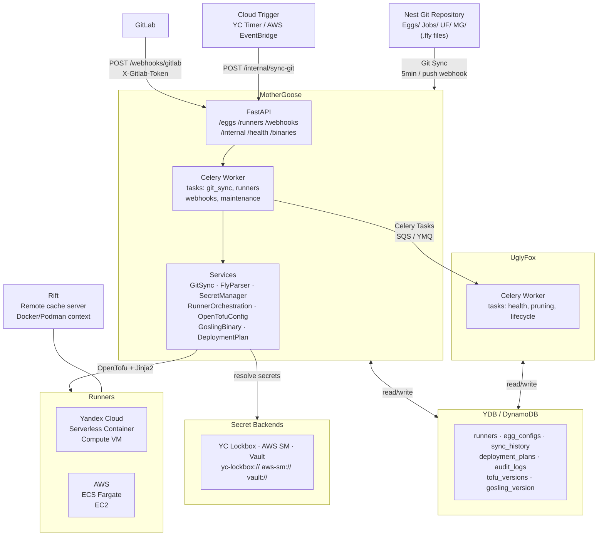
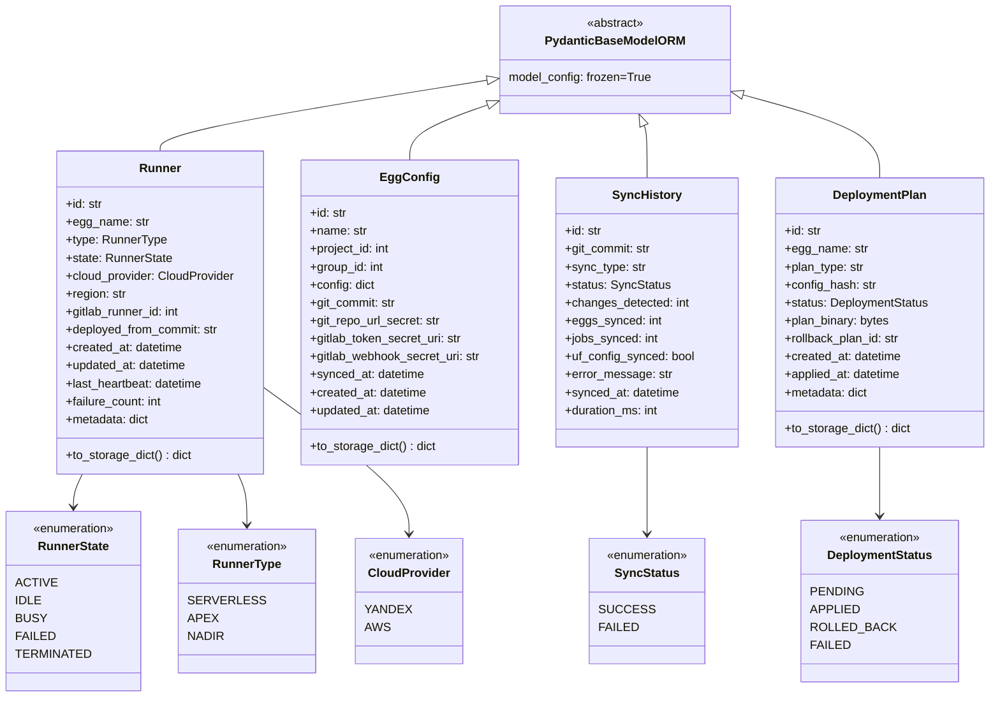
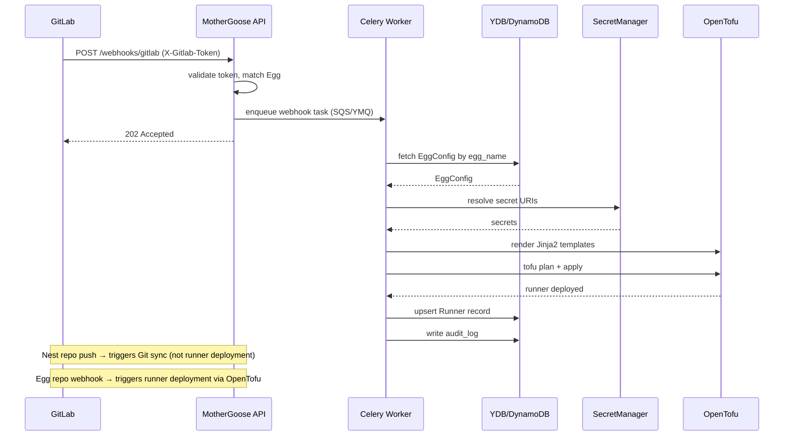
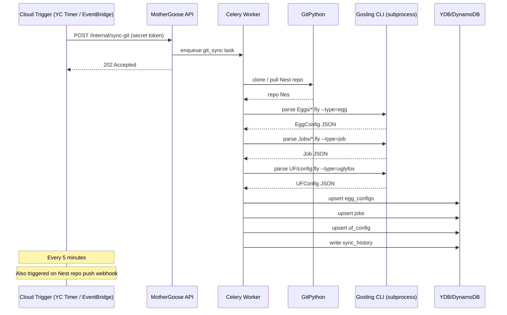
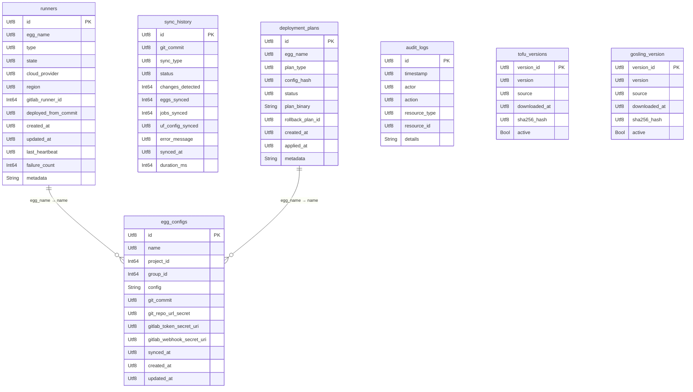
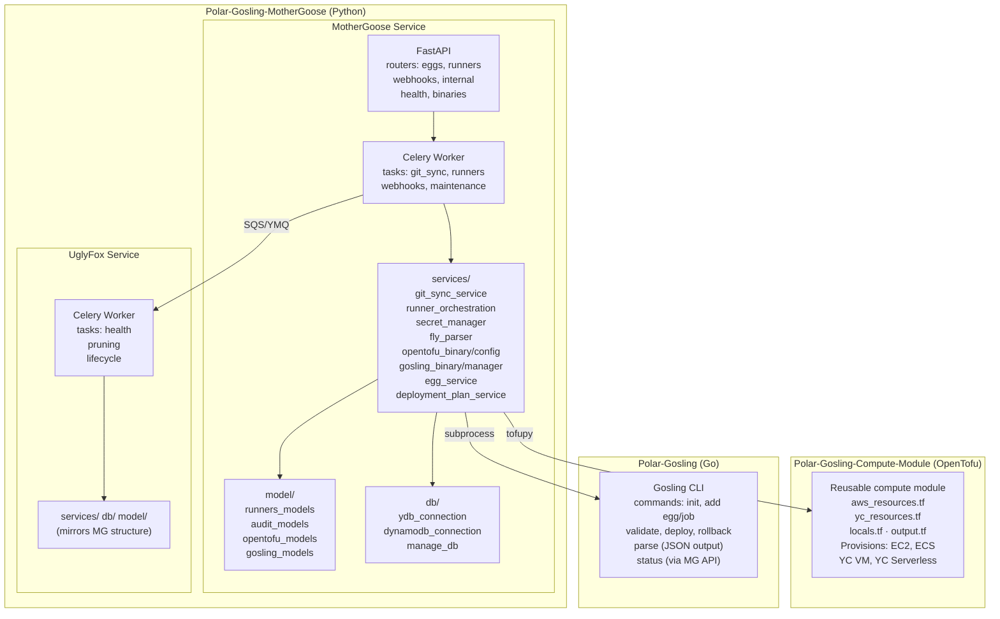

# Tech Stack

## Language & Runtime
- Python 3.10–3.13 (supports all four versions via tox)
- Package manager: `uv`
- Go (Gosling CLI)

## Frameworks & Libraries
- **FastAPI** + **uvicorn**: REST API (MotherGoose only)
- **Celery** + **Kombu**: Async task queue (both services)
- **Pydantic v2**: Data models and settings (`pydantic-settings`)
- **YDB SDK** (`ydb`): Yandex Cloud database
- **boto3** / **aioboto3**: AWS SDK (DynamoDB, SQS, Secrets Manager)
- **GitPython**: Git repository operations
- **Jinja2**: OpenTofu template rendering
- **tofupy**: Python wrapper for OpenTofu CLI
- **hypothesis**: Property-based testing
- **pytest** + **pytest-asyncio**: Test framework
- **testcontainers**: Integration test containers

## Code Quality Tools
- **black** + **isort**: Formatting (line length: 120, isort profile: black)
- **flake8** + **pylint**: Linting (pylint must score 10/10)
- **mypy**: Static type checking (strict — `disallow_untyped_defs = true`)
- **tox**: Multi-environment test runner

## Infrastructure
- **OpenTofu** (>= 1.3.5): IaC for runner provisioning
- **Terraform module** (`Polar-Gosling-Compute-Module`): Reusable compute module for AWS (EC2, ECS) and Yandex Cloud (VM, Serverless Container)
- Providers: `yandex >= 0.170.0`, `aws >= 4.66`, `random >= 3.4.3`

## Common Commands

All commands run from `Polar-Gosling-MotherGoose/` root via Makefile, or directly inside each service directory.

### MotherGoose
```bash
make mg-test              # Run pytest
make mg-lint              # flake8 + pylint via tox
make mg-type              # mypy via tox
make mg-format            # Apply black + isort
make mg-format-check      # Check formatting (CI)
make mg-tox-all           # Full tox suite (all Python versions + format + style + type)

# Direct (from mothergoose/)
uv run pytest -v
uv run pytest --cov=app --cov-report=html
uv run pytest -v --hypothesis-show-statistics
uv run tox
```

### UglyFox
```bash
make uf-test              # Run pytest
make uf-lint              # flake8 + pylint via tox
make uf-type              # mypy via tox
make uf-format            # Apply black + isort
make uf-tox-all           # Full tox suite

# Direct (from uglyfox/)
uv run pytest -v
uv run tox
```

### Compute Module (Terraform)
```bash
make pre-commit           # Run pre-commit hooks
# Tests use native Terraform test framework (.tftest.hcl files)
```

### Critical: Test Execution Warning

`make mg-tox-all` and `make uf-tox-all` spin up real containers (YDB + LocalStack) via testcontainers. **Always wait for the command to fully complete before running any other test command.** Running multiple test suites in parallel will cause YDB connection conflicts and test failures.

### Dependency Management
```bash
uv sync --all-groups      # Install all dependency groups
uv version --bump patch   # Bump patch version (or minor/major)
```

## UML Diagrams

### Architecture Diagram



---

### Class Diagram — Core Models



---

### Class Diagram — Services

```mermaid
classDiagram
    class GitSyncService {
        +sync_from_git(commit: str) SyncHistory
        +parse_eggs(path: str) list
        +parse_jobs(path: str) list
        +parse_uf_config(path: str) dict
    }

    class FlyParserService {
        +parse_egg(path: str) dict
        +parse_job(path: str) dict
        +parse_uf_config(path: str) dict
        -_call_gosling_parse(path, type) dict
    }

    class SecretManager {
        +get_secret(uri: str) str
        -_yc_lockbox(uri: str) str
        -_aws_sm(uri: str) str
        -_vault(uri: str) str
    }

    class SecretCache {
        +get(uri: str) str
        +set(uri: str, value: str) None
        -ttl: int
    }

    class RunnerOrchestrationService {
        +deploy_runner(egg: EggConfig) Runner
        +terminate_runner(runner_id: str) None
        +determine_runner_type(egg: EggConfig) RunnerType
    }

    class OpenTofuConfiguration {
        +render_templates(settings: TofuSetting) dict
        +generate_plan() bytes
        +apply_plan(plan: bytes) None
    }

    class OpenTofuBinary {
        <<abstract>>
        +store_downloaded_bin() tuple
        #_download_and_extract(extract_to: str) None
    }

    class OpenTofuDownloadGithub {
        +store_downloaded_bin() tuple
    }

    class OpenTofuDownloadFromOtherSource {
        +store_downloaded_bin() tuple
    }

    class GoslingBinary {
        <<abstract>>
        +store_downloaded_bin() tuple
        #_download_and_extract(extract_to: str) None
    }

    class GoslingDownloadGithub {
        +store_downloaded_bin() tuple
    }

    class GoslingDownloadFromOtherSource {
        +store_downloaded_bin() tuple
    }

    class GoslingBinaryManager {
        +mount_s3_binaries() None
        +get_active_binary_path() str
        +verify_and_activate(version: str) None
    }

    class DeploymentPlanService {
        +create_plan(egg_name: str, config: dict) DeploymentPlan
        +apply_plan(plan_id: str) None
        +rollback(plan_id: str) None
    }

    GitSyncService --> FlyParserService
    FlyParserService --> GoslingBinaryManager
    SecretManager --> SecretCache
    RunnerOrchestrationService --> OpenTofuConfiguration
    RunnerOrchestrationService --> DeploymentPlanService
    OpenTofuBinary <|-- OpenTofuDownloadGithub
    OpenTofuBinary <|-- OpenTofuDownloadFromOtherSource
    GoslingBinary <|-- GoslingDownloadGithub
    GoslingBinary <|-- GoslingDownloadFromOtherSource
```



---

### Sequence Diagram — Webhook Processing



---

### Sequence Diagram — Git Sync



---

### Database Schema



---

### Component Diagram


