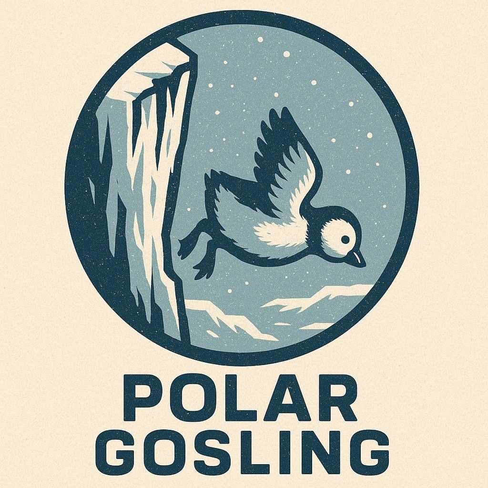

<div align="center">
  
</div>

# Gosling CLI

Go-based command-line tool for the Polar Gosling GitOps Runner Orchestration system.

## Overview

Gosling CLI is responsible for:
- Bootstrapping Nest repositories
- Parsing .fly configuration files
- Deploying resources using native cloud SDKs (Yandex Cloud, AWS)
- Managing GitLab Runner Agents in runner mode
- Converting .fly configurations to cloud provider objects

## Project Structure

```
Polar-Gosling/
├── cmd/
│   └── gosling/          # CLI entry point
├── internal/
│   ├── parser/           # Fly language parser
│   ├── deployer/         # Cloud deployment logic
│   ├── runner/           # Runner mode implementation
│   └── gitlab/           # GitLab integration
├── Dockerfile            # Container image for serverless runners
├── go.mod                # Go module definition
├── go.sum                # Go module checksums
└── README.md             # This file
```

## Building

```bash
# Download dependencies
go mod download

# Build the binary
go build -o gosling ./cmd/gosling

# Run
./gosling
```

## Docker Build

```bash
# Build container image
docker build -t gosling:latest .

# Run in runner mode
docker run gosling:latest --runner-id <id> --egg-name <name>
```

## Commands (To be implemented)

- `gosling init` - Initialize Nest repository
- `gosling add egg` - Add Egg configuration
- `gosling add job` - Add Job definition
- `gosling validate` - Validate .fly files
- `gosling deploy` - Deploy resources
- `gosling rollback` - Rollback deployment
- `gosling status` - Show deployment status
- `gosling runner` - Run in runner mode (manages GitLab Runner Agent)

## Requirements

- Go 1.21 or higher
- Docker (for containerized deployment)

## Dependencies

- Yandex Cloud Go SDK
- AWS SDK for Go v2
- GitLab Go SDK
- HCL parser
- Cobra CLI framework

## License

See LICENSE file for details.
